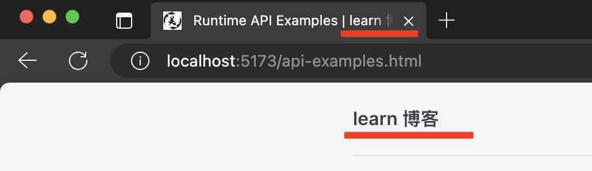

# 快速搭建博客 - 配置

先放上[官网配置](https://vitepress.dev/reference/site-config)

## 项目配置

在讲配置之前，先找到 `config/.vitepress/config.{mts|js} ` 文件，接下来所有的配置都是修改这个文件。这里的 config 目录就是之前的配置目录，如果是用 ts 的话，后缀是`.mts`，否则后缀是`.js`。


做开发久了，对于生成的目录文件还是有些不习惯，希望可以使用平常开发时的目录结构

```js
.
├─ config
│  ├─ .vitepress
│  |  ├─ cache
│  |  ├─ dist
│  |  ├─ theme
│  │  └─ config.mts
│  ├─ api-examples.md
│  ├─ markdown-examples.md
│  └─ index.md
└─ package.json
```


```js
.
├─ _cache
├─ dist
├─ config
│  ├─ .vitepress
│  |  ├─ theme
│  │  └─ config.mts
├─ src
│  ├─ api-examples.md
│  ├─ markdown-examples.md
│  └─ index.md
└─ package.json
```

所要修改配置项

config.mts 中

```ts{3-5}
export default defineConfig({
  //...
  outDir: '../dist/',
  cacheDir: '../_cache/',
  srcDir: '../src',
  //...
})
```

下面是对这些配置项的一些解释：


### base
类型：string

默认是 `/` 打开浏览器地址为 `http://localhost:5173/api-examples.html`

改为 `/blog/` 打开浏览器地址为 `http://localhost:5173/blog/api-examples.html`

### srcDir
类型：string

> 内容文件所在位置

默认是 `.` 默认在 `config/` 目录下面

改为 `../src`<sub>(由于开发时常用 `src` 作为开发目录)</sub> 与 config 同级

### outDir
类型： strig

默认是`./.vitepress/dist`

改为 `../dist` <sub>(由于开发时常用 `dist` 与 config 同级)</sub>

### cacheDir
> 开发过程中的缓存文件

默认 `./.vitepress/cache`

改为 `../_cache` 

## Metadata 配置

配置 head 标签里面的内容
```html
<!-- lang 配置 => 语言 -->
<html lang="en-US">
  <head>
    <!-- title 配置 => 标题 -->
    <title>title</title>

    <!-- description 配置 => 描述 -->
    <meta name="description" content="description">
    
    <!-- head 配置 => css | ico -->
    <link href="xxx" />

    <!-- head 配置 => js -->
    <script src="xxx" ></script>
  </head>
</html>

```

### title

title 的配置有两种：一种是直接配置 title, 另一种是配置 titleTemplate。

##### 展示位置：
1. 页面的左上角 
2. 浏览器 Tab 标题

浏览器 Tab 标题的展示形式： 当前页面的 title | title 配置



#### title 配置

直接配置 title

- 字符串
- 默认：VitePress

##### 配置位置：

```js{3}
export default defineConfig({
  //...
  title: 'learn blog'
  //...
});
```
#### titleTemplate 配置

titleTemplate 提供一种更为灵活的配置方式，自定义配置方式

- 字符串 | 布尔值

##### 配置位置：

```js{3}
export default defineConfig({
  //...
  titleTemplate: ':title - learn blog'
  //...
});
```
可以使用 `:title` 作为占位符，来展示当前页面的 title （如果没有 title， 则展示 h1 标签内容）

### description | lang

网站描述和语言

```js{3-4}
export default defineConfig({
  //...
  description: 'learn blog'
  lang: "zh-CN"
  //...
});
```
### head

```js{3-4}
export default defineConfig({
  //...
  head: [{
    link: { rel: 'ico', type: 'image/ico', href: '/favicon.ico' }
  }]
  //...
});
```

最终生成
```html
<link rel="ico" type="image/ico" href="/favicon.ico">

```


## 主题配置

主题配置

```js
export default defineConfig({
  //...
  vue: {},
  vite: {},
  markdown: {}
  //...
});
```

### 有关 vite, vue 和 Markdown 配置

```js{3-5}
export default defineConfig({
  //...
  vue: {},
  vite: {},
  markdown: {}
  //...
});
```
