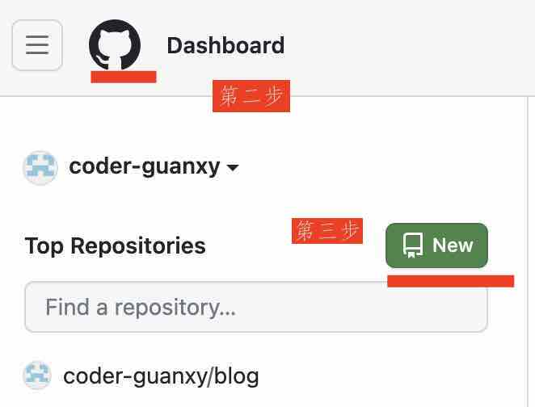
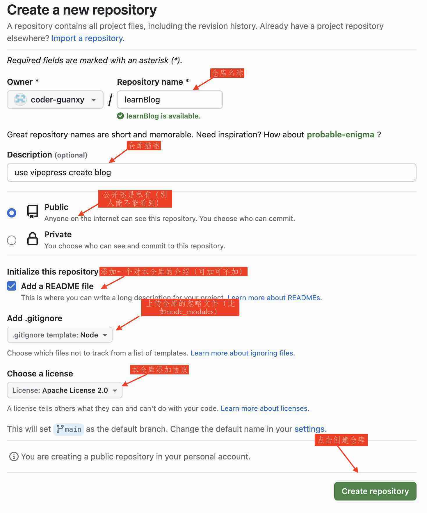
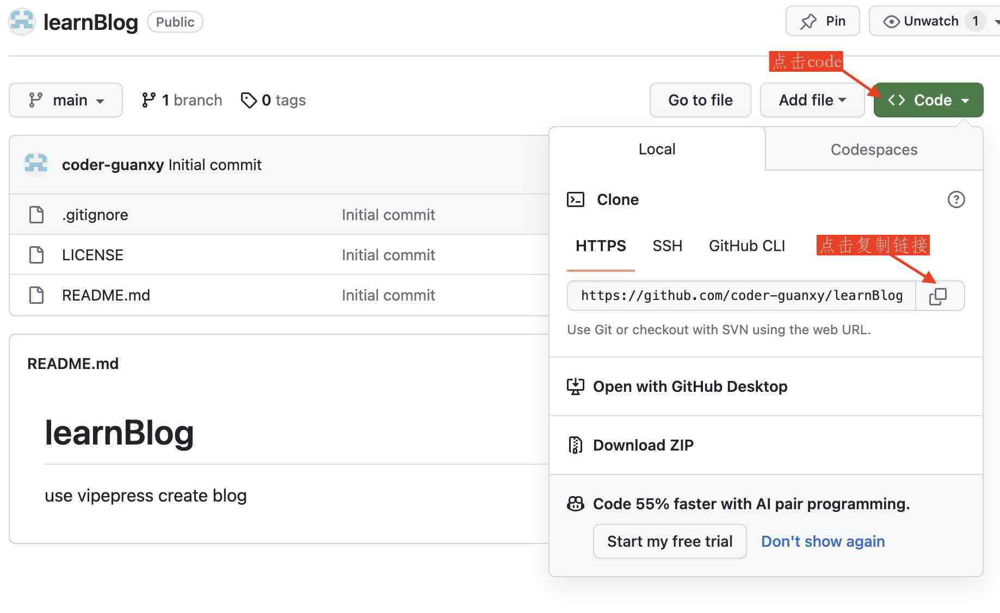
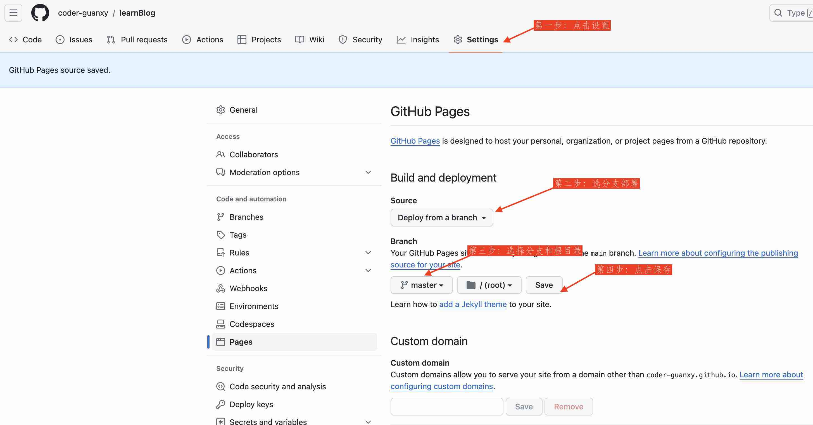

# 部署

主要是远程仓库的创建，以及本地仓库的关联

## 远程 GitHub 仓库

### 创建 GitHub 仓库
1. 登录 github
2. 点击左上角图标
3. 点击 new



### 填写远程仓库信息
- 填写仓库名称
- 仓库描述
- 是否公开，由于我们写的是博客，本身就是与其他人共享的所以点 Public 选项
- 添加 README 文件，可加可不加，主要是介绍仓库的（博客）简介
- 添加 git 忽略文件，比如开发时需要的 node_modules 就不需要上传到仓库
- 仓库的协议 - 开源协议



## 本地仓库
### 生成部署文件
- 先创建 `.github/workflows/deploy.yml`
- 然后将下面内容复制到该文件中

[官网 Github Pages 部署](https://vitepress.dev/guide/deploy#github-pages)

:::tip
有关 [Github Actions文档](https://docs.github.com/zh/actions/quickstart) 如果感觉比较枯燥也可以看 [阮一峰 Github Actions 入门教程](https://www.ruanyifeng.com/blog/2019/09/getting-started-with-github-actions.html)
:::

```yml
# Sample workflow for building and deploying a VitePress site to GitHub Pages
#
name: Deploy VitePress site to Pages

on:
  push:
    branches: [master] # 默认提交的分支为 master

  # Allows you to run this workflow manually from the Actions tab
  workflow_dispatch:

# Sets permissions of the GITHUB_TOKEN to allow deployment to GitHub Pages
permissions:
  contents: read
  pages: write
  id-token: write

# Allow only one concurrent deployment, skipping runs queued between the run in-progress and latest queued.
# However, do NOT cancel in-progress runs as we want to allow these production deployments to complete.
concurrency:
  group: pages
  cancel-in-progress: false

jobs:
  # Build job
  build:
    runs-on: ubuntu-latest  #运行在什么系统环境上
    steps:
      - name: Checkout
        uses: actions/checkout@v3
        with:
          fetch-depth: 0 # Not needed if lastUpdated is not enabled
      # - uses: pnpm/action-setup@v2 # Uncomment this if you're using pnpm
      # - uses: oven-sh/setup-bun@v1 # Uncomment this if you're using Bun
      - name: Setup Node
        uses: actions/setup-node@v3
        with:
          node-version: 18
          cache: npm # or pnpm / yarn
      - name: Setup Pages
        uses: actions/configure-pages@v3
      - name: Install dependencies
        run: npm ci # or pnpm install / yarn install / bun install
      - name: Build with VitePress
        run: |
          npm run docs:build # or pnpm docs:build / yarn docs:build / bun run docs:build
          touch dist/.nojekyll #修改 docs/.vitepress/dist/.nojekyll => dist/.nojekyll
      - name: Upload artifact
        uses: actions/upload-pages-artifact@v2
        with:
          path: dist #修改 docs/.vitepress/dist => dist

  # Deployment job
  deploy:
    environment:
      name: github-pages
      url: ${{ steps.deployment.outputs.page_url }}
    needs: build
    runs-on: ubuntu-latest
    name: Deploy
    steps:
      - name: Deploy to GitHub Pages
        id: deployment
        uses: actions/deploy-pages@v2
```


### 初始化本地仓库
- 进入到 learnBlog 项目
- learnBlog 项目新增 `.gitignore` 直接执行下面的 shell 脚本生成即可
   ```bash
   echo "/node_modules/\r\n/_cache/\r\n/dist/" > .gitignore
   ```
	 如果上面的不能执行：可以先创建 .gitignore 文件, 然后将文件内容替换为上面的内容

	 ```bash
	/node_modules/
	/dist/
	/_cache/
	 ```
- 在项目中初始化 git 仓库 `git init`
- 将项目添加到暂存区 `git add .`
- 将项目提交到仓库 `git commit -m "feat: 博客初始化"`

```bash
  > git init
  > git add .
  > git commit -m "feat: 博客初始化"
```

## 本地仓库与远程仓库连接

### 获取远程仓库地址
获取 github 上 learnBlog 仓库的 https 地址



### 本地仓库 Git 配置远程仓库地址
- 将项目的 git 与 github 仓库进行连接配置
```bash
  #配置远程仓库
  > git config --local use.name [github 仓库的名字]
  > git config --local use.email [github 仓库的邮箱]

  #github 的 leanBlog 仓库的地址就是上面获取的远程仓库地址
  > git remote add origin [github 的 leanBlog 仓库的地址]

  #现在的分支为 master， 由于 github 把默认分支改为了 main 
  > git checkout -b main

  #然后再查看刚才的配置是否配置成功
  > git config --list 


  #下面是我的仓库地址配置 - 注意：空格而不是等号
  > git remote add origin  https://github.com/coder-guanxy/learnBlog.git
  ```
  ### 将本地仓库的代码推送到远程仓库
  ```bash
   > git push -u origin master
  ```
  如果能推上去就成功了，但是如果没有推上去，可以将 github 改为 gitee 国内的更加稳定
  也可不使用 github pages 直接使用 gitee pages. 这里我使用 gitee 关联 github，意思是将代码提交到 gitee 上然后让 gitee 自动同步到 github pages 然后在自动部署到 github pages 上

  gitee pages 需要上传身份证正反面和手持身份证正反面才能开通

  ### 使用 gitee 中间转一道
  1. 登录 gitee
  2. 新建仓库
  3. 上面的步骤类似 github 新建仓库的介绍
  4. 关联 github 仓库


  ## 设置 GitHub Pages
  - 设置 github 仓库的 github action 自动部署

  
	
	当点击 [save] 之后，自动部署便开始了，之后再每次 push 代码之后，github action 就会自动部署，部署成功之后，github 仓库的 github pages 便自动更新了。
 
  - 可以在此查看有关[GitHub Pages 官方文档](https://docs.github.com/zh/pages)