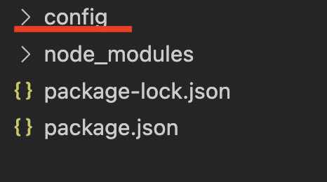
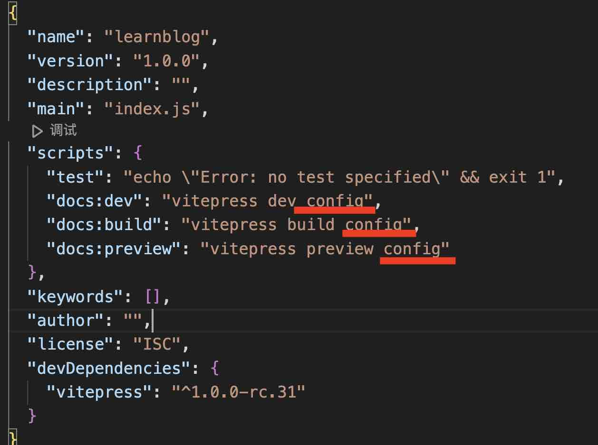
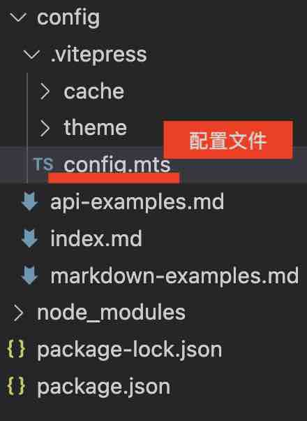
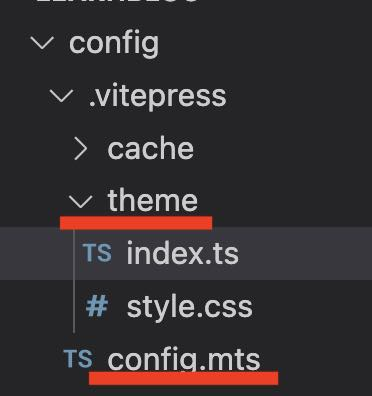

# 快速搭建博客 - 快速安装 | 初始化

搭建博客大致分为两步，第一步生成博客项目，第二步部署到服务器上
下面介绍的便是第一步快速搭建博客，第二步就是部署，这里我们选择的是免费的 GitHub Pages ，部署方式可以参考 [部署到 GitHub Pages](./deploy-to-github-pages.md)

## 安装 vitepress 的先决条件：

- Node.js 版本要高于 18

## 快速步骤

可以直接使用，也可以根据下面的步骤一步一步安装（正常步骤是快速步骤的拆解）：

这里创建的目录是 learnBlog -> 可以改为想要的任何名字

```bash
mkdir learnBlog && cd learnBlog && npm init -y && npm install vitepress -D && npx vitepress init && npm run docs:dev
```

然后在浏览器中打开 `http://localhost:5174/` 即可

## 正常步骤

第一步：选择一个你中的开发目录然后创建一个文件夹 `learnBlog` 并进入到该文件夹中

```bash

 mkdir learnBlog && cd learnBlog

```

第二步：生成 package.json 文件

```bash

npm init-y

```

第三步：安装 vitepress 依赖

```bash

npm installvitepress-D

```

第四步：使用 npx 创建 vitepress 目录

```bash

npx vitepressinit


```

执行上面的命令之后会在在 Terminal 中询问：

1. 在哪里初始化配置
2. 网站标题
3. 网站描述
4. 最后选择主题

- 默认主题
- 默认主题 + 自定义
- 自定义主题

5. 配置文件和主题文件是否使用 Typescript
6. 是否 `vitepress npm script`添加到 package.json 中


第五步：最后执行 `npm run docs:dev`

第六步：在浏览器中打开这个地址 `http://localhost:5174/`

此时已经成功构建一个简单的 Blog

## 快速创建过程中配置简介

上述步骤完成之后得到下面的目录结构：

```
.
├─ docs
│  ├─ .vitepress
│  │  └─ config.js // 配置文件
│  ├─ api-examples.md // api-examples 路由下的内容
│  ├─ markdown-examples.md // markdown-examples 路由下的内容
│  └─ index.md // 首页内容
└─ package.json

```

第一问：配置文件加命名（默认 docs）：

```
◇  Where should VitePress initialize the config?
│  ./docs
```

文件夹名字的更改：


`package.json` 中的 `scripts` 字段的更改：


网站的 title：
更改 `docs/.vitepress/config.js` 文件下面的 `title` 属性

```
◇ Site title:
│ My Awesome Project
```

网站描述：
更改 `docs/.vitepress/config.js` 文件下面的 `description` 属性

```
◇ Site description:
│ A VitePress Site
```

上面的两个配置的是配置文件中网站的 title - description




title 是指网站在浏览器 tab 页上面显示的文字


选择主题：

```
◆ Theme:
│ ○ Default Theme (Out of the box, good-looking docs)
│ ● Default Theme + Customization
│ ○ Custom Theme
```

这里选中的时默认主题 + 自定义主题


如果是默认主题则没有 theme 文件夹
如果是自定义主题则没有 config 文件

## pnpm 问题

在使用 pnpm 作为包管理，并且在 markdown 中使用 vue 时，需要单独再安装一下 `pnpm add vue`

因为其他包管理都会有幽灵依赖的问题，正好可以利用幽灵依赖，而不需要安装，pnpm 不存在幽灵依赖问题所以需要安装`vue`的包

<!-- <script setup>
    const data = useData()
    console.log('data: ', data);
</script> -->

也可直接参照官网的[快速开始](https://vitepress.dev/guide/getting-started)
