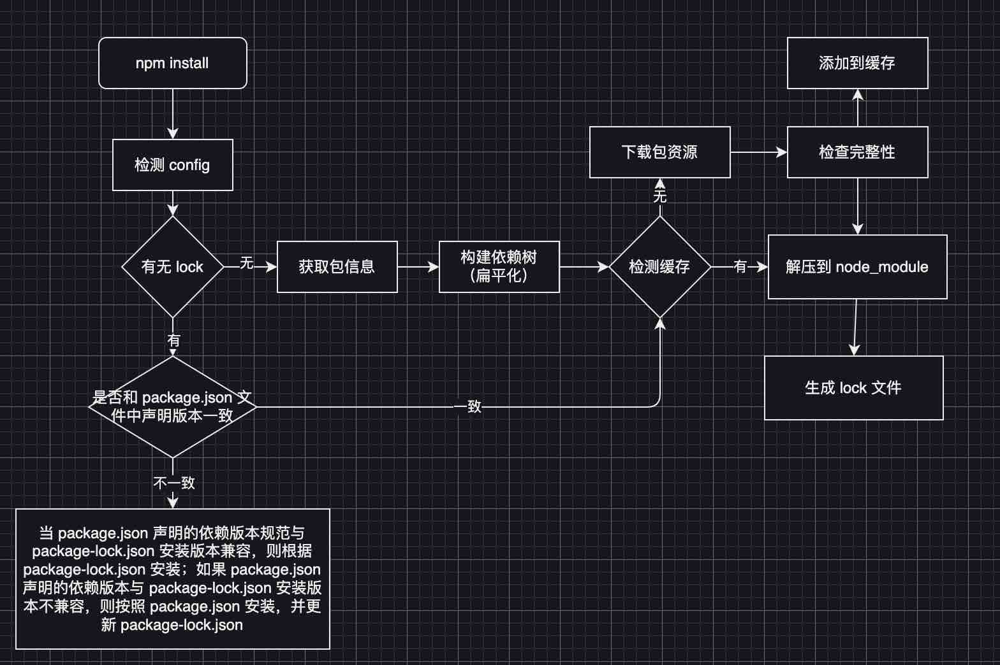

# 前端架构师 - 基础建设与架构设计思想


## 工作中接触到的“好项目”

前端工程化基建和架构设计定义：

1. 从 0 到 1 打造应用的基础设施
2. 确定应用的工程化方案
3. 实现应用构建和发布的流程
4. 设计应用中的公共方法和底层架构


前端业务价值（前端团队的技术能力）

- 团队作战并未单打独斗，那么如何设计工作流程，打造一个众人皆赞的项目根基？
- 项目依赖纷繁复杂，如何做好依赖管理和公共库管理？
- 如何深入理解框架，真正做到精通框架和准确拿捏技术选型？
- 从最基本的网络请求库说起，如何设计一个稳定灵活的多端 fetch 库？
- 如何借助 Low Code 或 No Code 技术，实现越来越智能的应用搭建方案？
- 如何统一中后台项目架构，提升跨业务线的产研效率？
- 如何开发设计一套适合业务的组件库，封装分层样式，最大限度做到复用，提升开发效率？
- 如何设计跨端方案，"Write Once , Run Everywhere" 是否真的可行？
- 如何处理各种模块化规范，以及精确做到代码拆分？
- 如何区分开发边界，比如前端如何更好地利用 Node.js 方案开疆扩土？


## 第一部分 - 前端工程化管理工具


### 安装机制及企业级部署私服原理

#### npm 安装机制与背后思想

有两种安装方式：项目安装和全局安装

Npm 优先安装依赖包到当前项目目录，使得不同应用项目的依赖各成体系。

优点：减轻包作者的 API 兼容性压力

缺点：同一个依赖包可能在电脑上被多次安装





1. 执行 `npm install` 命令之后，首先检查 config，获取 npm 配置，优先级由上向下
   1. 项目级别的 .npmrc
   2. 用户级的 .npmrc
   3. 全局的 .npmrc
   4. npm 内置的 .npmrc
2. 然后检查项目有无 package-lock.json 文件（简称 lock 文件）
   - 有 lock 文件，则检查 lock 文件和 package.json 文件版本是否一致
     - 一致，直接使用 lock 文件中的信息，从缓存中或网络资源中加载依赖
     - 不一致，则按照 package.json 文件安装
   - 无 lock 文件，则根据 package.json 文件递归构建依赖树，然后按照构建好的依赖树下载完整的依赖资源，在下载时会检查是否有相关缓存。
     - 有缓存，则从缓存中解压到 node_modules 中
     - 没有缓存，则先从 npm 远程仓库下载资源，检查包的完整性，并将其添加到缓存，同时解压到 node_modules 中
3. 最后生成 package-lock.json 文件


##### node_modules 扁平化

构建依赖树时，当前依赖项目无论是直接依赖还是子依赖的依赖，都遵循扁平化的原则优先将其放置在 node_modules 根目录下。在这个过程中，遇到相同的模块应先判断已放置在依赖树中的模块版本是否符合对新模块版本要求，如果符合就跳过，不符合则在当前模块的 node_modules 下放置该模块


缺点：其造成幽灵依赖的问题，即可以引用某个依赖，这个依赖并没有出现在 package.json 中


#### npm 缓存机制

1. 当 `npm install` 执行时，会现将依赖下载到缓存中，再将其解压到项目的 node_modules 下
2. 在每次安装资源时，根据 package-lock.json 中存储的 integrity, version, name 信息生成的唯一的 key 对应的缓存记录。如果有缓存，就会找到 tar  包的 hash 值，根据 hash 值找到缓存的 tar 包，并再次将对应的二进制文件解压到相应的项目 node_modules 下，省去网络下载时间


#### npm init

npm init 命令其实就是调用 Shell 脚本输出一个初始化的 package.json 文件


#### npm link

npm link 本质就是软连接

- 为目标 npm 模块创建软链接，将其链接全局模块安装路径下
- 为目标 npm 模块的可执行 bin 文件创建软链接，将其链接到全局 node 命令安装路径 `/usr/local/bin` 下


##### 场景：

假设正在开发项目 project1, 其中有一个包 package1, 对应 npm 模块包的名字 npm-package1, 我们在 package 1 中加入新功能 feature A

先在 package1 目录中执行 npm link 命令，这样 npm link 通过链接目录和可执行文件，可实现 npm 包命令的全局可执行。然后在 project1 中创建链接，执行 npm link npm-package1 命令，这时 npm 就会去 `/usr/local/lib/node_modules/` 路径下寻找是否有 npm-package1 这个包，如果有就建立软连接

调试结束后可以执行 npm unlink 命令以取消关联


#### npx 的作用

npx 在执行模块时会优先安装依赖，但是在安装成功后便删除此依赖。

```bash
> npm install ceate-react-app --save-dev
> ./node_modules/.bin/ceate-react-app cra-project

> npm uninstall create-react-app
```

上面可以简化为

```bash
> npx ceate-react-app cra-project
```


#### npm 多源镜像和企业级的部署私服原理


##### 切换多个镜像

现在 install 

```json
{
  //...
  	"scripts": {
      "preinstall": "node ./bin/preinstall.js"
    }
  //...
}
```


```js
require("child_process").exec("npm config set registry https:xxx")
```


##### 部署私有 npm 镜像

社区 3 中工具：

- nexus
- verdaccio
- cnpm


Nexus 工作在客户端和外部 npm 之间，并通过 Group Repository 合并 npm 仓库及私有仓库，这样就起了代理的转发作用


## CI环境下 npm 优化


### npm ci

- Npm ci 要求项目中必须存在 package-lock.json 或 npm-shrinkwrap.json 文件
- npm ci 完全根据 package-lock.json 文件安装依赖，这样可以保证开发团队成员使用版本一致的依赖
- 因为根据 package-lock.json 文件安装，因此安装过程中，不需要求解依赖满足问题及构造依赖树，安装过程更加迅速
- npm ci 在执行安装时会先删除项目中现有的 node_modules 目录，重新安装
- npm ci 只能一次性安装项目中所有的包，无法安装单个依赖包
- 如果 package-lock.json 文件和 package.json 文件冲突，那么执行 npm ci 命令会报错
- 执行 npm ci 永远不会改变 package.json 文件和 package-lock.json 文件内容

基于此，在 CI 环境下使用 npm ci 代替 npm install


### 为什么需要 lockfiles

Package-lock.json 文件作用是锁定依赖安装结构，目的是保证在任意机器上执行 npm install 命令时都会得到相同的 node_modules 安装结果。


为什么单一的 package.json 不能确定唯一的依赖树

- 不同版本 npm 的安装依赖策略和算法不同
- npm install 将根据 package,json 文件中的 semver-range version 更新依赖，某些依赖项自上次安装以来，可能已发布了新版本


### 要不要将 lockfiles 提交到仓库

这需要看项目定位：

- 开发应用 - 建议将 package-lock.json 文件提交到代码版本仓库，这样可以保证项目成员，运维部署成员或 CI 系统，在执行 npm install 后能得到完全一致的依赖安装内容
- 开发供外部使用的库 - 在不使用 package-lock.json 文件的情况下，可以复用主项目已经加载过的包，避免依赖重复，可减小体积
  - 如果开发的库依赖了一个具有精确版本号的模块，那么提交 lockfiles 到仓库可能会造成同一个依赖的不同版本都被下载的情况。作为库的开发者，如果帧的有使用某个特定版本依赖的需要，一个更好的方式是定义 peerDependencies 内容

推荐做法：将 package-lock.json 提交到代码库中，执行 npm publish 发布库的时候，lockfiles 会被忽略而不会被直接发布出去。


### package.json 和 package-lock.json

- 如果项目中只有 package.json 文件，执行 npm install 之后，会根据 package.json 生成一个 package-lock.json
- 如果项目存在 package.json 和 package-lock.json ，同时两者版本兼容，则npm install会根据 package-lock.json 下载
- 如果两者同时存在，则两者版本不兼容，执行 npm install 时，package-lock.json 文件会自动更新版本，与 package.json 文件的 semver-range 版本兼容


### Package.json 中的 xxxDependencies

- dependencies - 项目依赖
- devDependencies - 开发依赖
- peerDependencies - 同版本依赖
- bundledDependencies - 捆绑依赖
- optionalDependencies - 可选依赖


并不是只有 dependencies 下的模块才会被打包，而 devDependencies 下的模块一定不会被打包，实际上，模块是否作为依赖被打包，完全取决于项目是否引入了该模块。


dependencies 和 devDependencies 在业务中更多起到规范作用


peerDependencies 表示同版本依赖，如果你安装了我，那么最好也安装我对应的依赖

主要使用场景特点：

- 插件不能单独运行，插件正确运行的前提，必须先下载安装核心依赖库
- 不建议重复下载核心依赖库


bundledDependencies 表示捆绑依赖，和 npm pack 有关。不常用

optionalDependencies 表示可选依赖，即使安装失败，也不会影响整个安装过程。一般很少使用。


## corejs 及 polyfill 理念


本章学习目标：

- 通过 core-js，我们可以窥见前端工程化的方方面面
- Core-js 和 Babel 深度绑定，因此学习 core-js 也能帮助开发者更好地理解 Babel 生态，进而加深对前端生态的理解
- 通过 core-js 的解析，我们可以梳理前端领域一个极具特色的概念 - polyfill


### Corejs 工程

Core-js 是一个通过 lerna 搭建的 Monorepo 风格的项目，在它的包文件中，我们可以看到五个相关的包：core-js, core-js-pure, core-js-compact, core-js-builder, core-js-bundle。

- Core-js - 实现的基础 polyfill 能力是整个 core-js 的核心

  ```js
  import "core-js" // 全局引入
  ```

- Core-js-pure - 提供不污染全局变量的 polyfill 能力

  ```js
  import _from from "core-js-pure/features/array/from"
  ```

- Core-js-compact 维护了遵循 Browserslist 规范的 polyfill 需求数据

  ```js
  const { list, targets } = require("core-js-compact")({ targets: "> 2.5%" })
  ```

- Core-js-builder 可以结合 core-js-compact 及 core-js 使用

  ```js
  require("core-js-builder")({
  	targets: "> 0.5%",
  	filename: "./my-core-js-bunlde.js"
  }).then(core => {}).catch(err => {})
  // 符合需求的 core-js polyfill 将被打包到 my-core-js-bundle.js 文件中
  ```


Core-js 将自身充分解耦，提供的多个包都可以被其他项目依赖

- core-js-compact 可以被 Babel 生态使用，由 Babel 分析出环境需要的 polyfill.
- Core-js-builder 可以被 Node.js 服务使用，构建出不同场景所需的 polyfill 包。

从宏观设计上来说，core-js 体现了工程复用能力。


#### 如何复用一个 polyfill

站在工程化的角度，从 core-js 的视角出发来看，

此处以 Array.prototype.every 的 polyfill 为例。

思路：

Core-js-pure 不同于 core-js，它提供了不污染命名空间的引用方式，因此它的核心逻辑实现，就需要被 core-js-pure 和 core-js 同时引用，只要区分最后导出的方式即可。

实际上，  Array.prototype.every  的 polyfill 核心逻辑在 ./packages/core-js/modules/es.array.every.js 中实现

在 core-js 中，作者通过 ../internals/export 方法导出了实现原型。表示 core-js 需要在数组 Array 的原型之上以”污染数组原型“的方式来扩展方法

在 core-js-pure 则单独维护了一份 export 镜像 ../internals/export

> 本书作者认为：既然是 Monorepo 风格的仓库，也许一种更好的设计是将 core-js 核心 polyfill 单独放入一个包中，由 core-js 和 core-js-pure 分别进行引用 - 这种方式更能利用 Monorepo 的能力，且能减少构建过程中的魔法常量处理。


#### 寻找最佳的 polyfill 方案


##### polyfill 是什么？

 简单来说，polyfill 就是用社区上提供的一段代码，让偶我们能在不兼容某些新特性的浏览器上使用该新特性。

:tipping_hand_man:不一定是新特性，也可能是某些不统一的 API


##### 为什么需要polyfill？

随着前端的发展，尤其是 ECMAScript 的迅速成长及浏览器的频繁的更新迭代。


##### 如何能再工程中寻找并设计一个”最完美“的 polyfill 方案？

最完美：

- 侵入性最小
- 工程化，自动化程度最高
- 业务影响最低


###### 第一种方式：

手动打补丁：es5-shim, es6-shim

特点：简单直接

缺点：不是一个工程化的解决方案，笨重，难以维护


###### 第二种方式：

Babel-polyill 结合 @babel/preset-env + useBuiltins(entry) + preset-env targets 

```json
{
  "presets": [
    "@babel/env", {
      "useBuiltIns": "entry",
      "targets": {chrome: 44}
    }
  ]
}
```


特点：@babel/preset-env 定义了 Babel 所需插件，同时 Babel 根据 preset-env targets 配置的支持环境自动按需加载 polyfill.

缺点：业务的代码中并没有用到配置环境填充的 polyfill, 那么 polyfill 的引入反而带来了引用浪费的问题，实际上，环境需要是一回事儿，代码需要又是另外一回事儿。


第三种方式：

Babel-polyill 结合 @babel/preset-env + useBuiltins(usage) + preset-env targets 

其中区别在于 useBuiltIns 的配置一个是 entry 一个是 usage

Entry： 在工程代码入口处需要添加 `imort '@babel/polyfill'`

Usage: 可以真正根据代码情况分析 AST 并进行更细粒度的按需引用。

```json
{
  "presets": [
    "@babel/env", {
      "useBuiltIns": "usage",
      "targets": {chrome: 44}
    }
  ]
}
```


第四种方式：

在动态打补丁，以 Polyfill.io 为代表。它提供了 CDN 服务，使用者可以根据环境生成打包链接。


按需打补丁意味着 bundle 体积更小，直接决定了应用的性能。

按需主要包括两方面：

- 按照用户终端环境打补丁
- 按照业务代码使用情况打补丁


## Babel

`Babel is JavaScript compiler`

Babel 就是一个 Javascript 的编译器


一方面：主要是前端语言特性和宿主环境（浏览器，Node.js 等）高速发展，但宿主环境无法第一时间支持新语言特性，而且开发者又需要兼容各种宿主环境，因此语言特性的降级称为刚需。

一方面：前端框架"自定义 DSL"的风格越来越明显，使用前端各种代码被编译为 JavaScript 代码的需求成为标配。

- 语法转换，一般是高级语言特性的降级
- Polyfill 特性的实现和接入
- 源码转换，比如 JSX 等


Babel 的设计需要秉承一下理念：

- 可插拔（Pluggable）
- 可调试（Debuggable）
- 基于协定（Compact）


编译是 Babel 的核心目标，因此它自身的实现基于编译原理，深入 AST 来生成代码，同时需要工程化协作，需要和各种工具相互配合。


### Babel Monorepo 架构包解析


Babel 是一个使用 Lerna 构建的 Monorepo 风格的仓库，其 ./packages 目录下有 140 多个包，这些包的作用可以分为两种：

- Babel 的一些包的意义在工程上起作用，因此对于业务来说是不透明的，比如一些插件可能被 Babel preset 预设机制打包并对外输出。
- Babel 的另一些包是供纯工程项目使用的，或者运行在 Node 环境中。


@babel/core 是 Babel 实现转换的核心，它可以根据配置进行源码的编译转换。

@babel/cli 是 Babel 提供命令行，可以在终端中通过命令行方式运行，编译文件或目录。


@babel/cli 负责获取配置内容，并最终依赖 @babel/core 完成编译。


@babel/standalone 可以在非 Node.js 环境（比如浏览器环境）下自动编译 type 值为 text/babel 或 text/jsx 的 script 标签。


@babel/parser 是 Babel 用来对 JavaScript 语言进行解析的解析器。它的实现主要依赖并参考了 acorn 和 acorn-jsx


针对源码编译得到的 AST，有了 AST，还需要对它进行修改，以产出编译后的代码.

 @babel/types 该包提供了对具体的 AST 节点进行修改的能力。

得到编译后的 AST 之后，最后使用 @babel/generator 对新 AST 进行聚合并生成 JavaScript 代码。

```
 
 Source Code => @babel/core => AST => @babel/traverse(@babel/types) => AST => @babel/generator => Output code
 
```


在工程中，我们需要 Babel 做到的编译降级，而这个编译降级一般通过 @babel/preset-env 来配置。@babel/preset-env 允许我们配置需求支持的目标环境，利用 babel-polyfill 完成补丁接入。


@babel/polyfill 其实就是 core-js 和 regenerator-runtime 两个包结合。


#### @babel/plugin-transform-runtime 和 @babel/runtime

@babel/plugin-transform-runtime 可以重复使用 babel 注入的 helper 函数，达到节省代码空间的目的。

@babel/runtime 中含有 Babel 编译所需的一些运行时 helper 函数，同时提供了 regenerator-runtime 包，对 generator 和 async 函数进行编译降级。


- @babel/plugin-transform-runtime 需要和 @babel/runtime  配合使用
- @babel/plugin-transform-runtime 在编译时使用，作为 devDependencies.
- @babel/plugin-transform-runtime 将业务代码进行编译，引用 @babel/runtime 提供的 helper 函数，达到缩减编译产出代码体积的目的
- @babel/runtime 用于运行时，作为 dependencies.
- @babel/plugin-transform-runtime 和 @babel/runtime   配合使用除了可以实现 “代码瘦身”，还能避免污染全局作用域。

------------


- @babel/plugin 是 Babel 插件集合
- @babel/plugin-syntax-* 是 Babel 的语法插件
- @babel/plugin-proposal-* 用于对提议阶段的语言特性进行编译转换
- @babel/plugin-transform-* 是 Babel 的转换插件
- @babel/template 可以将字符串代码转换为 AST,
- @babel/node 提供了在命令行执行高级语法的环境
- @babel/register 实际上为 require 增加了一个 hook，使用之后，所有被 node.js 引用的文件都会先被 Babel 转码


### Babel 工程生态架构设计和分层理念


辅助层 -> 基础层 -> 胶水层 -> 应用层


```
应用层：
@babel/cli  @babel/standalone @babel/loader @babel/node @babel/register @babel/eslint-parser
```


```
胶水层：
@babel/plugin @babel/presets @babel/polyfill @babel/helpers @babel/runtime
```


```
基础层：
@babel/parser => @babel/polyfill => @babel/runtime
```


```
辅助层：
@babel/types @babel/code-frame @babel/template @babel/heighlight
```


基础层提供了基础的编译能力，完成分词，解析 AST ，生成产出代码的工作。在基础层中，我们将一些抽象能力下沉到辅助层，这些抽象能力被基础层使用。在基础层之上的胶水层，我们构建了如 @babel/presets 等预设/插件能力，这些类似“胶水”的包完成了代码编译降级所需补丁的构建，运行时逻辑的模块化抽象等工作。在最上层的应用层，Babel 生态提供了终端命令行，浏览器编译等应用级别的能力

 


## 前端工具链：统一标准化的 babel-preset


### 应用项目构建和公共库构建的差异

- 对于一个应用项目来说，它“只要能在需要兼容的环境中跑起来”就达到基本目的
- 对于一个公共库来说，它可能被各种环境所引用或需要支持各种兼容需求，因此它要兼容性能和易用性，要注重质量和广泛度


##### 一个企业级公共库的设计原则

对于开发者，应最大确保开发体验：

- 最快地搭建调试和开发环境
- 安全地发版维护

对于使用者，应最大化确保使用体验

- 公共库文档建设完善
- 公共库质量有保障
- 接入和使用负担最小


基于上述原则，在团队里设计一个公共库前，需要考虑以下问题。

- 自研公共库还是使用社区已有的“轮子”
- 公共库的运行环境是什么？这将决定公共库的编译构建目标。
- 公共库是偏向业务还是“业务 free” 的？这将决定公共库的职责和边界


#### 指定一个统一标准化的 babel-preset

设计方案：

- 支持 NODE_ENV = 'development' | 'production' | 'test' 三种环境，并有对应的优化措施
- 配置插件默认不开启 Babel loose: true 配置选项，让插件的行为尽可能的遵循规范，但对有较严重性能损耗或有兼容性问题的场景，需要保留修改入口。
- 方案落地后，应该支持应用编译和公共库编译。
  - @Lucas/babel-preset/app - 负责编译除 node_modules 以外的业务代码
  - @Lucas/babel-preset/dependencies - 负责编译 node_modules 第三方代码
  - @Lucas/babel-preset/library - 按照当前 Node.js 环境编译输出代码
  - @Lucas/babel-preset/library/compact - 会将代码编译降级为 ES5 代码

对于企业级公共库，建议使用标准 ES 特性来发布；对 Tree Shaking 有强烈需求的库，应同时发布 ES Module 格式代码。企业级公共库发布的代码不包含 polyfill，由使用方统一处理。


## 从 0 到 1构建一个符合标准的公共库


## 代码拆分与按需加载

代码拆分和按需加载能够使初始代码的体积更小，页面加载更快


### 代码拆分与按需加载技术的实现


按需加载表示代码模块在交互时需要动态导入；

按需打包针对第三方依赖库及业务模块，只打包真正在运行时可能会用到的代码；


按需打包一般通过两种方法实现：

- 使用 ES Module 支持的 Tree Shaking 方案，在使用构建工具打包时完成按需打包。
- 使用 babel-plugin-import 为主的 Babel 插件实现自动按需打包


1. ##### 使用 Tree Shaking 实现按需打包


如果第三方库提供了 ES Module 版本，并开启了 Tree Shaking 功能，那么我们就可以通过 “摇树” 特性将不会被使用的代码在构建阶段移除


2. ##### 编写 Babel 插件实现自动按需打包

如果第三方库不支持 Tree Shaking 方案，我们依然可以通过 Babel 插件改变业务代码中对模块的引用路径来实现按需打包。


比如：babel-plugin-import

```
import { Button, Input } from 'antd'
```

转化为

```
import _Button from 'antd/lib/button'
import _Input from 'antd/lib/input'
```


#### 重新认识动态导入

标准用法的 import 操作属于静态导入，会使所有被导入的模块在加载时就被编译。

当我们需要按需加载一个模块或根据运行时事件选定一个模块时，动态导入就变得尤为重要。


Import() 是一个 Functon-like 语法形式。

- 动态导入并非继承自 Function.prototype，因此不能使用 Function 构造函数原型上的方法。
- 动态导入并非继承自 Object.prototype，因此不能使用 Object 构造函数原型上的方法。


dynamicImport 函数：

```
```


通过动态插入一个 script 标签来实现对目标 script URL 的加载。并将模块导出内容赋值给 Window 对象。


webpack 提供了三种支持代码拆分和按需加载相关能力

- 通过入口配置手动分割代码
- 动态导入
- 通过 splitChunk 插件提供公共代码（公共代码分割）。


动态导入：通过调用 import()，被请求的模块和它引用的所有子模块会被分离到一个单独的 chunk 中。


#### Webpack 中的 splitChunk 插件和代码拆分

 代码拆分的核心意义在于避免重复打包及提高缓存利用率，进而提升访问速度。

比如：

- 不常变化的第三方依赖库 - 方便对第三方依赖库缓存
- 抽离公共逻辑 - 减小单个文件的体积


Webpack 4.0  splitChunk 插件在模块满足下述条件时，将自动进行代码拆分：

- 模块时可以共享的（即被重复引用），或存储于 node_modules 中
- 压缩前的体积大于 30 kb
- 按需加载模块时，并行加载的模块数不得超过 5 个
- 页面初始化加载时，并行加载的模块数不得超过 3 个


## Tree Shaking: 移除 JavaScript 上下文中的未引用代码


在传统的编译型语言中，一般由编译器将未引用代码从 AST 中删除，而前端 JS 中并没有正统的的“编译器”概念，因此 Tree Shaking 需要工具链中由工程化工具实现。


#### Tree Shaking 为什么要依赖 ESM 规范？

Tree Shaking 是在编译时进行未引用代码消除的，因此它需要在编译时确定依赖关系，进而确定哪些代码可被“摇掉”，而 ESM 规范具备一下特点：

- import 模块名只能是字符串常量。
- import 一般只能在模块的顶层出现。
- import 依赖的内容是不可变的

这些特点使得 ESM 规范具有静态分析能力。而 CommonJS 定义的模块化规范，只有在执行代码后才能动态确定依赖模块，因此不具备支持 Tree Shaking 的先天条件。


#### 什么是副作用模块，如何对副作用模块进行 Tree Shaking 操作


> 副作用（effect 或者 side effect）指在导入时会执行特殊行为的代码，而不是仅仅暴露一个或多个导出内容。polyfill 就是一个例子，尽管其通常不提供导出，但是会影响全局作用域，因此 polyfill 将被视为一个副作用。


上面是 webpack 官网上的一段话，概括起来**副作用就是会影响全局作用域的代码**


具有副作用的模块难以被 Tree Shaking 优化

webpack 在解决副作用的是怎么做的？

- 利用 package.json 的 sideEffect 属性来告诉工程化工具，哪些模块具有副作用，哪些模块不具有副作用


##### 一个 Tree Shaking 友好的导出模式

不利于进行 Tree Shaking 处理的情况如下：

- 导出一个包含多个属性和方法的对象
- 导出一个包含多个属性和方法的类
- 使用 export default 方法导出

推荐：遵循原子化和颗粒化原则导出 `export`


#### 前端工程化生态和 Tree Shaking 实践


##### Babel 和 Tree Shaking

前提： Tree Shaking 依托于 ESM 规范

问题：有些场景需要 Babel 将代码编译为 CommonJS 规范，比如 Jest。Jest 基于 Node.js 开发

解决方法：根据环境不同采用不同的 Babel 配置

生产：

```js
{
	presets: [
		["@babel/preset-env", { modules: false }]
	]
}
```

测试：

```js
{
	presets: [
		["@babel/preset-env", { modules: "commonjs" }]
	]
}
```


##### Webpack 和 Tree Shaking

mode 为 production 时，会自动开启 Tree Shaking

```js
{
	mode: "production",
	optimization: {
		usedExports: true,
		minimizer: {
			new TerserPlugin({}) // 支持删除未引用代码的压缩器
		}
	}
}
```


Webpack 真正执行 Tree Shaking 时依赖了 TerserPlugin, UglifyJS 等压缩插件。Webpack 负责对模块进行分析和标记，而这些压缩插件负责根据标记结果进行代码删除。webpack 在分析时有三类相关标记。

- used export： 被使用过的 export 会被标记为 used export.
- unused harmony export：没被使用过的 export 会被标记为 unused harmony export.
- harmony import: 所有 import 会被标记为 harmony import


##### 设计一个兼顾 Tree Shaking 和易用性的公共库

如果希望一个 npm 包既能提供 ESM 规范代码，又能提供 CommonJS 规范代码

实际上 npm package.json 及社区工程化规范解决了这个问题

```json
{
	"name": "Lib",
	"main": "dist/index.cjs.js",
  "module": "dist/index.esm.js",
}
```


当 `require` 执行时，webpack 会找到 `dist/index.cjs.js`

当 `import`执行时， webpack 会找到 `dist/index.esm.js` 


#### CSS 和 Tree Shaking


CSS 的 Tree Shaking 要在样式表中找出没有被应用的选择器的样式代码，并对其进行删除。

- 遍历所有 CSS 文件的选择器
- 在 JS 代码中对所有 CSS 文件的选择器进行匹配
- 如果没有匹配到则删除对应选择器的样式代码


在样式世界中，PostCSS 起到了 Babel 的作用。PostCSS 提供了一个解析器，能够将 CSS 解析成 AST，我们可以通过 PostCSS 插件对 CSS 对应的 AST 进行操作，实现 Tree Shaking。


推荐一个 wepack 插件 purgecss-webpack-plugin


## 工程化思维：主题切换架构


主要讲了怎么写一个 PostCSS 插件，将下面的内容进行转换（一般对于主题切换处理会使用其他方法） 


```css
a {
	color: cc(GBK05A)
}
```

转换为：

```css
a {
	color: #333
}

html[data-theme='dark'] a {
	color: #333
}
```


## 14 解析 Webpack 源码，实现工具构建


## 15 跨端解析小程序多端方案


### 小程序多端方案出现的背景

自微信小程序在用户规模及商业化方面取得巨大成功后，各巨头也纷纷建立起自己的小程序，这些小程序设计原理类似，但是开发方式并不互通。在此背景下，效率为先，也就出现了各种小程序多端方案。


小程序多端方案的愿景很简单，就是使用一种 DSL，实现 “write once, run everywhere”.


小程序多端放哪根据技术实现的不同可以大体划分为三类：

- 编译时方案
- 运行时方案
- 编译时和运行时的结合方案

目前主流的是第三种。


小程序多端方案最终对外提供的使用方式可以分为以下几种：

- 类 Vue 风格框架
- 类 React 风格框架
- 自定义 DSL 框架


### 编译时方案 - 简洁

vue 的设计风格和各小程序设计风格更加接近，因此， vue DSL 静态编译方案相对容易实现。

vue 中单文件组件主要由 template, script, style 组成，分别对应小程序中的 . wxml template 文件，.js .json 文件，.wxss 文件

小程序基本上都可以兼容 H5 环境中的 CSS, 因此 style 部分基本上可以直接平滑迁移，将 template 转换为 .wxml 文件时需要进行 HTML 标签和模板语法的转换。


- 开发者代码（类 vue/ 类 react / 其他）
- AST 产出（AST 分析）
- 新 AST 产出（AST 修改）
- 小程序代码（AST 产出）


### 运行时方案


对于一段 vue 代码，通过响应式理念监听数据变化，触发视图修改，放在小程序中，多端方案要做的就是监听数据变化，调用 setData 方法触发小程序渲染层的变化。


以微信小程序为例，微信小程序平台规定，小程序页面中需要有一个 Page 方法，用于生成一个小程序实例，该方法是小程序官方提供的 API。

对于业务写的 new vue 代码，多端平台要手动执行微信小程序平台的 page 方法，完成初始化处理

```
new Vue()

// 在 vue 实例化时，会调用 vue.init 
Vue.init = () => {
	// 魔改 vue.init 方法，保留原始逻辑，并调用小程序 Page 方法
	Page()
}
```


多端方案内容了 vue 运行时版本，并实例化一个 vue 实例，同时在初始化阶段调用了小程序平台的 Page 方法，因此也就有了一个小程序实例。


#### 具体实施：

vue 基于响应式对数据进行监听，在数据改动时，新生成一份虚拟节点 VNode。接下来对比新旧两份虚拟节点，找到 diff, 并进行 patch 操作，最终更新真实的 DOM。

因为小程序架构中并没有提供操作小程序节点的 API 方法，因此对于小程序多端方案，我们需要进行 vue 源码中的 patch 操作。又因为小程序隔离了渲染层和逻辑层，因此不需要处理渲染层，只需要调用 setData 方法，更新一份最新的数据即可


我们秉承“数据部分让 vue 运行时版本接手，渲染部分让小程序架构接手”


### 类 React 风格的编译时和运行时结合方案


React 团队将 Reconciler 部分作为一个独立的 npm 包（react-reconiler）发布。在 react 环境下不同平台可以依赖 hostConfig 配置了 react-reconciler 互动，连接并使用 reconiler 能力，因此，不同平台的 renderers 函数在 hostConfig 中内容基本方法，即可构造自己的渲染逻辑，


在初始化阶段及第一次进行 mount 操作中，我们通过 setData 方法初始化小程序。具体组发是，通过递归数据结构渲染小程序页面。接着，当数据发生变化时，我们通过 React Reconciler 阶段的计算信息，以及自定义 HostConfig 衔接函数更新数据，并通过 setData 方法触发小程序的渲染更新。

 

#### 剖析 Taro Next

Taro 团队提供的 taro-react 包是用来连接 react-reconciler 和 taro-runtime 的。它主要负责实现 HostConfig 配置。

Taro-runtime 模拟了  DOM/BOM API，但是在小程序环境下，它并不能直接操作 DOM 节点，而是操作数据（即前面提到的 VNodeData,对应 taro 里面的 TaroNode）


### 小程序多端方案的优化


小程序多端框架主要由编译时和运行时两部分组成，一般来说，编译时做的事情越多，也就意味着运行时越轻量，负担越小，性能也越好。

厚重的运行时一般意味着需要将完整的组件树从逻辑层传输到视图层，这将导致数据传输量增大，而且页面中存在更多的监听器。

随着终端性能的增强，找到编译时和运行时所承担工作的平衡点，也显得至关重要。


一般可以从一下几个方面来进一步实现性能优化：

- 框架的包的大小：小程序的初始化加载性能直接依赖于资源的包大小，因此小程序多端框架的包大小至关重要。为此，各解决方案都从不同角度完成瘦身，比如 Taro 实现更轻量的 DOM/BOM API，不同 jsdom(size: 2.1MB)，Taro 的核心 DOM/BOM API 代码只有不到 1000 行。
- 数据更新粒度：在数据更新阶段，小程序的 setData 方法所负载的数据一直是重要的优化方向，目前已经成为默认的常规优化方向，那么利用框架来完成 setData 方法调用优化也就理所应当了。比如：数据负载的扁平化处理和增量处理都是常见的优化手段。


## 从移动端跨平台到 Flutter 的技术变革


### 移动端跨平台出现的背景：

- 移动端原生技术需要配备 IOS 和 Android 两个团队及技术栈，且存在发版周期限制，在开发效率上存在天然缺陷。
- 原生跨平台技术虽然“出道”较早，但是个方案都难以达到完美程度，因此没有大一统的技术垄断。


Hybrid 时期：

- HTML + JS + CSS
- Cordova
- Ionic

OEM 时期：

- React Native
- Weex

自渲染时期：

- Flutter


最早的移动端跨平台是跨平台实践就是通过 WebView 双端运行 Web 代码。

虽然 IOS 和 Android 系统难以统一，但是它们都对 Web 技术开放。


JSBridge 是指：H5（Web View 容器）和原生平台的交互

在原生平台中，JS 代码是运行在一个独立的上下文环境中的，这个独立的上下文环境和原生能力的交互过程是双向的。


JS 调用原生的能力：

- 注入 API - 原生平台通过 WebView 提供的接口，向 JS 上下文中（一般使用 Window 对象）注入相关方案和数据
- 拦截 URL Scheme - 前端发送定义好的 URL Scheme 请求，并将相关数据放在请求体中，该请求被原生平台拦截后，由原生平台做出响应


**原生能力调用 JS：**

原生平台可以通过 WebView API 直接执行 JS 代码


#### 缺点：

- JS 上下文和原生通信频繁，导致性能较差。
- 页面逻辑由前端负责编写，组件也是前端渲染而来的，造成性能短板
- 运行 JS 的 Web View 内核在各平台上不统一
- 国内厂商对于系统的深度定制，导致内核碎片化


### React Native - OEM 的 Hybrid 方案

主要的思想：开发者依然使用 Web 语言（如 React 框架或其他 DSL），但渲染基本交给原生平台处理。

好处：视图层摆脱 WebView 的束缚，保障了开发体验，效率及使用性能。


React Native 主要由 JS, C++, IOS/Android 三层组成，最重要的 C++ 层实现了动态链接库，起到了衔接前端和原生平台的作用。


#### 缺点：

- 数据通信过程是异步的，通信成本很高
- React Native 仍有部分组件和 API 并没有实现平台统一


### Flutter 新贵背后的技术变革

 Flutter 组件依赖自身高性能的渲染引擎进行视图渲染。

每个组件会被渲染在 Skia 上， Skia 是一个 2D 绘图引擎库，具有跨平台的特点。Skia 唯一需要的就是原生平台提供 Canvas 接口，实现绘制。


Flutter 组件分为两种类型， StatelessWidget 无状态组件和 StatefullWidget 有状态组件。


Flutter 技术方案主要分为三层：

- Framework - 有 Dart 语言实现，业务代码直接运行在此层，提供了 Material Design 风格的组件，以及适合 IOS 系统的 Cupertino 风格的组件 
- Engine - 主要由 C 或 C++ 实现，通过内置的 Dart 运行时，Flutter 提供了 Debug 模式下对 JIT（Just in time）的支持，以及在 Release 和 Profile 模式下的 AOT(Ahead of time) 编译生成原生 ARM 代码的能力
- Embedder - 最底层的嵌入层


Flutter 有了更好的跨端一致性和稳定性，以及更高的性能表现。