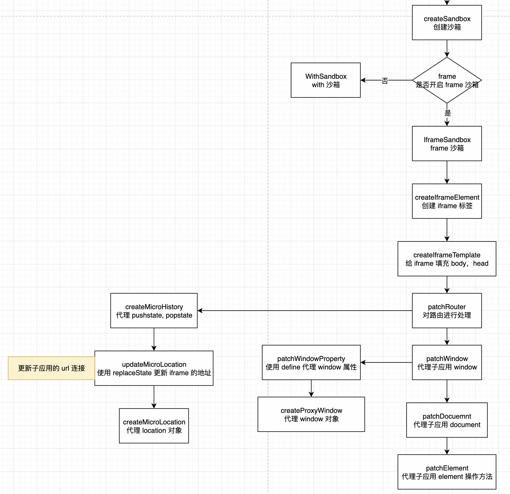

# 创建沙箱以 iframe 为例

由 [创建上下文实例](./sourceCreateSandbox.md) 可知创建实例 `new IframeSandbox()`

## IframeSandbox - iframe 沙箱类

- 给 appName 和 url 赋值
- 获取全局的 location, host
- 创建 iframe 标签 - createIframeElement
- 子应用全局变量 microAppWindow
- 可以先忽略 this.patchIframe ，这个函数相当于 setTimeout(() => {xxx}, 0)
- 给 iframe 标签填充内容 head 和 body 标签
- 插件处理 - getSpecialProperties 简单可以自行看一下
- 代理 pushstate, replacestate, popstate 监听, 更新 iframe url， 代理 location - patchRouter
- 对 window 对象进行 defineProperty 代理, function 进行缓存，非函数进行代理 - patchWindow
- 对 document 上的属性进行重写 - patchDocument
- 子应用操作 dom 时，使用子应用下面的 element 的操作方法，以及属性的操作方法 - patchElement
- 初始化一些挂载在全局上面的 micro-app 特殊全局变量 - initStaticGlobalKeys

```ts
export default class IframeSandbox {
  static activeCount = 0 // number of active sandbox
  private active = false
  private windowEffect!: CommonEffectHook
  private documentEffect!: CommonEffectHook
  private removeHistoryListener!: CallableFunction
  // Properties that can be escape to rawWindow
  public escapeProperties: PropertyKey[] = []
  // Properties escape to rawWindow, cleared when unmount
  public escapeKeys = new Set<PropertyKey>()
  public deleteIframeElement: () => void
  public iframe!: HTMLIFrameElement | null
  // Promise used to mark whether the sandbox is initialized
  public sandboxReady!: Promise<void>
  public proxyWindow: WindowProxy & microAppWindowType
  public microAppWindow: microAppWindowType // 当前子应用 window 全局
  public proxyLocation!: MicroLocation
  public baseElement!: HTMLBaseElement
  public microHead!: HTMLHeadElement
  public microBody!: HTMLBodyElement // 
  // TODO: 放到 super中定义，super(appName, url)，with沙箱也需要简化
  public appName: string // 子应用名称
  public url: string // 子应用 url

  constructor(appName: string, url: string) {
    // micro-app 子应用名字
    this.appName = appName
    // 子应用链接
    this.url = url

    // 全局 location
    const rawLocation = globalEnv.rawWindow.location
    const browserHost = rawLocation.protocol + '//' + rawLocation.host
    // 创建一个 iframe 插入到 body 中 => <iframe url="xxx" style="display: none"></iframe>
    // 返回的是一个删除 iframe DOM 的函数
    this.deleteIframeElement = this.createIframeElement(appName, browserHost + rawLocation.pathname)

    // 子应用 iframe 的 window 对象
    this.microAppWindow = this.iframe!.contentWindow

    // this.patchIframe - 相当于 setTimeout(() => {}, 0)
    this.patchIframe(this.microAppWindow, (resolve: CallableFunction) => {
      // create new html to iframe
      // 给 iframe 添加响应的内容 body, head 标签
      this.createIframeTemplate(this.microAppWindow)
      // get escapeProperties from plugins
      // 可以逃逸到外部的全局变量(escapeProperties中的变量会同时赋值到子应用和外部真实的window上)
      // 将全局和当前子应用的插件合并到 this.escapeProperties 属性上
      this.getSpecialProperties(appName)
      // patch location & history of child app
      // 构建子应用连接 - 代理 pushstate, replacestate, popstate 监听, 更新 iframe url， 代理 location
      this.proxyLocation = patchRouter(appName, url, this.microAppWindow, browserHost)
      // patch window of child app
      // 对 window 对象进行 defineProperty 代理, function 进行缓存，非函数进行代理
      this.windowEffect = patchWindow(appName, this.microAppWindow, this)
      // patch document of child app
      // 对 document 上的属性进行重写
      this.documentEffect = patchDocument(appName, this.microAppWindow, this)
      // patch Node & Element of child app
      // 子应用操作 dom 时，使用子应用下面的 element 的操作方法，以及属性的操作方法
      patchElement(appName, url, this.microAppWindow, this)
      /**
       * create static properties
       * NOTE:
       *  1. execute as early as possible
       *  2. run after patchRouter & createProxyWindow
       */
      // 初始化一些挂载在全局上面的 micro-app 特殊全局变量
      this.initStaticGlobalKeys(appName, url, this.microAppWindow)
      resolve()
    })
  }


}
```

## createIframeElement | createIframeTemplate - 创建并填充 iframe 元素


createIframeElement：

- 创建 iframe 元素
- 给 iframe 元素添加 src, style, id 属性, style 为 display: none 不可见状态
- 插入到 body 中
- 返回一个删除当前 iframe 元素的函数

```ts
  createIframeElement (
    appName: string,
    browserPath: string,
  ): () => void {

    // 创建一个 iframe 元素
    this.iframe = pureCreateElement('iframe')

    const iframeAttrs: Record<string, string> = {
      src: microApp.options.iframeSrc || browserPath,
      style: 'display: none',
      id: appName,
    }

    Object.keys(iframeAttrs).forEach((key) => this.iframe!.setAttribute(key, iframeAttrs[key]))

    // effect action during construct
    // 创建一个 iframe 插入到 body 中
    globalEnv.rawDocument.body.appendChild(this.iframe)

    /**
     * If dom operated async when unmount, premature deletion of iframe will cause unexpected problems
     * e.g.
     *  1. antd: notification.destroy()
     * WARNING:
     *  If async operation time is too long, defer cannot avoid the problem
     * TODO: more test
     */
    return () => defer(() => {
      // default mode or destroy, iframe will be deleted when unmount
      this.iframe?.parentNode?.removeChild(this.iframe)
      this.iframe = null
    })
  }
```

createIframeTemplate：

- 清除子应用 iframe 中所有的 DOM
- 创建一个 html 标签，并插入 head, body 标签
- 添加到 iframe 中
- 记录 iframe 的 body 和 head 标签

```ts
  // 给 iframe 添加内容 body, head 标签
  private createIframeTemplate (microAppWindow: microAppWindowType): void {
    const microDocument = microAppWindow.document
    clearDOM(microDocument)
    const html = microDocument.createElement('html')
    html.innerHTML = '<head></head><body></body>'
    microDocument.appendChild(html)

    // 记录iframe原生body
    this.microBody = microDocument.body
    this.microHead = microDocument.head
  }
```


## patchRouter - 派发路由

- 拼接当前子应用的 host - childHost
- 拼接当前子应用的 fullPath - childFullPath

```ts
export function patchRouter (
  appName: string,
  url: string,
  microAppWindow: microAppWindowType,
  browserHost: string,
): MicroLocation {
  // 此 url 是传入的子应用标签的 url
  const childStaticLocation = createURL(url)
  const childHost = childStaticLocation.protocol + '//' + childStaticLocation.host
  // 子应用完整的 url
  const childFullPath = childStaticLocation.pathname + childStaticLocation.search + childStaticLocation.hash

  // rewrite microAppWindow.history
  // iframe 下面的 history API 
  const microHistory = microAppWindow.history
  // iframe 下面的 replaceState API 
  microAppWindow.rawReplaceState = microHistory.replaceState
  // createMicroHistory - 代理 pushState, replaceState, state
  // createMicroHistory => 代理全局 globalEnv.rawWindow.history
  // 合并子应用和父应用 history 
  assign(microHistory, createMicroHistory(appName, microAppWindow.location))

  /**
   * Init microLocation before exec sandbox.start
   * NOTE:
   *  1. exec updateMicroLocation after patch microHistory
   *  2. sandbox.start will sync microLocation info to browser url
   */
  // 使用子应用 frame 沙箱的 window 调用响应的 method - pushState, replaceState
  updateMicroLocation(
    appName,
    childFullPath,
    microAppWindow.location,
    'prevent'
  )

  // create proxyLocation
  // location 代理 assign, replace, reload, self, fullPath
  return createMicroLocation(
    appName,
    url,
    microAppWindow,
    childStaticLocation,
    browserHost,
    childHost,
  )
}

```

### createMicroHistory - 创建

- proxy 代理全局变量上面的 window.history 方法
- 对 state, pushState, replaceState 进行特殊处理，如果全局调用 pushState 或者 replaceState 方法，则需要将子应用的 history 进行更新
- 

```ts
export function createMicroHistory(appName: string, microLocation: MicroLocation): MicroHistory {
  // 全局的 history
  const rawHistory = globalEnv.rawWindow.history

  // 
  function getMicroHistoryMethod (methodName: string): CallableFunction {
    return function (...rests: any[]): void {
        //...
    }
  }

  // 重写 pushState 方法
  const pushState = getMicroHistoryMethod('pushState')
  // 重写 replaceState 方法
  const replaceState = getMicroHistoryMethod('replaceState')

  // iframe 沙箱
  if (isIframeSandbox(appName)) return { pushState, replaceState } as MicroHistory

  // 代理 pushState， replaceState 方法和 state 属性
  // vue-router 主要也是使用 pushState 和 replaceState
  return new Proxy(rawHistory, {
    get (target: History, key: PropertyKey): HistoryProxyValue {
      if (key === 'state') {
        // search 使用子应用 state, 其他都是父应用 state
        return getMicroState(appName)
      } else if (key === 'pushState') {
        // 重写 pushState 方法 - 执行的时候也会先执行 get
        return pushState
      } else if (key === 'replaceState') {
        // 返回重写的 replaceState 方法
        return replaceState
      }
      // 其他方法直接从全局 rawHistory 上获取
      return bindFunctionToRawTarget<History, HistoryProxyValue>(Reflect.get(target, key), target, 'HISTORY')
    },
    set (target: History, key: PropertyKey, value: unknown): boolean {
      Reflect.set(target, key, value)
      /**
       * If the set() method returns false, and the assignment happened in strict-mode code, a TypeError will be thrown.
       * e.g. history.state = {}
       * TypeError: 'set' on proxy: trap returned false for property 'state'
       */
      return true
    }
  })
}
```

#### getMicroHistoryMethod

- 主要针对 pushState, replaceState 方法，这两个方法也是 vue 路由主要使用的方法
- targetLocation, targetFullPath 构建跳转 url(目标路径)
- 路由模式非 pure 模式，执行 navigateWithNativeEvent
- 

```ts
  function getMicroHistoryMethod (methodName: string): CallableFunction {
    return function (...rests: any[]): void {
      // TODO: 测试iframe的URL兼容isURL的情况
      // rests 表示跳转路径，
      if (isString(rests[2]) || isURL(rests[2])) {
        const targetLocation = createURL(rests[2], microLocation.href)
        // 构建完整的子应用路径
        const targetFullPath = targetLocation.pathname + targetLocation.search + targetLocation.hash

        // 非 pure 模式：pure模式下子应用独立于浏览器进行渲染，即不会修改浏览器地址，也不会受其影响，其表现和iframe类似
        if (!isRouterModePure(appName)) {
          // 触发全局的 pushstate, replacestate, popstate
          navigateWithNativeEvent(
            appName,
            methodName,
            setMicroPathToURL(appName, targetLocation),
            true,
            setMicroState(appName, rests[0]),
            rests[1],
          )
        }

        // 子应用 URL 发生了改变
        if (targetFullPath !== microLocation.fullPath) {
          // 更新子应用
          updateMicroLocation(appName, targetFullPath, microLocation)
        }

        // 执行更新 iframe 方法
        appInstanceMap.get(appName)?.sandBox.updateIframeBase?.()
      } else {
        nativeHistoryNavigate(appName, methodName, rests[2], rests[0], rests[1])
      }
    }
  }
```

### setMicroState - 合并 state

search 模式更新子应用的 microAppState 内容

```ts
export function setMicroState (
  appName: string,
  microState: MicroState,
): MicroState {
  // search 模式
  if (isRouterModeSearch(appName)) {
    const rawState = globalEnv.rawWindow.history.state

    // 合并子应用的 state 多家一个属性 [appName]: microState
    const additionalState: Record<string, any> = {
      microAppState: assign({}, rawState?.microAppState, {
        [appName]: microState
      })
    }

    // create new state object
    return assign({}, rawState, additionalState)
  }

  return microState
}
```

### setMicroPathToURL

- 主要处理  search 模式
- 只有 hash 
- 有 search 的情况

```ts
export function setMicroPathToURL (appName: string, targetLocation: MicroLocation): HandleMicroPathResult {
  const targetFullPath = targetLocation.pathname + targetLocation.search + targetLocation.hash
  let isAttach2Hash = false

  // search mode
  if (isRouterModeSearch(appName)) {
    let { pathname, search, hash } = globalEnv.rawWindow.location
    const queryObject = getQueryObjectFromURL(search, hash)
    const encodedMicroPath = encodeMicroPath(targetFullPath)

    /**
     * Is parent is hash router
     * In fact, this is not true. It just means that the parameter is added to the hash
     */
    // If hash exists and search does not exist, it is considered as a hash route
    // 只有 hash 模式
    if (hash && !search) {
      isAttach2Hash = true
      if (queryObject.hashQuery) {
        queryObject.hashQuery[formatQueryAppName(appName)] = encodedMicroPath
      } else {
        queryObject.hashQuery = {
          [formatQueryAppName(appName)]: encodedMicroPath
        }
      }

      // 找出 base
      const baseHash = hash.includes('?') ? hash.slice(0, hash.indexOf('?') + 1) : hash + '?'
      hash = baseHash + stringifyQuery(queryObject.hashQuery)
    } else {

      // 存在 query 的情况
      if (queryObject.searchQuery) {
        queryObject.searchQuery[formatQueryAppName(appName)] = encodedMicroPath
      } else {
        queryObject.searchQuery = {
          [formatQueryAppName(appName)]: encodedMicroPath
        }
      }
      search = '?' + stringifyQuery(queryObject.searchQuery)
    }

    return {
      fullPath: pathname + search + hash,
      isAttach2Hash,
    }
  }

  return {
    fullPath: targetFullPath,
    isAttach2Hash,
  }
}

```

### navigateWithNativeEvent

```ts
export function navigateWithNativeEvent (
  appName: string,
  methodName: string,
  result: HandleMicroPathResult,
  onlyForBrowser: boolean,
  state?: unknown,
  title?: string,
): void {
  // 是不是非 prefetch 方式
  if (isEffectiveApp(appName)) {
    // 全局的 location
    const rawLocation = globalEnv.rawWindow.location

    // 旧全局路径
    const oldFullPath = rawLocation.pathname + rawLocation.search + rawLocation.hash
    // oldHref use for hashChangeEvent of base app
    const oldHref = result.isAttach2Hash && oldFullPath !== result.fullPath ? rawLocation.href : null
    // navigate with native history method
    // 全局调用 pushState 或者 replaceState
    nativeHistoryNavigate(appName, methodName, result.fullPath, state, title)
    /**
     * TODO:
     *  1. 如果所有模式统一发送popstate事件，则isRouterModeSearch(appName)要去掉
     *  2. 如果发送事件，则会导致vue router-view :key='router.path'绑定，无限卸载应用，死循环
     */
    if (oldFullPath !== result.fullPath && isRouterModeSearch(appName)) {
      // 触发 popstate 监听事件
      dispatchNativeEvent(appName, onlyForBrowser, oldHref)
    }
  }
}
```


### nativeHistoryNavigate - 调用全局方法

- 非 prefetch 方式，调用全局的 pushState 或者 replaceState

```ts
export function nativeHistoryNavigate (
  appName: string,
  methodName: string,
  fullPath: string,
  state: unknown = null,
  title: unknown = '',
): void {
  if (isEffectiveApp(appName)) {
    const method = methodName === 'pushState' ? globalEnv.rawPushState : globalEnv.rawReplaceState
    method.call(globalEnv.rawWindow.history, state, title, fullPath)
  }
}
```

### dispatchNativeEvent - 调用 popState, hashChange

```ts
export function dispatchNativeEvent (
  appName: string,
  onlyForBrowser: boolean,
  oldHref?: string,
): void {
  // clear element scope before dispatch global event
  removeDomScope()
  if (isEffectiveApp(appName)) {
    dispatchNativePopStateEvent(onlyForBrowser)
    if (oldHref) {
      dispatchNativeHashChangeEvent(oldHref)
    }
  }
}

// popstate - 重写全局的 popstate 并且触发，以兼容其他路由 react-router 之类的
function dispatchNativePopStateEvent (onlyForBrowser: boolean): void {
  const event = new PopStateEvent('popstate', { state: null }) as MicroPopStateEvent
  if (onlyForBrowser) event.onlyForBrowser = true
  globalEnv.rawWindow.dispatchEvent(event)
}

// hashchange - 重写全局的 hashchange 并且触发，以兼容其他路由 react-router 之类的
function dispatchNativeHashChangeEvent (oldHref: string): void {
  const newHashChangeEvent = new HashChangeEvent(
    'hashchange',
    {
      newURL: globalEnv.rawWindow.location.href,
      oldURL: oldHref,
    }
  )

  globalEnv.rawWindow.dispatchEvent(newHashChangeEvent)
}
```


## updateMicroLocation - 更新子应用

- iframe 沙箱：主要对 iframe 进行 replaceState 操作，用户更新 iframe 内容
- with 沙箱：不同的路径进行 replace 操作

```ts
export function updateMicroLocation (
  appName: string,
  path: string,
  microLocation: MicroLocation,
  type?: string,
): void {
  // record old values of microLocation to `from`
  const from = createGuardLocation(appName, microLocation)
  // if is iframeSandbox, microLocation muse be rawLocation of iframe, not proxyLocation
  const newLocation = createURL(path, microLocation.href)
  // frame 沙箱
  if (isIframeSandbox(appName)) {
    // 使用子应用 frame 沙箱的 window 调用想应的 method
    const microAppWindow = appInstanceMap.get(appName)!.sandBox.microAppWindow
    // 使用子应用 replaceState 方法
    microAppWindow.rawReplaceState?.call(microAppWindow.history, getMicroState(appName), '', newLocation.href)
  } else {
    let targetHref = newLocation.href
    if (microLocation.self.origin !== newLocation.origin) {
      targetHref = targetHref.replace(newLocation.origin, microLocation.self.origin)
    }
    microLocation.self.href = targetHref
  }
  // update latest values of microLocation to `to`
  const to = createGuardLocation(appName, microLocation)

  // The hook called only when fullPath changed
  if (type === 'auto' || (from.fullPath !== to.fullPath && type !== 'prevent')) {
    executeNavigationGuard(appName, to, from)
  }
}
```

## createMicroLocation - 创建子应用的 location

主要就是对 location 进行代理
主要代理一下 location 的改变 url 方法：
- assign, 
- replace, 
- reload, 
- self, 
- fullPath

主要就涉及三个跳转方法： assign， replace， reload
代理 location 跳转方法，触发父应用的 pushState, replaceState 和触发 hashchange, popstate 事件

上面是 getter 的过程

下面是 setter 的过程
- href
- pathname
- search
- hash
- 


```ts
export function createMicroLocation (
  appName: string,
  url: string,
  microAppWindow?: microAppWindowType,
  childStaticLocation?: MicroLocation,
  browserHost?: string,
  childHost?: string,
): MicroLocation {
  const rawWindow = globalEnv.rawWindow
  const rawLocation = rawWindow.location
  const isIframe = !!microAppWindow
  /**
   * withLocation is microLocation for with sandbox
   * it is globally unique for child app
   */

  // url
  const withLocation = createURL(url)

  function getTarget (): MicroLocation {
    return isIframe ? microAppWindow.location : withLocation
  }

  //...
  
  rawDefineProperty(getTarget(), 'fullPath', {
    enumerable: true,
    configurable: true,
    get: () => proxyLocation.pathname + proxyLocation.search + proxyLocation.hash,
  })

  const proxyLocation = new Proxy({} as Location, {
    get: (_: Location, key: string): unknown => {

      // microAppWindow.location - 子应用的 location
      const target = getTarget()

      if (key === 'assign') return assign
      if (key === 'replace') return replace
      if (key === 'reload') return reload
      if (key === 'self') return target
      if (key === 'fullPath') return target.fullPath // 直接返回上面 rawDefineProperty 定义的 fullpath 属性

      if (isRouterModeNative(appName)) {
        return bindFunctionToRawTarget<Location>(Reflect.get(rawLocation, key), rawLocation, 'LOCATION')
      }

      // src of iframe is base app address, it needs to be replaced separately
      if (isIframe) {
        // host hostname port protocol
        // hijackMicroLocationKeys = ['host','hostname', 'port', 'protocol', 'origin']
        if (hijackMicroLocationKeys.includes(key)) {

          // 此 url 是传入的子应用标签的 url 对象
          return childStaticLocation![key]
        }

        // 子应用上 replace 替换
        if (key === 'href') {
          // do not use target, because target may be deleted
          return target[key].replace(browserHost!, childHost!)
        }
      }

      return bindFunctionToRawTarget<Location>(Reflect.get(target, key), target, 'LOCATION')
    },
    set: (_: Location, key: string, value: string): boolean => {
      if (isEffectiveApp(appName)) {
        const target = getTarget()
        if (key === 'href') {
          /**
           * In vite, targetPath without origin will be completed with child origin
           * So we use browser origin to complete targetPath to avoid this problem
           * NOTE:
           *  1. history mode & value is childOrigin + path ==> jump to browserOrigin + path
           *  2. disable mode & value is childOrigin + path ==> jump to childOrigin + path
           *  3. search mode & value is browserOrigin + path ==> jump to browserOrigin + path
           */
          const targetPath = commonHandler(value, 'pushState')
          if (targetPath) {

            // 直接调用基座 location 的 href
            rawLocation.href = createURL(targetPath, rawLocation.origin).href
          }
        } else if (key === 'pathname') {
          if (isRouterModeCustom(appName)) {
            rawLocation.pathname = value
          } else {
            const targetPath = ('/' + value).replace(/^\/+/, '/') + proxyLocation.search + proxyLocation.hash

            // 更改 pathname 处理跳转，不同的 url 跳转选择不同的跳转方式
            handleForPathNameAndSearch(targetPath, 'pathname')
          }
          // 更改 search
        } else if (key === 'search') {
          if (isRouterModeCustom(appName)) {
            rawLocation.search = value
          } else {
            const targetPath = proxyLocation.pathname + ('?' + value).replace(/^\?+/, '?') + proxyLocation.hash
            handleForPathNameAndSearch(targetPath, 'search')
          }
        } else if (key === 'hash') {
          if (isRouterModeCustom(appName)) {
            rawLocation.hash = value
          } else {

            // 多个 # 替换为一个 #
            const targetPath = proxyLocation.pathname + proxyLocation.search + ('#' + value).replace(/^#+/, '#')
            const targetLocation = createURL(targetPath, url)
            // The same hash will not trigger popStateEvent
            // hash 不同触发 pushState
            if (targetLocation.hash !== proxyLocation.hash) {
              navigateWithNativeEvent(
                appName,
                'pushState',
                setMicroPathToURL(appName, targetLocation),
                false,
              )
            }
          }
        } else {
          Reflect.set(target, key, value)
        }
      }
      return true
    },
  })

  return proxyLocation as MicroLocation
}
```


### assign，replace，reload - 代理 location 中的方法

- reload - 直接调用基座(父应用)的 reload
- replace -> replaceState
- assign -> pushState

最终调用是全局的 replaceState， pushState 改变浏览器 url，然后触发 hashchange 或者 popstate 

```ts
//...

  // 统一处理 assign 和 replace -> pushState, replaceState
  function commonHandler (value: string | URL, methodName: string): string | URL | void {
    const targetLocation = createURL(value, proxyLocation.href)
    // Even if the origin is the same, developers still have the possibility of want to jump to a new page
    if (targetLocation.origin === proxyLocation.origin) {
      const setMicroPathResult = setMicroPathToURL(appName, targetLocation)
      // if disable memory-router, navigate directly through rawLocation
      // search 模式
      if (isRouterModeSearch(appName)) {
        /**
         * change hash with location.href will not trigger the browser reload
         * so we use pushState & reload to imitate href behavior
         * NOTE:
         *    1. if child app only change hash, it should not trigger browser reload
         *    2. if address is same and has hash, it should not add route stack
         */
        if (
          targetLocation.pathname === proxyLocation.pathname &&
          targetLocation.search === proxyLocation.search
        ) {
          let oldHref = null

          // 不同的 hash
          if (targetLocation.hash !== proxyLocation.hash) {
            if (setMicroPathResult.isAttach2Hash) oldHref = rawLocation.href
            // 直接调用全局的 pushState 或者 replaceState 不会触发浏览器
            // 刷新，所以需要手动刷新
            nativeHistoryNavigate(appName, methodName, setMicroPathResult.fullPath)
          }

          if (targetLocation.hash) {
            // popstate 和 hashchange 触发
            dispatchNativeEvent(appName, false, oldHref)
          } else {
            // 如果没有 hash, 刷新当前页面
            reload()
          }
          return void 0
        /**
         * when baseApp is hash router, address change of child can not reload browser
         * so we imitate behavior of browser (reload) manually
         */
        // 只有 hash 更新
        } else if (setMicroPathResult.isAttach2Hash) {
          nativeHistoryNavigate(appName, methodName, setMicroPathResult.fullPath)
          reload()
          return void 0
        }
      }

      return setMicroPathResult.fullPath
    }

    return value
  }

  const createLocationMethod = (locationMethodName: string) => {
    return function (value: string | URL) {
      // 非 prefetch
      if (isEffectiveApp(appName)) {
        // value 传入路径，assign，或者 replace
        // assign 替换为 pushState, replace 替换为 replaceState
        const targetPath = commonHandler(value, locationMethodName === 'assign' ? 'pushState' : 'replaceState')
        if (targetPath) {
          // Same as href, complete targetPath with browser origin in vite env
          rawLocation[locationMethodName](createURL(targetPath, rawLocation.origin).href)
        }
      }
    }
  }


  const assign = createLocationMethod('assign')
  const replace = createLocationMethod('replace')

  // 全局的 reload 方法
  const reload = (forcedReload?: boolean): void => rawLocation.reload(forcedReload)
//...
```


### handleForPathNameAndSearch - 代理 location 的 setter

- hash：触发 popstate 和 hashchange 方法
- 非 hash：直接调用 replaceState 或 pushState 方法

```ts
  function handleForPathNameAndSearch (targetPath: string, key: keyof Location): void {
    const targetLocation = createURL(targurl)
    // When the browser url has a hash value, the same pathname/search will not refresh browser
    if (targetLocation[key] === proxyLocation[key] && proxyLocation.hash) {
      // The href has not changed, not need to dispatch hashchange event
      dispatchNativeEvent(appName, false)
    } else {
      /**
       * When the value is the same, no new route stack will be added
       * Special scenes such as:
       * pathname: /path ==> /path#hash, /path ==> /path?query
       * search: ?query ==> ?query#hash
       */
      nativeHistoryNavigate(
        appName,
        targetLocation[key] === proxyLocation[key] ? 'replaceState' : 'pushState',
        setMicroPathToURL(appName, targetLocation).fullPath,
      )
      reload()
    }
  }
```

有关 patchWindow， patchDocument， patchElement和 initStaticGlobalKeys 都是做一些代理的操作，可自行看

## 总结

