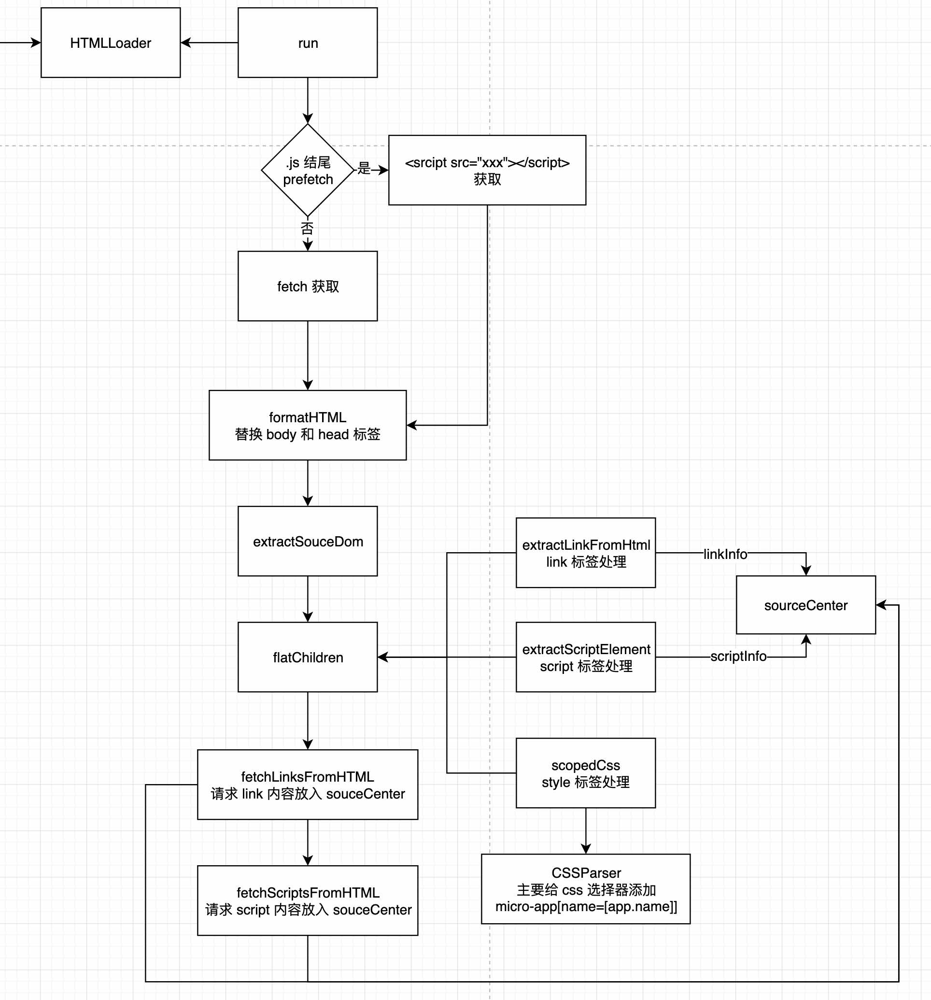

# loadSourceCode 加载源码

HTMLLoader 是一个单例模式的类。
调用静态方法 getInstance 获取实例。
不管调用多少次都是同一个实例

```ts
export class HTMLLoader implements IHTMLLoader {
  private static instance: HTMLLoader;

  // 单例模式
  public static getInstance (): HTMLLoader {
    if (!this.instance) {
      this.instance = new HTMLLoader()
    }
    return this.instance
  }

  //...
}
```

## run - 开始解析的方法

1. 如果是 prefetch 相关提前加载是 .js 为后缀的 js 文件使用 `<micro-app-head><script src='${htmlUrl}'></script></micro-app-head><micro-app-body></micro-app-body>` 方式
2. 如果是正常的 url 是加载 html 文件，使用 `fetch(htmlUrl)` 方式
3. 将远程的资源拉回到本地之后，将 head 和 body 标签改为 micro-app-head，micro-app-body
4. successCb 其实是 extractSourceDom 函数，提取 出 script 标签，link 标签

```ts
  // 直接执行
  public run (app: AppInterface, successCb: CallableFunction): void {
    const appName = app.name
    const htmlUrl = app.ssrUrl || app.url

    // 请求 js 或 css 源码资源
    const htmlPromise = htmlUrl.includes('.js')
      // 当 script 标签同步加载完毕，执行下一个微任务 - prefetch 时使用
      ? Promise.resolve(`<micro-app-head><script src='${htmlUrl}'></script></micro-app-head><micro-app-body></micro-app-body>`)
      // 自定义 fetch 或者 window.fetch
      : fetchSource(htmlUrl, appName, { cache: 'no-cache' })
    
    htmlPromise.then((htmlStr: string) => {
      if (!htmlStr) {
        const msg = 'html is empty, please check in detail'
        app.onerror(new Error(msg))
        return logError(msg, appName)
      }

      // 将 head，body 标签改为 micro-app-head，micro-app-body
      htmlStr = this.formatHTML(htmlUrl, htmlStr, appName)

      // 执行成功回调
      successCb(htmlStr, app)
    }).catch((e) => {
      logError(`Failed to fetch data from ${app.url}, micro-app stop rendering`, appName, e)
      app.onLoadError(e)
    })
  }

```

## formatHTML

将 head 和 body 标签改为 micro-app-head，micro-app-body

```ts

  // 格式化 html 转换 head 和 body 标签
  private formatHTML(htmlUrl: string, htmlStr: string, appName: string) {
    // 执行 html 处理插件
    return this.processHtml(htmlUrl, htmlStr, appName, microApp.options.plugins)
      .replace(/<head[^>]*>[\s\S]*?<\/head>/i, (match) => {
        return match
          .replace(/<head/i, '<micro-app-head')
          .replace(/<\/head>/i, '</micro-app-head>')
      })
      .replace(/<body[^>]*>[\s\S]*?<\/body>/i, (match) => {
        return match
          .replace(/<body/i, '<micro-app-body')
          .replace(/<\/body>/i, '</micro-app-body>')
      })
  }
```

## extractSourceDom - 提取 DOM 中的 link 和 script 标签

利用 window 自带的 DOM 解析器，将 html 解析为 DOM 树
从 DOM 树中获取 micro-app-head 标签内容
从 DOM 树中获取 micro-app-body 标签内容

flatChildren 主要的处理逻辑

```ts
export function extractSourceDom(htmlStr: string, app: AppInterface): void {
  // window自带的 DOM 解析器 - DOMParser 
  const wrapElement = app.parseHtmlString(htmlStr)
  
  // micro-app-head 标签内容
  const microAppHead = globalEnv.rawElementQuerySelector.call(wrapElement, 'micro-app-head')
  // micro-app-body 标签内容
  const microAppBody = globalEnv.rawElementQuerySelector.call(wrapElement, 'micro-app-body')

  // 如果任意一个不存在就抛出错误
  if (!microAppHead || !microAppBody) {
    const msg = `element ${microAppHead ? 'body' : 'head'} is missing`
    app.onerror(new Error(msg))
    return logError(msg, app.name)
  }

  // fiber 任务
  const fiberStyleTasks: fiberTasks = app.isPrefetch || app.fiber ? [] : null


  // 主要的处理逻辑
  flatChildren(wrapElement, app, microAppHead, fiberStyleTasks)

  /**
   * Style and link are parallel, because it takes a lot of time for link to request resources. During this period, style processing can be performed to improve efficiency.
   */
  const fiberStyleResult = serialExecFiberTasks(fiberStyleTasks)

  if (app.source.links.size) {
    // 请求 link  标签内容，然后将其作为 style 标签解析后放入到原位置
    // 请求完成之后，在使用 scopedCSS ，为样式选择器添加作用域 micro-app[name=[app.name]] xxx {}
    fetchLinksFromHtml(wrapElement, app, microAppHead, fiberStyleResult)
  } else if (fiberStyleResult) {
    // 如果是 style 标签，处理完成之后执行 onLoad
    fiberStyleResult.then(() => app.onLoad({ html: wrapElement }))
  } else {
    // 没有 link 和 style 任意一个标签，执行 onLoad
    app.onLoad({ html: wrapElement })
  }

  // 下载远程 script 标签中的
  if (app.source.scripts.size) {
    fetchScriptsFromHtml(wrapElement, app)
  } else {
    app.onLoad({ html: wrapElement })
  }
}

```

## flatChildren - 拉平子元素

1. 循环 html 下的子元素，然后递归调用 flatChildren 方法，直到子元素为空。
2. 循环解析 link, script, style 标签，然后将其放入到 fiberStyleTasks 数组中。

解析 link 标签
- 存在 exclude 属性或者 excludeChecker 插件处理完成之后，添加注释节点
- 不存在 ignore 属性或者 ignoreChecker 插件处理完成之后，使用 extractLinkFromHtml 提取 link 信息
- 存在 ignore 或者 ignoreChecker 插件并且存在 href 处理完成之后，仅设置 href 

解析 style 标签
- 存在 exclude 属性添加注释
- 使用 scopedCSS 解析 - 处理注释先不进行展开，因为获取 link 远程 css 内容，之后也是需要进行 scopedCSS 处理

解析 scripts 标签
- extractScriptElement

解析 img 标签
- 将 src 的资源链接，添加子应用的 host，然后设置到 img 标签上


```ts
function flatChildren (
  parent: HTMLElement,
  app: AppInterface,
  microAppHead: Element,
  fiberStyleTasks: fiberTasks,
): void {
  const children = Array.from(parent.children)

  // 递归拉平子节点
  children.length && children.forEach((child) => {
    flatChildren(child as HTMLElement, app, microAppHead, fiberStyleTasks)
  })
  
 for (const dom of children) {
    // <link /> 标签
    if (isLinkElement(dom)) {
      // excludeChecker 插件: 如果函数返回 `true` 则忽略 script 和 link 标签的创建
      if (dom.hasAttribute('exclude') || checkExcludeUrl(dom.getAttribute('href'), app.name)) {
        // 如果返回 true，则创建注释节点
        parent.replaceChild(document.createComment('link element with exclude attribute ignored by micro-app'), dom)

        // 没有忽略属性
      } else if (!(dom.hasAttribute('ignore') || checkIgnoreUrl(dom.getAttribute('href'), app.name))) {
        // 提取 link 信息到 sourceCenter 仓库中，然后删除该 link 标签
        extractLinkFromHtml(dom, parent, app)

        // 设置 href 
      } else if (dom.hasAttribute('href')) {
        globalEnv.rawSetAttribute.call(dom, 'href', CompletionPath(dom.getAttribute('href')!, app.url))
      }

    // <style /> 标签
    } else if (isStyleElement(dom)) {
      // exclude 属性添加注释
      if (dom.hasAttribute('exclude')) {
        parent.replaceChild(document.createComment('style element with exclude attribute ignored by micro-app'), dom)

        // 处理 style 标签
      } else if (app.scopecss && !dom.hasAttribute('ignore')) {
        injectFiberTask(fiberStyleTasks, () => scopedCSS(dom, app))
      }

    // <script /> 标签（内联 | 外链）
    } else if (isScriptElement(dom)) {
      // 提取 script 标签信息放入到 sourceCenter.script 中，然后将标签替换为注释标签
      extractScriptElement(dom, parent, app)

    //  标签
    } else if (isImageElement(dom) && dom.hasAttribute('src')) {
      globalEnv.rawSetAttribute.call(dom, 'src', CompletionPath(dom.getAttribute('src')!, app.url))
    }
  }
}

```

## extractLinkFromHtml - 提取 link 标签内容

sourceCenter 存储数据格式
```js
{
  link: {
    setInfo(address, info){ linkList.set(address, info) },
    getInfo(){ },
    hasInfo(){ },
    deleteInfo(){ },
  },
  script: {
    setInfo(address, info){ script.set(address, info) },
    getInfo(){ },
    hasInfo(){ },
    deleteInfo(){ },
    deleteInlineInfo(){ },
  }
}


// 每个 href 对应一个 linkList 信息
linkList = {
 code: "",
 appSpace: {
   [app.name]: {
     attrs: {href: "xxx", ref: "stylesheet"},
     placeholder: "link标签或者注释标签"
   }
 }
}

{
    "xxx[href]xxx": {
        code: "", // 将来将从 href 中获取的 css 资源放入到 code 中
        appSpace: {
            [app.name]: {
                attrs: {href: "xxx", ref: "stylesheet"},
                placeholder: "link标签或者注释标签"
            }
        }
    }
}
```

解析 link 标签： - 暂不考虑 prefetch, 只看主流程
- stylesheet 属性表示一个外部加载样式表
- 拼接完整的 href, 放入到 sourceCenter 的 link 属性中
- 将相关信息存储到 sourceCenter 中
- 非动态链接，将 link 节点替换为注释节点


```ts
// 提取 link 信息到一个 sourceCenter 仓库中，然后删除该标签
export function extractLinkFromHtml (
  link: HTMLLinkElement,
  parent: Node | null,
  app: AppInterface,
  isDynamic = false,
): any {
  const rel = link.getAttribute('rel')
  let href = link.getAttribute('href')
  let replaceComment: Comment | null = null

  // stylesheet 表示一个外部加载样式表
  if (rel === 'stylesheet' && href) {
    href = CompletionPath(href, app.url)

    // 查看是否已经存在，存在则直接返回
    let linkInfo = sourceCenter.link.getInfo(href)
    const appSpaceData = {
      attrs: getAttributes(link),
    }

    // linkInfo 存在，则合并 appSpaceData
    if (!linkInfo) {
      linkInfo = {
        code: '',
        appSpace: {
          [app.name]: appSpaceData,
        }
      }
    } else {
      linkInfo.appSpace[app.name] = linkInfo.appSpace[app.name] || appSpaceData
    }

    sourceCenter.link.setInfo(href, linkInfo)

    // 非动态链接
    if (!isDynamic) {
      // 放入到全局资源中
      app.source.links.add(href)

      // 填充 placeholder 属性
      replaceComment = document.createComment(`link element with href=${href} move to micro-app-head as style element`)
      linkInfo.appSpace[app.name].placeholder = replaceComment
    } else {
      return { address: href, linkInfo }
    }

    // 如果是预加载
  } else if (rel && ['prefetch', 'preload', 'prerender', 'modulepreload'].includes(rel)) {
    // preload prefetch prerender ....
    if (isDynamic) {
      replaceComment = document.createComment(`link element with rel=${rel}${href ? ' & href=' + href : ''} removed by micro-app`)
    } else {
      parent?.removeChild(link)
    }

    // 有 href 链接 - dns-prefetch 提前将 href 解析为 ip 地址
  } else if (href) {
    // dns-prefetch preconnect modulepreload search ....
    globalEnv.rawSetAttribute.call(link, 'href', CompletionPath(href, app.url))
  }

  // 静态的 link 标签提取出 link 标签的属性之后，在 DOM 树中删除该 link DOM
  if (isDynamic) {
    return { replaceComment }
  } else if (replaceComment) {
    // 替换 link 标签为 replaceComment 注释标签 
    return parent?.replaceChild(replaceComment, link)
  }
}
```

## extractScriptElement - 提取 script 标签信息

类似 extractLinkFromHtml 将 script 标签放入到 sourceCenter.script 中

- 处理 exclude 属性， ignore 属性
- 远程 script，将标签属性作为 appSpaceData 对象属性，存储起来，将链接存起来，并且存到全局上
- 内联 script，比远程多一个将内联的内容赋值到 code 属性上
- 非动态状态，将注释节点替换原有节点，执行 script 脚本

```ts
// 提取 script 标签信息放入到 sourceCenter.script 中
export function extractScriptElement (
  script: HTMLScriptElement,
  parent: Node | null,
  app: AppInterface,
  isDynamic = false,
): any {
  let replaceComment: Comment | null = null
  let src: string | null = script.getAttribute('src')
  if (src) src = CompletionPath(src, app.url)

  // 过滤元素 - 当子应用不需要加载某个js或css，可以通过在link、script、style设置exclude属性，当micro-app遇到带有exclude属性的元素会进行删除。
  if (script.hasAttribute('exclude') || checkExcludeUrl(src, app.name)) {
    replaceComment = document.createComment('script element with exclude attribute removed by micro-app')
  } else if (
    (
      script.type &&
      !scriptTypes.includes(script.type)
    ) ||
    script.hasAttribute('ignore') ||
    checkIgnoreUrl(src, app.name)
  ) {
    // 配置为忽略的脚本，清空 rawDocument.currentScript，避免被忽略的脚本内获取 currentScript 出错
    if (globalEnv.rawDocument?.currentScript) {
      delete globalEnv.rawDocument.currentScript
    }
    return null
  } else if (
    (globalEnv.supportModuleScript && script.noModule) ||
    (!globalEnv.supportModuleScript && script.type === 'module')
  ) {
    replaceComment = document.createComment(`${script.noModule ? 'noModule' : 'module'} script ignored by micro-app`)

    // 远程脚本
  } else if (src) { // remote script
    let scriptInfo = sourceCenter.script.getInfo(src)
    const appSpaceData = {
      async: script.hasAttribute('async'),
      defer: script.defer || script.type === 'module',
      module: script.type === 'module',
      inline: script.hasAttribute('inline'),
      pure: script.hasAttribute('pure'),
      attrs: getAttributes(script),
    }
    if (!scriptInfo) {
      scriptInfo = {
        code: '',
        isExternal: true,
        appSpace: {
          [app.name]: appSpaceData,
        }
      }
    } else {
      /**
       * Reuse when appSpace exists
       * NOTE:
       * 1. The same static script, appSpace must be the same (in fact, it may be different when url change)
       * 2. The same dynamic script, appSpace may be the same, but we still reuse appSpace, which should pay attention
       */
      scriptInfo.appSpace[app.name] = scriptInfo.appSpace[app.name] || appSpaceData
    }

    // 将 script 标签信息提取到 sourceCenter.script 仓库中
    sourceCenter.script.setInfo(src, scriptInfo)

    if (!isDynamic) {
      // 添加到
      app.source.scripts.add(src)
      replaceComment = document.createComment(`script with src='${src}' extract by micro-app`)
    } else {
      return { address: src, scriptInfo }
    }

    // 内联 script 标签
  } else if (script.textContent) { // inline script
    /**
     * NOTE:
     * 1. Each inline script is unique
     * 2. Every dynamic created inline script will be re-executed
     * ACTION:
     * 1. Delete dynamic inline script info after exec
     * 2. Delete static inline script info when destroy
     */
    const nonceStr: string = getUniqueNonceSrc()
    const scriptInfo = {
      code: script.textContent,
      isExternal: false,
      appSpace: {
        [app.name]: {
          async: false,
          defer: script.type === 'module',
          module: script.type === 'module',
          inline: script.hasAttribute('inline'),
          pure: script.hasAttribute('pure'),
          attrs: getAttributes(script),
        }
      }
    }
    if (!isDynamic) {
      // 放入全局资源中
      app.source.scripts.add(nonceStr)
      sourceCenter.script.setInfo(nonceStr, scriptInfo)
      replaceComment = document.createComment('inline script extract by micro-app')
    } else {
      // Because each dynamic script is unique, it is not put into sourceCenter
      return { address: nonceStr, scriptInfo }
    }
  } else if (!isDynamic) {
    /**
     * script with empty src or empty script.textContent remove in static html
     * & not removed if it created by dynamic
     */
    replaceComment = document.createComment('script element removed by micro-app')
  }

  if (isDynamic) {
    return { replaceComment }
  } else {
    // 将注释节点替换原有节点，执行 script 脚本
    return parent?.replaceChild(replaceComment!, script)
  }
}

```


### fetchLinksFromHtml - 提取完成 link 信息之后，请求其内容

- 将请求的 link 进行 fetchLinkSuccess 处理

```ts
export function fetchLinksFromHtml (
  wrapElement: HTMLElement,
  app: AppInterface,
  microAppHead: Element,
  fiberStyleResult: Promise<void> | null,
): void {

  // 从全局中获取所有的 link 信息
  const styleList: Array<string> = Array.from(app.source.links)

  // 构建请求数组，如果内联直接返回，如果是外链则去 fetch 请求
  const fetchLinkPromise: Array<Promise<string> | string> = styleList.map((address) => {
    const linkInfo = sourceCenter.link.getInfo(address)!
    return linkInfo.code ? linkInfo.code : fetchSource(address, app.name)
  })

  const fiberLinkTasks: fiberTasks = fiberStyleResult ? [] : null

  // 类似 Promise.all 的效果
  promiseStream<string>(fetchLinkPromise, (res: { data: string, index: number }) => {
    injectFiberTask(fiberLinkTasks, () => fetchLinkSuccess(
      styleList[res.index],
      res.data,
      microAppHead,
      app,
    ))
  }, (err: {error: Error, index: number}) => {
    logError(err, app.name)
  }, () => {
    /**
     * 1. If fiberStyleResult exist, fiberLinkTasks must exist
     * 2. Download link source while processing style
     * 3. Process style first, and then process link
     */
    if (fiberStyleResult) {
      fiberStyleResult.then(() => {
        fiberLinkTasks!.push(() => Promise.resolve(app.onLoad({ html: wrapElement })))
        serialExecFiberTasks(fiberLinkTasks)
      })
    } else {
      app.onLoad({ html: wrapElement })
    }
  })
}

```

### fetchLinkSuccess 

- handleConvertStyle：处理 style 标签内容

主要是处理标签问题，将 link 远程内容以 style 标签的形式替换到原来 link 的位置上

```ts
export function fetchLinkSuccess (
  address: string,
  code: string,
  microAppHead: Element,
  app: AppInterface,
): void {
  /**
   * linkInfo must exist, but linkInfo.code not
   * so we set code to linkInfo.code
   */
  // 将请求的外链的文本放入到 code 属性上
  const linkInfo = sourceCenter.link.getInfo(address)!
  linkInfo.code = code
  const appSpaceData = linkInfo.appSpace[app.name]

  // 注释标签内容
  const placeholder = appSpaceData.placeholder!
  /**
   * When prefetch app is replaced by a new app in the processing phase, since the linkInfo is common, when the linkInfo of the prefetch app is processed, it may have already been processed.
   * This causes placeholder to be possibly null
   * e.g.
   * 1. prefetch app.url different from <micro-app></micro-app>
   * 2. prefetch param different from <micro-app></micro-app>
   */
  if (placeholder) {
    const convertStyle = pureCreateElement('style')

    handleConvertStyle(
      app,
      address,
      convertStyle,
      linkInfo,
      appSpaceData.attrs,
    )

    if (placeholder.parentNode) {
      // 将注释节点替换为新建的 style 标签及标签里的内容
      placeholder.parentNode.replaceChild(convertStyle, placeholder)
    } else {
      // 将新建的 style 标签直接加入到 head 标签中
      microAppHead.appendChild(convertStyle)
    }

    // clear placeholder
    // 重置注释 - 表示已经处理过了
    appSpaceData.placeholder = null
  }
}

```

### handleConvertStyle - 处理 style 标签

主要是将请求回来的 code 经过 scopedCSS 处理之后放入到 code 中

```ts
// 创建 style 标签，如果隔离直接使用 scopedCSS 解析之后，否则不用解析直接放入到 style 标签中
export function handleConvertStyle (
  app: AppInterface,
  address: string,
  convertStyle: HTMLStyleElement,
  linkInfo: LinkSourceInfo,
  attrs: AttrsType,
): void {
  // 全局开启样式隔离
  if (app.scopecss) {
    const appSpaceData = linkInfo.appSpace[app.name]
    appSpaceData.prefix = appSpaceData.prefix || createPrefix(app.name)
    if (!appSpaceData.parsedCode) {
      const existParsedCode = getExistParseCode(app.name, appSpaceData.prefix, linkInfo)
      // 获取到 css 内容之后，将其作为 style 进行解析（scopedCSS）
      if (!existParsedCode) {
        convertStyle.textContent = linkInfo.code
        scopedCSS(convertStyle, app, address)
      } else {
        convertStyle.textContent = existParsedCode
      }

      // 解析完成之后，放入到 parsedCode 属性上
      appSpaceData.parsedCode = convertStyle.textContent
    } else {
      // 将解析后的内容，放入到新创建 style 标签中 
      convertStyle.textContent = appSpaceData.parsedCode
    }
  } else {
    // 样式不进行隔离，不进行处理直接放入到 style 标签中
    convertStyle.textContent = linkInfo.code
  }

  // 将属性赋值到 style 上，除了 rel 和 href 属性
  setConvertStyleAttr(convertStyle, attrs)
}
```

## fetchScriptsFromHtml - 请求 script 内容

```ts
// 请求 script，将其内容放入到 scriptInfo 的 code 上
export function fetchScriptsFromHtml (
  wrapElement: HTMLElement,
  app: AppInterface,
): void {
  const scriptList: Array<string> = Array.from(app.source.scripts)
  const fetchScriptPromise: Array<Promise<string> | string> = []
  const fetchScriptPromiseInfo: Array<[string, ScriptSourceInfo]> = []

  // 循环 script 链接数组
  for (const address of scriptList) {
    const scriptInfo = sourceCenter.script.getInfo(address)!
    const appSpaceData = scriptInfo.appSpace[app.name]
    if ((!appSpaceData.defer && !appSpaceData.async) || (app.isPrefetch && !app.isPrerender)) {
      // scriptInfo.code 存在表示内联 script 标签，code 为标签内内容
      // fetchSource 使用 fetch 拉取源码，Promise.then 放入到 fetchScriptPromise 中
      fetchScriptPromise.push(scriptInfo.code ? scriptInfo.code : fetchSource(address, app.name))

      // 链接和 script 标签信息
      fetchScriptPromiseInfo.push([address, scriptInfo])
    }
  }

  const fiberScriptTasks: fiberTasks = app.isPrefetch || app.fiber ? [] : null

  if (fetchScriptPromise.length) {

    // 执行请求
    promiseStream<string>(fetchScriptPromise, (res: { data: string, index: number }) => {
      // fetchScriptSuccess - 将请求的数据放入到 script.code 上
      injectFiberTask(fiberScriptTasks, () => fetchScriptSuccess(
        fetchScriptPromiseInfo[res.index][0],
        fetchScriptPromiseInfo[res.index][1],
        res.data,
        app,
      ))
    }, (err: {error: Error, index: number}) => {
      logError(err, app.name)
    }, () => {
      // 请求完成之后的最终调用
      if (fiberScriptTasks) {
        // 最终执行 app.onLoad 函数
        fiberScriptTasks.push(() => Promise.resolve(app.onLoad({ html: wrapElement })))
        serialExecFiberTasks(fiberScriptTasks)
      } else {
        app.onLoad({ html: wrapElement })
      }
    })
  } else {
    app.onLoad({ html: wrapElement })
  }
}

```


### fetchScriptSuccess - 将 code 赋值到 scriptInfo 属性上的 code

- 主要是将 code 放入到 scriptInfo.code 上

```ts
export function fetchScriptSuccess (
  address: string,
  scriptInfo: ScriptSourceInfo,
  code: string,
  app: AppInterface,
): void {
  // reset scriptInfo.code
  scriptInfo.code = code

  /**
   * Pre parse script for prefetch, improve rendering performance
   * NOTE:
   * 1. if global parseResult exist, skip this step
   * 2. if app is inline or script is esmodule, skip this step
   * 3. if global parseResult not exist, the current script occupies the position, when js is reused, parseResult is reference
   */
  if (app.isPrefetch && app.prefetchLevel === 2) {
    const appSpaceData = scriptInfo.appSpace[app.name]
    /**
     * When prefetch app is replaced by a new app in the processing phase, since the scriptInfo is common, when the scriptInfo of the prefetch app is processed, it may have already been processed.
     * This causes parsedCode to already exist when preloading ends
     * e.g.
     * 1. prefetch app.url different from <micro-app></micro-app>
     * 2. prefetch param different from <micro-app></micro-app>
     */
    if (!appSpaceData.parsedCode) {
      // 插件处理
      appSpaceData.parsedCode = bindScope(address, app, code, scriptInfo)
      // js 沙箱
      appSpaceData.sandboxType = getSandboxType(app, scriptInfo)
      if (!isInlineMode(app, scriptInfo)) {
        try {
          appSpaceData.parsedFunction = getParsedFunction(app, scriptInfo, appSpaceData.parsedCode)
        } catch (err) {
          logError('Something went wrong while handling preloaded resources', app.name, '\n', err)
        }
      }
    }
  }
}
```

## 总结

