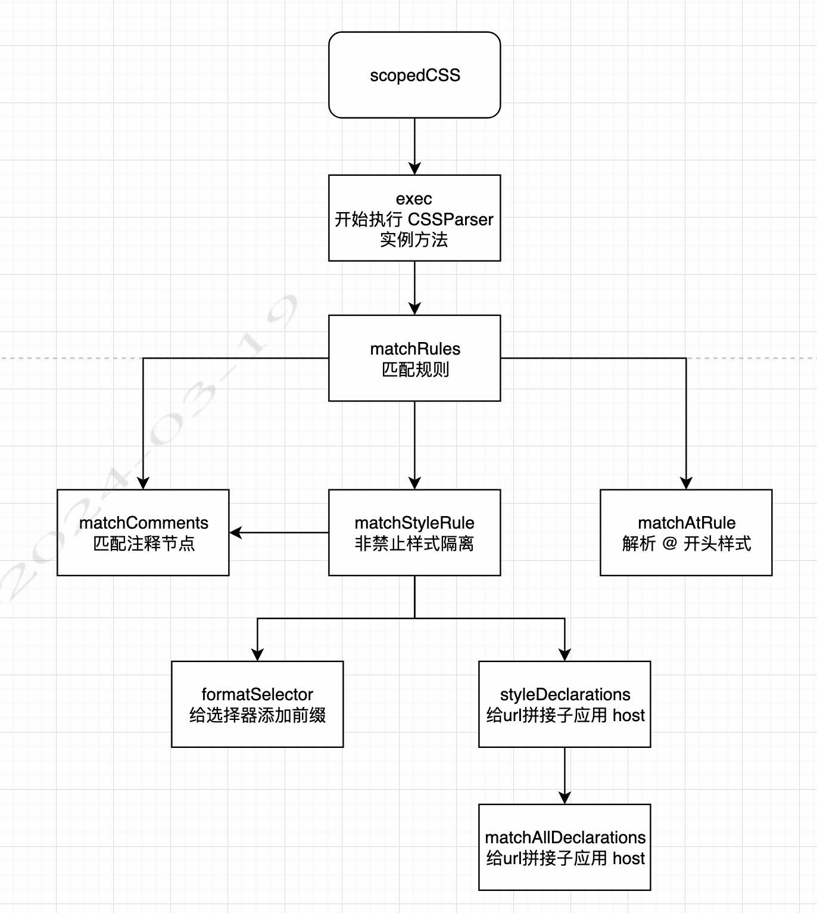

# 解析 css


这块的处理的是 [CSS 解析](https://micro-zoe.github.io/micro-app/docs.html#/zh-cn/scopecss)


```css
.test {
  color: red;
}

/* 转换为 */
micro-app[name=xxx] .test {
  color: red;
}

```

## scopedCSS

- 创建 CSSParser 实例
- 如果存在 style 标签内容，则直接调用 commonAction
- 如果不存在则监听该 style 标签，如果 style 标签内容有变化，调用 commonAction 函数

```ts
export default function scopedCSS (
  styleElement: HTMLStyleElement,
  app: AppInterface,
  linkPath?: string,
): HTMLStyleElement {
  if (app.scopecss) {
    // css 前缀
    const prefix = createPrefix(app.name)

    // 创建 css 解析器
    if (!parser) parser = new CSSParser()

    if (styleElement.textContent) {
      commonAction(
        styleElement,
        app.name,
        prefix,
        app.url,
        linkPath,
      )
    } else {
    
     // 如果不存在 styleElement.textContent 监听 styleElement 元素。
     // 如果 styleElement.textContent 更改则调用 commonAction
      const observer = new MutationObserver(function () {
        observer.disconnect()

        // 
        // styled-component will be ignore
        if (styleElement.textContent && !styleElement.hasAttribute('data-styled')) {
          commonAction(
            styleElement,
            app.name,
            prefix,
            app.url,
            linkPath,
          )
        }
      })

      // 监听元素包括子元素
      observer.observe(styleElement, { childList: true })
    }
  }

  return styleElement
}
```

## commonAction - 标签只处理一次

- 主要标签只处理一次
- 执行 parser.exec 函数

主要的还是调用 CSSParser 实例的函数

```ts
function commonAction (
  styleElement: HTMLStyleElement,
  appName: string,
  prefix: string,
  baseURI: string,
  linkPath?: string,
) {

  // 该标签没有被处理过
  if (!styleElement.__MICRO_APP_HAS_SCOPED__) {
    // 设置标签处理过标识
    styleElement.__MICRO_APP_HAS_SCOPED__ = true
    let result: string | null = null
    try {
      // 执行解析器
      result = parser.exec(
        styleElement.textContent!,
        prefix,
        baseURI,
        linkPath,
      )
      parser.reset()
    } catch (e) {
      parser.reset()
      logError('An error occurred while parsing CSS:\n', appName, e)
    }

    // 将解析后 styleContent 放入 textContent 中
    if (result) styleElement.textContent = result
  }
}
```

## CSSParser - css 解析

- commonAction 中调用 exec 函数

```ts
class CSSParser {
  private cssText = '' // css 内容
  private prefix = '' // 前缀 as micro-app[name=xxx]
  private baseURI = '' // domain name
  private linkPath = '' // link resource address, if it is the style converted from link, it will have linkPath
  private result = '' // parsed cssText， 解析结果
  private scopecssDisable = false // 开启 scopecss
  private scopecssDisableSelectors: Array<string> = [] // 开启或关闭 scopecss 为了特殊的 selectors
  private scopecssDisableNextLine = false // 处理注释 /* scopecss-disable-next-line */ to disable scopecss on a specific line

  // 
  public exec (
    cssText: string,
    prefix: string,
    baseURI: string,
    linkPath?: string,
  ): string {
    this.cssText = cssText // css 内容
    this.prefix = prefix // 前缀
    this.baseURI = baseURI // 基础 URI
    this.linkPath = linkPath || '' // 连接地址
    this.matchRules() // 开启解析

    // 返回解析结果
    return isFireFox() ? decodeURIComponent(this.result) : this.result
  }

  // 核心: 
  private matchRules (): void {
    this.matchLeadingSpaces()
    // 禁用样式隔离 - 注释解析
    // 1. 
    this.matchComments()
    while (
      this.cssText.length &&
      this.cssText.charAt(0) !== '}' &&
      // 循环每次都执行 matchAtRule 和 matchStyleRule 函数
      // 1. matchAtRule 解析 @keyframes 等特殊
      // 2. matchStyleRule 如果是非禁止样式隔离则添加前缀
      (this.matchAtRule() || this.matchStyleRule())
    ) {
      this.matchComments()
    }
  }

  // 注释匹配
  private commonMatch (reg: RegExp, skip = false): RegExpExecArray | null | void {
    // 正则匹配
    const matchArray = reg.exec(this.cssText)
    if (!matchArray) return
    const matchStr = matchArray[0]
    // 移除正则匹配，前进正则匹配过的步数
    this.cssText = this.cssText.slice(matchStr.length)

    // 不影响主流程
    if (!skip) this.recordResult(matchStr)
    return matchArray
  }

  // 空格
  private matchLeadingSpaces (): void {
    this.commonMatch(/^\s*/)
  }
}

```


## matchComments - 注释解析

- 循环调用 matchComment 
- 非 /* 则表示没有禁止样式隔离的，直接返回 false

1. 获取注释内容
- scopecss-disable-next-line - 下一行禁止样式隔离
- scopecss-disable - 下一块禁止样式隔离
- scopecss-disable - 下一块某些选择器禁止样式隔离


```ts
//...
  private matchComments(): void {
    // 如果非 /* 直接退出
    while (this.matchComment());
  }

  // css comment - css 注释解析
  private matchComment(): boolean | void {
    // 如果非 /* 直接退出
    if (this.cssText.charAt(0) !== '/' || this.cssText.charAt(1) !== '*') return false
    // reset scopecssDisableNextLine
    this.scopecssDisableNextLine = false

    let i = 2
    // */
    while (this.cssText.charAt(i) !== '' && (this.cssText.charAt(i) !== '*' || this.cssText.charAt(i + 1) !== '/')) ++i
    i += 2

    if (this.cssText.charAt(i - 1) === '') {
      return parseError('End of comment missing', this.linkPath)
    }

    // get comment content
    // 获取注释内容
    let commentText = this.cssText.slice(2, i - 2)

    this.recordResult(`/*${commentText}*/`)

    // 去除注释空格
    commentText = trim(commentText.replace(/^\s*!/, ''))

    // set ignore config
    // 在文件中使用以下格式的注释在某一特定的行上禁用样式隔离
    if (commentText === 'scopecss-disable-next-line') {
      this.scopecssDisableNextLine = true

    // 一，可以在你的css文件中使用以下格式的注释来禁用样式隔离：
    // 二，也可以对指定的选择器禁用样式隔离
    } else if (/^scopecss-disable/.test(commentText)) {
      // 一 的情况
      if (commentText === 'scopecss-disable') {
        this.scopecssDisable = true

      // 二 的情况，后面是禁止的选择器
      } else {
        this.scopecssDisable = true
        const ignoreRules = commentText.replace('scopecss-disable', '').split(',')
        ignoreRules.forEach((rule: string) => {
          this.scopecssDisableSelectors.push(trim(rule))
        })
      }

    // 关闭样式隔离
    } else if (commentText === 'scopecss-enable') {
      this.scopecssDisable = false
      this.scopecssDisableSelectors = []
    }

    // 步进到剩下的 cssText
    this.cssText = this.cssText.slice(i)

    // 步进空格
    this.matchLeadingSpaces()

    return true
  }

//...

```


## matchAtRule - 匹配特殊的规则


特殊规则：
- keyframes
- media
- custom-media
- supports
- import
- charset
- namespace
- container
- document
- page
- host
- font-face

这些都是利用 commonMatch 匹配进行处理的

```ts
  private matchAtRule (): boolean | void {
    if (this.cssText[0] !== '@') return false
    // reset scopecssDisableNextLine
    this.scopecssDisableNextLine = false
    return this.keyframesRule() || // 处理 @keyframes 
      this.mediaRule() || // 处理 @media
      this.customMediaRule() || // 处理 @custom-media
      this.supportsRule() || // 处理 @supports
      this.importRule() || // 处理 @import
      this.charsetRule() || // 处理 @charset
      this.namespaceRule() || // 处理 @namespace
      this.containerRule() || // 处理 @container
      this.documentRule() || // 处理 @document
      this.pageRule() || // 处理 @page
      this.hostRule() || // 处理 @host
      this.fontFaceRule() // 处理 @font-face
  }

```


## matchStyleRule - 匹配特殊 style 规则

```ts
//...
  private matchStyleRule(): boolean | void {
    // 给选择器添加 scope 比如：micro-app[name=[app.name]] [selector] {}
    const selectors = this.formatSelector(true)

    // reset scopecssDisableNextLine
    this.scopecssDisableNextLine = false

    if (!selectors) return parseError('selector missing', this.linkPath)

    // 将选择器赋值给 this.results 属性
    this.recordResult(selectors)

    // 继续解析注释
    this.matchComments()

    // 样式描述 匹配 url(xxx) 这种规则将子应用的 host 构建完整的 url
    this.styleDeclarations()

    // 步进空格
    this.matchLeadingSpaces()

    return true
  }

  // 格式化选择器 - 将选择器添加前缀
  private formatSelector (skip: boolean): false | string {
    const m = this.commonMatch(/^[^{]+/, skip)
    if (!m) return false

    return m[0].replace(/(^|,[\n\s]*)([^,]+)/g, (_, separator, selector) => {
      selector = trim(selector)
      if (!(
        // 非下一行进行禁止样式隔离
        this.scopecssDisableNextLine ||
        // 禁止样式隔离，当前选择器在禁止列表中
        (
          this.scopecssDisable && (
            !this.scopecssDisableSelectors.length ||
            this.scopecssDisableSelectors.includes(selector)
          )
        ) ||
        // html 或者 root 选择器
        rootSelectorREG.test(selector)
      )) {

        // const rootSelectorREG = /(^|\s+)(html|:root)(?=[\s>~[.#:]+|$)/
        // const bodySelectorREG = /(^|\s+)((html[\s>~]+body)|body)(?=[\s>~[.#:]+|$)/
        // 如果选择器是 body 则改为 micro-app[name=[app.name]] micro-app-body
        if (bodySelectorREG.test(selector)) {
          selector = selector.replace(bodySelectorREG, this.prefix + ' micro-app-body')
        } else {
          // 否则其他选择就是前缀 + 选择器
          selector = this.prefix + ' ' + selector
        }
      }

      return separator + selector
    })
  }
//...
```


## 总结一张图

