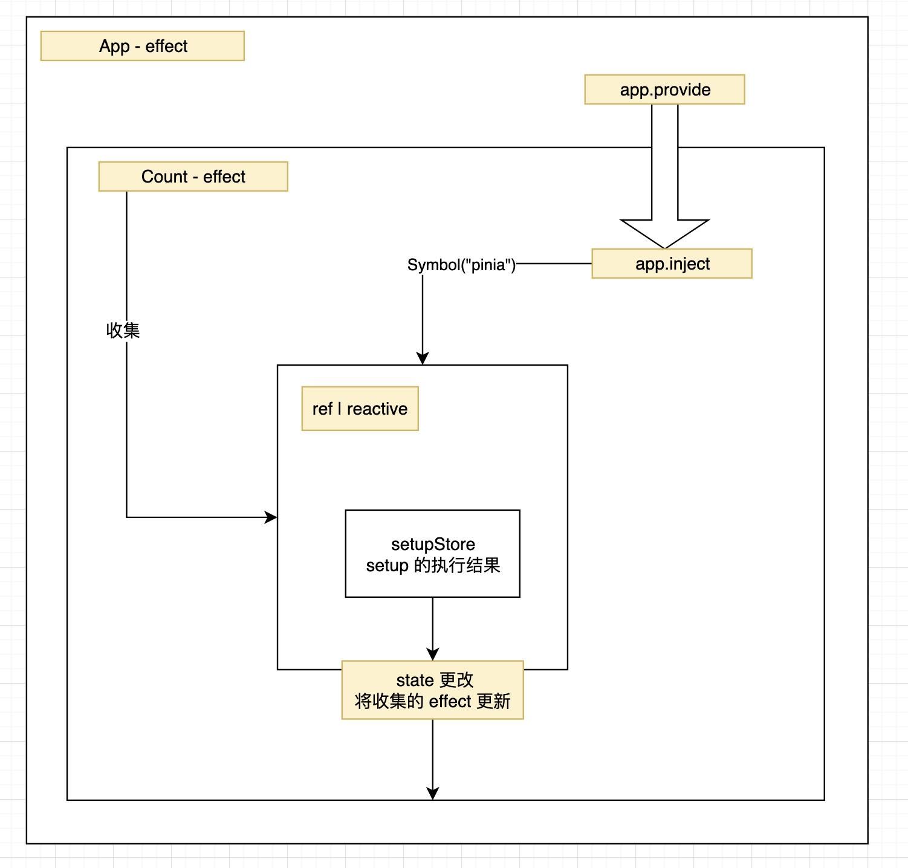

### pinia

由于不太常用 vue 在看 pinia 源码时，有一点恍惚，抓不到重点，
刚开始以为会是像 zustand 一样，本身是一个观察者，然后借用 vue api 中的某个触发更新的 api


主要想解决两个问题：
1. pinia 中数据更新怎么触发视图更新的
2. 怎么结合 vue

大致分为两部分：
## 第一部分：怎么结合 vue

作为插件传入到 vue 中

[文档写法](https://pinia.vuejs.org/zh/getting-started.html)

```ts
import { createApp } from 'vue'
import { createPinia } from 'pinia'
import App from './App.vue'

const pinia = createPinia()
const app = createApp(App)

app.use(pinia)
app.mount('#app')
```

先看一下 app.use 是如何实现的

优先级： plugin.install > plugin

// vue-core 源码：packages/runtime-core/src/apiCreateApp.ts
```ts
 const installedPlugins = new Set()


 const app: App = (context.app = {
  //...
  use(plugin: Plugin): any {
    // 插件已经存在
    if (installedPlugins.has(plugin)) {
      
    // 插件上有一个 install 属性方法
    } else if (plugin && isFunction(plugin.install)) {
      // 加入到插件仓库中
      installedPlugins.add(plugin)

      // 执行 install 方法
      plugin.install(app, ...options)

    // 插件本身就是一个方法
    } else if (isFunction(plugin)) {
      // 加入到插件仓库中
      installedPlugins.add(plugin)
      // 执行插件方法
      plugin(app, ...options)
    }
    return app
  }
 })

```

然后看 createPinia 方法

pinia 也是有插件的，添加插件的方法 use 方法

 源码地址：packages/pinia/src/createPinia.ts
```ts
export function createPinia(): Pinia {
  const scope = effectScope(true)
  // 可以先了解一下 effectScope 
  const state = scope.run<Ref<Record<string, StateTree>>>(() =>
    ref<Record<string, StateTree>>({})
  )!

  let _p: Pinia['_p'] = []
  // 在 app.use(pinia) 之前，先使用了 pinia.use(Plugin)
  let toBeInstalled: PiniaPlugin[] = []

  // 返回的时这个对象
  const pinia: Pinia = markRaw({
    install(app: App) {
      // this allows calling useStore() outside of a component setup after
      // installing pinia's plugin
      setActivePinia(pinia)
      if (!isVue2) {
        // 注册 pinia 实例到 app 上
        pinia._a = app

        // 重点：构建一个 provide 
        app.provide(piniaSymbol, pinia)

        // 给 vue 的实例 app 添加一个属性
        app.config.globalProperties.$pinia = pinia
        // 执行插件
        toBeInstalled.forEach((plugin) => _p.push(plugin))
        // 清空插件
        toBeInstalled = []
      }
    },

    // 添加插件的方法
    use(plugin) {
      // 在 vue3 中，还有使用 app.use 加到 vue 的插件列表中
      if (!this._a && !isVue2) {
        toBeInstalled.push(plugin)
      } else {
        _p.push(plugin)
      }
      return this
    },

    _p,
    // it's actually undefined here
    // @ts-expect-error
    _a: null,
    _e: scope,
    _s: new Map<string, StoreGeneric>(),
    state,
  })

  return pinia
}
```

## 第二部分：怎么触发 vue 视图更新

首先看一下用法

::: code-group

```js [store/counter.js]
export const useCounterStore = defineStore('counter', () => {
  const count = ref(0)
  const doubleCount = computed(() => count.value * 2)
  function increment() {
    count.value++
  }

  return { count, doubleCount, increment }
})

```

```html [app.vue]
<template>
  <div>
    <div>{count}</div>
    <button>*2</button>
    <button>+</button>
  </div>
<template>

<script setup>

  import {useCounterStore} from "../store/counter"
  const {count, doubleCount, increment} = useCounterStore()

</script>
```
:::

简化一下只看 setupStore 的情况

看一下 defineStore 方法：


### 定义 store - defineStore

- 分离参数 idOrOptions
- 构建 useStore 函数并返回

```ts
export function defineStore(
  idOrOptions,
  setup,
  setupOptions
) {
  let id;
  let options;

  // 只看 vue3 的 setupStore 的情况
  const isSetupStore = typeof setup === 'function'

  // 将 idOrOptions 赋值给 id
  // 如果是字符串，则将 idOrOptions 赋值给 id
  // 如果是对象，则将 idOrOptions.id 赋值给 id
  // 如果是对象，则将 idOrOptions 赋值给 options
  if (typeof idOrOptions === 'string') {
    id = idOrOptions
    // 只考虑是 isSetupStore 为 true 的情况
    options = isSetupStore ? setupOptions : setup
  } else {
    options = idOrOptions
    id = idOrOptions.id
  }

  // 创建一个 store hook 函数
  function useStore(pinia?: Pinia | null, hot?: StoreGeneric): StoreGeneric {
    const hasContext = hasInjectionContext()

    // 重要：将 inject 插入到组件中
    pinia = hasContext ? inject(piniaSymbol, null) : null

    // 将 activePinia 赋予 pinia
    if (pinia) setActivePinia(pinia)

    // 将当前正在活动 pinia 赋值为 pinia
    pinia = activePinia!


    if (!pinia._s.has(id)) {
      // 只考虑 true 的情况
      if (isSetupStore) {
        createSetupStore(id, setup, options, pinia)
      } else {
        // 暂不考虑
        createOptionsStore(id, options as any, pinia)
      }
    }

    // 获取 id 的 store
    const store = pinia._s.get(id)

    // 返回 store
    return store;
  }

  useStore.$id = id

  return useStore
}

```

### 核心逻辑 - createSetupStore

代码有点多，只看关心的怎么触发视图更新

```js
function createSetupStore(
   $id,
  setup,
  options,
  pinia,
  hot,
  isOptionsStore
){

  // 看一下初始的 state, 如果初始已经存在就不创建
  const initialState = pinia.state.value[$id]

  // setup 并且没有初始化 state
  if (!isOptionsStore && !initialState){
    pinia.state.value[$id] = {}
  }

  const partialStore = {
    //...
    $id,
    // 
  }

  // 生成一个响应式对象，任何一个函数更改都会触发视图更新
  const store = reactive(partialStore)

  // 将其放到 store 中，useStore 中获取
  pinia._s.set($id, store)

  // 执行一下 setup
  const setupStore = pinia._e.run(() => {
    scope = effectScope()
    return runWithContext(() => scope.run(setup))
  })

  // 循环 setup 的结果，将其每个属性都放到 pinia.state.value[$id] 中
  // 在 useStore 中会使用
  for (const key in setupStore) {
    const prop = setupStore[key]

    if ((isRef(prop) && !isComputed(prop)) || isReactive(prop)) {
      // setup 模式
      if (!isOptionsStore) {
        pinia.state.value[$id][key] = prop
      }

    } else if (typeof prop === 'function') {
      const actionValue = wrapAction(key, prop)

      setupStore[key] = actionValue
    }
    
  }

  // 将 store 和 setupStore 合并
  assign(store, setupStore)
  // 将为原始 store 和 setupStore 合并
  assign(toRaw(store), setupStore)

  // 返回 store
  return store
}

```

