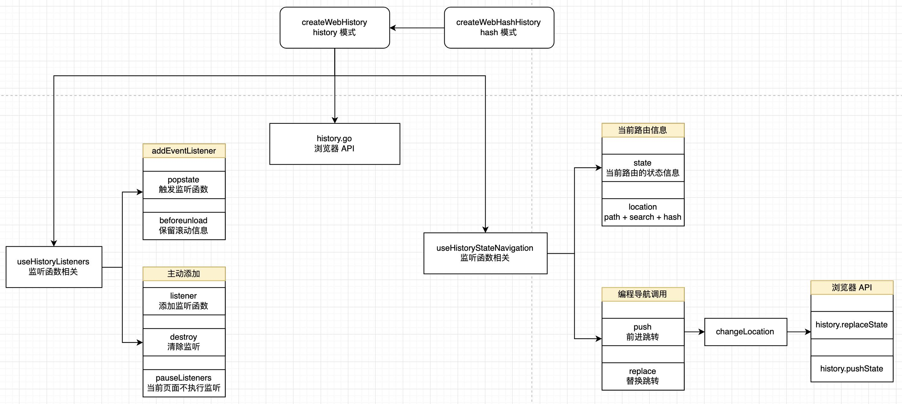

# history 和 hash 模式

## history 模式

先从顶层的 api 开始 `createWebHistory`, 这个不知是 history 入口还是 hash 模式调用

### createWebHistory

主要调用两个函数： `useHistoryStateNavigation` 和 `useHistoryListeners`

一个主动跳转函数，一个监听函数

```ts
export function createWebHistory(base?: string): RouterHistory {
  // 初始化配置，如果没有传入 base,则取 <base> 标签，默认 "/"
  base = normalizeBase(base)

  // 跳转函数 - location， state，push，replace
  const historyNavigation = useHistoryStateNavigation(base)

  // 监听
  const historyListeners = useHistoryListeners(
    base,
    historyNavigation.state,
    historyNavigation.location,
    historyNavigation.replace
  )

  // go 函数 - 直接调用 window.history.go 函数
  // pauseListeners - 当前页面不触发监听函数
  function go(delta: number, triggerListeners = true) {
    if (!triggerListeners) historyListeners.pauseListeners()
    history.go(delta)
  }

  // 合并函数
  const routerHistory: RouterHistory = assign(
    {
      // it's overridden right after
      location: '',
      base,
      go,
      createHref: createHref.bind(null, base),
    },

    historyNavigation,
    historyListeners
  )

  // 拦截 location 属性
  Object.defineProperty(routerHistory, 'location', {
    enumerable: true,
    get: () => historyNavigation.location.value,
  })

  // 拦截 location 属性
  Object.defineProperty(routerHistory, 'state', {
    enumerable: true,
    get: () => historyNavigation.state.value,
  })

  return routerHistory
}
```

### 主动跳转 - useHistoryStateNavigation


构建两个主动跳转的函数, `push`, `replace`

push 是调用两次 changeLocation，先构建一个当前的 state 执行一次 replace 的 changeLocation，
用来保存当前页面的滚动信息，然后执行一次 changeLocation，用来跳转

replace 是调用一次 changeLocation

```ts
function useHistoryStateNavigation(base: string) {
  // 从 window 对象中取出 history， location 对象
  const { history, location } = window

  // createCurrentLocation: 拼接路由 path + search + hash
  const currentLocation: ValueContainer<HistoryLocation> = {
    value: createCurrentLocation(base, location),
  }

  // 历史状态
  const historyState: ValueContainer<StateEntry> = { value: history.state }


  // 刷新导航
  if (!historyState.value) {
    changeLocation(
      currentLocation.value,
      {
        back: null,
        current: currentLocation.value,
        forward: null,
        // the length is off by one, we need to decrease it
        position: history.length - 1,
        replaced: true,
        // don't add a scroll as the user may have an anchor, and we want
        // scrollBehavior to be triggered without a saved position
        scroll: null,
      },
      true
    )
  }

  // 真实结合浏览器 history 的跳转的方法
  // 同时结合了 hash 和 state 的跳转
  function changeLocation(
    to: HistoryLocation,
    state: StateEntry,
    replace: boolean
  ): void {
    // hash 的索引
    const hashIndex = base.indexOf('#')

    // 构建完整的 url
    const url =
      hashIndex > -1
        ? (location.host && document.querySelector('base')
            ? base
            // hash 模式
            : base.slice(hashIndex)) + to
        : createBaseLocation() + base + to
    try {
      // 真正跳转的 history
      history[replace ? 'replaceState' : 'pushState'](state, '', url)

      // 更新历史状态
      historyState.value = state
    } catch (err) {
      console.error(err)
      // Force the navigation, this also resets the call count
      // 强制跳转
      location[replace ? 'replace' : 'assign'](url)
    }
  }

  // 主动调用的替换跳转
  function replace(to: HistoryLocation, data?: HistoryState) {
    // 构建新的历史状态
    const state: StateEntry = assign(
      {},
      history.state,

      // 将传入的信息，只是简单的组合为一个对象
      // 返回：back, current, forward, position, replaced, position, scroll 对象
      buildState(
        historyState.value.back,
        // keep back and forward entries but override current position
        to,
        historyState.value.forward,
        true // 计算滚动信息
      ),
      
      // 传递的数据
      data,
      { position: historyState.value.position }
    )

    // 跳转
    changeLocation(to, state, true)

    // 更新当前的 location 信息
    currentLocation.value = to
  }

  // 主动跳转 push
  function push(to: HistoryLocation, data?: HistoryState) {
    // 构建一个当前 state 信息
    const currentState = assign(
      {},
      historyState.value,
      history.state as Partial<StateEntry> | null,
      {
        forward: to,
        // 计算滚动信息 返回：{left, top}
        scroll: computeScrollPosition(),
      }
    )

    // 替换跳转当前路由 - 保留当前的路由信息 currentState
    // 主要是为了保存当前页面滚动的位置
    changeLocation(currentState.current, currentState, true)

    // 从新构建 state 信息
    const state: StateEntry = assign(
      {},
      buildState(currentLocation.value, to, null),
      { position: currentState.position + 1 },
      data
    )
    
    // 跳转到新页面
    changeLocation(to, state, false)
    currentLocation.value = to
  }

  // 返回两个主动跳转函数 | 历史状态 | 当前路由
  return {
    location: currentLocation,
    state: historyState,

    push,
    replace,
  }
}

```

#### 构建当前路由信息 - createCurrentLocation

- 拼接路由 path + search + hash

```ts
function createCurrentLocation(
  base: string,
  location: Location
): HistoryLocation {
  // 从当前路由信息中找出 pathname, search, hash
  const { pathname, search, hash } = location
  // 允许 hash #, /#, #/, #!, #!/, /#!/
  const hashPos = base.indexOf('#')

  // 判断当前路由信息是否包含 hash 信息
  if (hashPos > -1) {

    // hash 中包含
    let slicePos = hash.includes(base.slice(hashPos))
      ? base.slice(hashPos).length
      : 1
    let pathFromHash = hash.slice(slicePos)
    // prepend the starting slash to hash so the url starts with /#
    if (pathFromHash[0] !== '/') pathFromHash = '/' + pathFromHash
    return stripBase(pathFromHash, '')
  }

  // stripBase: pathname.slice(base.length) || '/'
  const path = stripBase(pathname, base)

  // 拼接路由
  return path + search + hash
}
```

### 被动监听 - useHistoryListeners

popstate - 当用户点击浏览器的后退前进按钮时，会触发 popstate 事件

> 调用 history.pushState() 或者 history.replaceState() 不会触发 popstate 事件。popstate 事件只会在浏览器某些行为下触发，比如点击后退按钮（或者在 JavaScript 中调用 history.back() 方法）即，在同一文档的两个历史记录条目之间导航会触发该事件。


两个监听函数：
- popstate 
  - popstate 事件只会在浏览器某些行为下触发，在同一文档的两个历史记录条目之间导航会触发该事件。
  - 调用 history.pushState() 或者 history.replaceState() 不会触发 popstate 事件。
- beforeunload
  - 监听卸载当前页面事件

popstate 监听函数：重置当前路由信息，触发监听函数
beforeunload 监听函数：利用 replace，记录当前页面的滚动信息


```ts
function useHistoryListeners(
  base: string,
  historyState: ValueContainer<StateEntry>,
  currentLocation: ValueContainer<HistoryLocation>,
  replace: RouterHistory['replace']
) {
  // 存储监听函数的仓库
  let listeners: NavigationCallback[] = []
  let teardowns: Array<() => void> = []

  // 主要： 重置当前路由信息，触发监听函数
  // 监听 popstate 事件
  // 当用户点击浏览器的后退前进按钮时，会触发 popstate 事件
  const popStateHandler: PopStateListener = ({
    state,
  }: {
    state: StateEntry | null
  }) => {
    // 拼接路由 path + search + hash
    const to = createCurrentLocation(base, location)
    // 当前路由信息
    const from: HistoryLocation = currentLocation.value
    // 当前路由状态
    const fromState: StateEntry = historyState.value
    let delta = 0

    // 如果有新的 state
    if (state) {
      // 更新当前路由信息
      currentLocation.value = to
      historyState.value = state

      // 如果当前路由信息和暂停路由信息相同，则直接返回，不再触发监听函数
      if (pauseState && pauseState === from) {
        pauseState = null
        return
      }

      // 计算前进或后退几步
      delta = fromState ? state.position - fromState.position : 0
    } else {
      // 替换
      replace(to)
    }

    // 将上面计算结果传入到所有监听函数中，并足一触发
    listeners.forEach(listener => {
      listener(currentLocation.value, from, {
        delta,
        type: NavigationType.pop,
        direction: delta
          ? delta > 0
            ? NavigationDirection.forward
            : NavigationDirection.back
          : NavigationDirection.unknown,
      })
    })
  }

  // 下面这些函数比较简单，
  // 暂停监听 - 将当前的路由信息保存起来
  function pauseListeners() {
    pauseState = currentLocation.value
  }

  // 添加监听函数
  function listen(callback: NavigationCallback) {
    // 将监听函数推入仓库
    listeners.push(callback)

    // 找到当前的监听函数，并从监听仓库中删除
    const teardown = () => {
      const index = listeners.indexOf(callback)
      if (index > -1) listeners.splice(index, 1)
    }

    // 将当前监听函数的销毁函数推入销毁函数仓库
    teardowns.push(teardown)
    return teardown
  }

  // beforeunload 事件触发于 window、document 和它们的资源即将卸载时。
  function beforeUnloadListener() {
    const { history } = window
    if (!history.state) return

    // 记录滚动状态
    history.replaceState(
      assign({}, history.state, { scroll: computeScrollPosition() }),
      ''
    )
  }

  // 清空销毁函数仓库
  // 移除两个监听函数
  function destroy() {
    for (const teardown of teardowns) teardown()
    teardowns = []
    window.removeEventListener('popstate', popStateHandler)
    window.removeEventListener('beforeunload', beforeUnloadListener)
  }


  // 暂停 state 初始化
  let pauseState: HistoryLocation | null = null
  
  // 监听 popstate
  window.addEventListener('popstate', popStateHandler)
  // 可以看阮一峰的文章理解这块
  // https://www.ruanyifeng.com/blog/2018/11/page_lifecycle_api.html
  window.addEventListener('beforeunload', beforeUnloadListener, {
    passive: true,
  })

  return {
    pauseListeners,
    listen,
    destroy,
  }
}

```

## hash 模式

不管是 history 模式还是 hash 模式，都是主动跳转都是使用 `history.push` 和 `history.replace`

直接调用上面的 `createWebHistory` 函数

```ts
export function createWebHashHistory(base?: string): RouterHistory {

  base = location.host ? base || location.pathname + location.search : ''
  // 确保 base 末尾有 #
  if (!base.includes('#')) base += '#'

  // 调用 createWebHistory 
  return createWebHistory(base)
}
```

## 总结一张图

