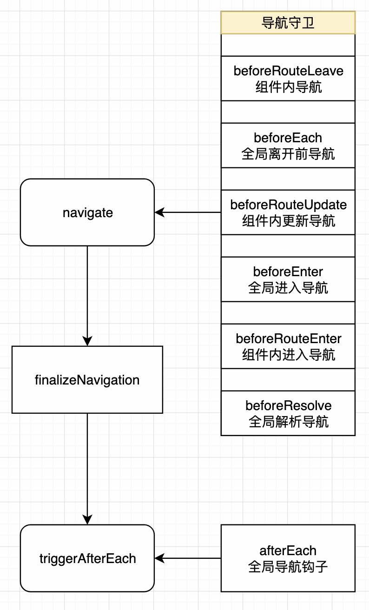

# 导航守卫

入口 navigate 函数

1. 执行当前路由下的组件，组件内 beforeRouteLeave 导航守卫
2. 执行全局 beforeEach 导航守卫
3. 如果跳转路由相同，则执行 beforeRouteUpdate 组件内导航守卫
4. 提取并执行全局导航钩子 beforeEach 
5. 提取并执行组件内导航守卫 beforeRouteEnter
6. 提取并执行全局导航守卫 beforeResolve

```ts
  function navigate(
    to: RouteLocationNormalized,
    from: RouteLocationNormalizedLoaded
  ): Promise<any> {
    let guards: Lazy<any>[]

    // 当前匹配器和跳转匹配不是同一个
    // 提取当前匹配器 - 相同：updatingRecords - 不同：leavingRecords
    // 获取跳转匹配器 - 不同：enteringRecords 
    const [leavingRecords, updatingRecords, enteringRecords] =
      extractChangingRecords(to, from)

    // 传入特定的守卫类型，然后提取匹配路由的守卫 - beforeRouteLeave
    guards = extractComponentsGuards(
      // 将当前匹配器先翻转一下
      leavingRecords.reverse(),
      'beforeRouteLeave',
      to,
      from
    )

    // 暂不考虑 - RouterView
    for (const record of leavingRecords) {
      record.leaveGuards.forEach(guard => {
        guards.push(guardToPromiseFn(guard, to, from))
      })
    }

    // 取消
    const canceledNavigationCheck = checkCanceledNavigationAndReject.bind(
      null,
      to,
      from
    )

    // 将取消放入
    guards.push(canceledNavigationCheck)
    

    // 开始执行 guards，相当于先执行 beforeRouteLeave
    return (
      runGuardQueue(guards)
        .then(() => {
          // 复用守卫变量
          guards = []

          // 全局导航守卫 - beforeEach
          for (const guard of beforeGuards.list()) {
            guards.push(guardToPromiseFn(guard, to, from))
          }
          guards.push(canceledNavigationCheck)

          // 执行全局导航守卫 - beforeEach
          return runGuardQueue(guards)
        })
        .then(() => {
          // 如果跳转路由相同，则提取 beforeRouteUpdate 导航守卫
          guards = extractComponentsGuards(
            updatingRecords,
            'beforeRouteUpdate',
            to,
            from
          )

          for (const record of updatingRecords) {
            record.updateGuards.forEach(guard => {
              guards.push(guardToPromiseFn(guard, to, from))
            })
          }
          guards.push(canceledNavigationCheck)

          // 执行 beforeRouteUpdate 组件内导航守卫
          return runGuardQueue(guards)
        })
        .then(() => {
          // 提取全局导航钩子 beforeEach 
          guards = []
          for (const record of enteringRecords) {
            // do not trigger beforeEnter on reused views
            if (record.beforeEnter) {
              if (isArray(record.beforeEnter)) {
                for (const beforeEnter of record.beforeEnter)
                  guards.push(guardToPromiseFn(beforeEnter, to, from))
              } else {
                guards.push(guardToPromiseFn(record.beforeEnter, to, from))
              }
            }
          }
          guards.push(canceledNavigationCheck)

          // 执行全局导航钩子 beforeEach
          return runGuardQueue(guards)
        })
        .then(() => {
          // 清除存在 enterCallbacks
          to.matched.forEach(record => (record.enterCallbacks = {}))

          // 提取组件内导航守卫 beforeRouteEnter
          guards = extractComponentsGuards(
            enteringRecords,
            'beforeRouteEnter',
            to,
            from
          )
          guards.push(canceledNavigationCheck)

          // 执行组件内导航守卫 beforeRouteEnter
          return runGuardQueue(guards)
        })
        .then(() => {
          // 提取全局导航守卫 beforeResolve
          guards = []
          for (const guard of beforeResolveGuards.list()) {
            guards.push(guardToPromiseFn(guard, to, from))
          }
          guards.push(canceledNavigationCheck)

          // 执行全局导航守卫 beforeResolve
          return runGuardQueue(guards)
        })

        // 接收取消的错误还是正常在执行导航函数中的错误
        .catch(err =>
          isNavigationFailure(err, ErrorTypes.NAVIGATION_CANCELLED)
            ? err
            : Promise.reject(err)
        )
    )
  }

```


## 提取导航 - extractChangingRecords

将当前和跳转的导航进行分类：

- 提取 matcher
- 提取当前路由
- 提取下一个路由

```ts
function extractChangingRecords(
  to: RouteLocationNormalized,
  from: RouteLocationNormalizedLoaded
) {
  // 声明三个数组
  const leavingRecords: RouteRecordNormalized[] = []
  const updatingRecords: RouteRecordNormalized[] = []
  const enteringRecords: RouteRecordNormalized[] = []

  // 找出 matchd，路由的最长的个数
  const len = Math.max(from.matched.length, to.matched.length)

  // 循环
  for (let i = 0; i < len; i++) {
    // 当前匹配器
    const recordFrom = from.matched[i]

    // 如果当前匹配器存在
    if (recordFrom) {
      // 判断是否是相同的路由,如果是相同的则将当前匹配器放入到更新 updatingRecords 数组中
      if (to.matched.find(record => isSameRouteRecord(record, recordFrom)))
        updatingRecords.push(recordFrom)

      // 否则放入到离开的数组中
      else leavingRecords.push(recordFrom)
    }
    const recordTo = to.matched[i]

    // 跳转匹配器是否存在
    if (recordTo) {
      // 如果跳转的路由与当前不同，则将跳转匹配器放入到 enteringRecords
      if (!from.matched.find(record => isSameRouteRecord(record, recordTo))) {
        enteringRecords.push(recordTo)
      }
    }
  }

  return [leavingRecords, updatingRecords, enteringRecords]
}

```


## 提取特定守卫 - extractComponentsGuards 

传入特定的守卫类型，然后提取匹配路由的守卫

```ts
type GuardType = 'beforeRouteEnter' | 'beforeRouteUpdate' | 'beforeRouteLeave'

export function extractComponentsGuards(
  matched: RouteRecordNormalized[],
  guardType: GuardType,
  to: RouteLocationNormalized,
  from: RouteLocationNormalizedLoaded
) {
  const guards: Array<() => Promise<void>> = []

  // 循环 
  for (const record of matched) {

    // 循环每个组件
    for (const name in record.components) {
      let rawComponent = record.components[name]

      // 如果组件没有被挂载，并且导航类型不是 beforeRouteEnter 则跳过
      if (guardType !== 'beforeRouteEnter' && !record.instances[name]) continue

      // 是否是组件
      if (isRouteComponent(rawComponent)) {
        // __vccOpts is added by vue-class-component and contain the regular options
        const options: ComponentOptions =
          (rawComponent as any).__vccOpts || rawComponent

        // 提取当前传入 type 的导航
        const guard = options[guardType]

        // 将导航中包裹到 promise 中，然后推到 guard 
        guard && guards.push(guardToPromiseFn(guard, to, from, record, name))

      // 
      } else {
        // 懒加载，先执行懒加载
        let componentPromise: Promise<
          RouteComponent | null | undefined | void
        > = (rawComponent as Lazy<RouteComponent>)()

        // 将懒加载结果放入到 guards 中
        guards.push(() =>
          componentPromise.then(resolved => {
            if (!resolved)
              return Promise.reject(
                new Error(
                  `Couldn't resolve component "${name}" at "${record.path}"`
                )
              )
            const resolvedComponent = isESModule(resolved)
              ? resolved.default
              : resolved

            record.components![name] = resolvedComponent
            const options: ComponentOptions =
              (resolvedComponent as any).__vccOpts || resolvedComponent
            const guard = options[guardType]
            return guard && guardToPromiseFn(guard, to, from, record, name)()
          })
        )
      }
    }
  }

  return guards
}
```

在执行完 `navigate` 之后执行 `finalizeNavigation` 也就是执行路由跳转，最后执行导航完后钩子函数 `triggerAfterEach`

## after 导航 - triggerAfterEach

执行全局导航 afterEach 

```ts
  function triggerAfterEach(
    to: RouteLocationNormalizedLoaded,
    from: RouteLocationNormalizedLoaded,
    failure?: NavigationFailure | void
  ): void {
    // 执行
    afterGuards
      .list()
      .forEach(guard => runWithContext(() => guard(to, from, failure)))
  }
```

## 总结一张图

