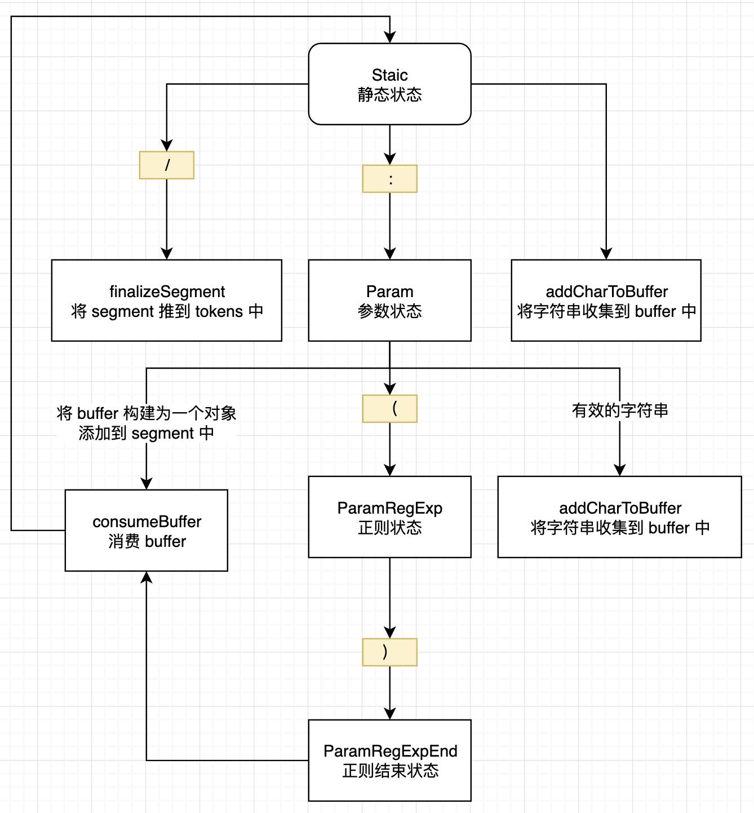

# 将 path 转为 token

tokenizePath 函数就是一个状态机，由一个状态转为另一个状态




## 源码解析

下面的程序可以复制直接执行

```js
const TokenType = {
  Static: "Static",
  Param: "Param",
  Group: "Group",
}

const TokenizerState = {
  Static: "Static",
  Param: "Param",
  ParamRegExp: "ParamRegExp", // custom re for a param
  ParamRegExpEnd: "ParamRegExpEnd", // check if there is any ? + *
  EscapeNext: "EscapeNext",
}

const ROOT_TOKEN = {
  type: TokenType.Static,
  value: '',
}

const VALID_PARAM_RE = /[a-zA-Z0-9_]/

function tokenizePath(path) {

  // 处理下面三种边界情况
  // 如果没有 path 直接返回
  // path 只有一个 /
  // 如果 path 不是以 / 开头，抛出错误
  if (!path) return [[]]
  if (path === '/') return [[ROOT_TOKEN]]
  if (!path.startsWith('/')) {
    throw new Error(
      `Route paths should start with a "/": "${path}" should be "/${path}".`
    )
  }

  // 抛错函数
  function crash(message) {
    throw new Error(`ERR (${state})/"${buffer}": ${message}`)
  }

  // 初始化状态
  let state = TokenizerState.Static

  // 上一个状态
  let previousState = state

  // 初始化 token 数组
  const tokens = []
  let segment

  // 以 / 为分隔符
  // 如果一段结束，放入 token 数组中
  function finalizeSegment() {
    if (segment) tokens.push(segment)
    segment = []
  }

  // index on the path
  let i = 0
  // char at index
  let char
  // buffer of the value read
  let buffer = ''
  // custom regexp for a param
  let customRe = ''

  // 消费 buffer 并重置 buffer
  function consumeBuffer() {
    if (!buffer) return

    // 如果是静态的，直接放入 segment 数组
    if (state === TokenizerState.Static) {
      segment.push({
        type: TokenType.Static,
        value: buffer,
      })

      // 如果是 :xxx 转为 param
    } else if (
      state === TokenizerState.Param ||
      state === TokenizerState.ParamRegExp ||
      state === TokenizerState.ParamRegExpEnd
    ) {

      // 
      if (segment.length > 1 && (char === '*' || char === '+'))
        crash(
          `A repeatable param (${buffer}) must be alone in its segment. eg: '/:ids+.`
        )
      segment.push({
        type: TokenType.Param,
        value: buffer,
        regexp: customRe,
        repeatable: char === '*' || char === '+',
        optional: char === '*' || char === '?',
      })
    } else {
      crash('Invalid state to consume buffer')
    }

    // 重置 buffer
    buffer = ''
  }

  // 添加 char 到 buffer
  function addCharToBuffer() {
    buffer += char
  }

  // 状态机开始
  while (i < path.length) {

    // 找出第一个 char
    char = path[i++]

    // path = "/\\:" - 没太明白这个状态
    if (char === '\\' && state !== TokenizerState.ParamRegExp) {
      previousState = state
      state = TokenizerState.EscapeNext
      continue
    }

    switch (state) {

      // 第一种状态 - 初始或正常状态
      case TokenizerState.Static:
        // 遇到 /
        if (char === '/') {
          if (buffer) {
            consumeBuffer()
          }
          // 将老的 segment 添加到 tokens 中
          // 开始一个新的 segment
          finalizeSegment()

          // 开始一个新的 segment
        } else if (char === ':') {
          consumeBuffer()
          
          // 转为下一个状态 param
          state = TokenizerState.Param
        } else {
          // 正常字符串添加到 buffer
          addCharToBuffer()
        }
        break

      case TokenizerState.EscapeNext:
        addCharToBuffer()
        state = previousState
        break

      // 第二种状态：/:orderId(\\d+)
      case TokenizerState.Param:

        // 遇到 （ 转为正则状态 ParamRegExp
        if (char === '(') {
          state = TokenizerState.ParamRegExp

        // 如果是有效的字符串添加到 buffer 中
        } else if (VALID_PARAM_RE.test(char)) {
          addCharToBuffer()
        } else {
          // 遇到无效的字符串
          consumeBuffer()

          // 回退到 Static 状态
          state = TokenizerState.Static
          // go back one character if we were not modifying
          if (char !== '*' && char !== '?' && char !== '+') i--
        }
        break

      case TokenizerState.ParamRegExp:
        // TODO: is it worth handling nested regexp? like :p(?:prefix_([^/]+)_suffix)
        // /prefix_:p()_suffix
        // 遇到 ）表示正则结束
        if (char === ')') {
          // handle the escaped )
          if (customRe[customRe.length - 1] == '\\')
            customRe = customRe.slice(0, -1) + char
          // 结束正则
          else state = TokenizerState.ParamRegExpEnd
        } else {
          customRe += char
        }
        break

      // 正则结束
      case TokenizerState.ParamRegExpEnd:
        // 消费 buffer
        consumeBuffer()

        // 转为下一个状态
        state = TokenizerState.Static
        // go back one character if we were not modifying
        if (char !== '*' && char !== '?' && char !== '+') i--
        customRe = ''
        break

      default:
        crash('Unknown state')
        break
    }
  }

  if (state === TokenizerState.ParamRegExp)
    crash(`Unfinished custom RegExp for param "${buffer}"`)

  // 最后消费 buffer
  consumeBuffer()

  // 将最后一个 segment 添加到 tokens
  finalizeSegment()

  return tokens
}

tokenizePath('/user/:username')
// tokenizePath('/:orderId(\\d+)')
```


结果为：

```js
{
  optional: false,
  regexp: "\\d+",
  repeatable: false,
  type: "Param",
  value: "orderId",
}
```

## 实例分步解析
`/:orderId(\\d+)` 的解析过程

第一步：初始状态 `TokenizerState.Static` 遇到 `/` 调用 `finalizeSegment` 初始化 `segment`
第二步：循环第二次遇到了 `:` 状态转为 `TokenizerState.Param`
第三步：继续循环遇到了 `orderId` 将其添加到 `buffer` 中，
第四步：直到遇到 `(` 字符，状态转为 `TokenizerState.ParamRegExp`
第五步：继续循环遇到了 `\\d+` 将其添加到 `customRe` 中，
第六步：直到遇到 `)` 字符，状态转为 `TokenizerState.ParamRegExpEnd`
第七步：执行 `consumeBuffer` 将 `buffer` 添加到 `segment` 中，
第八步：执行 `finalizeSegment` 将 `segment` 添加到 `tokens` 中，


