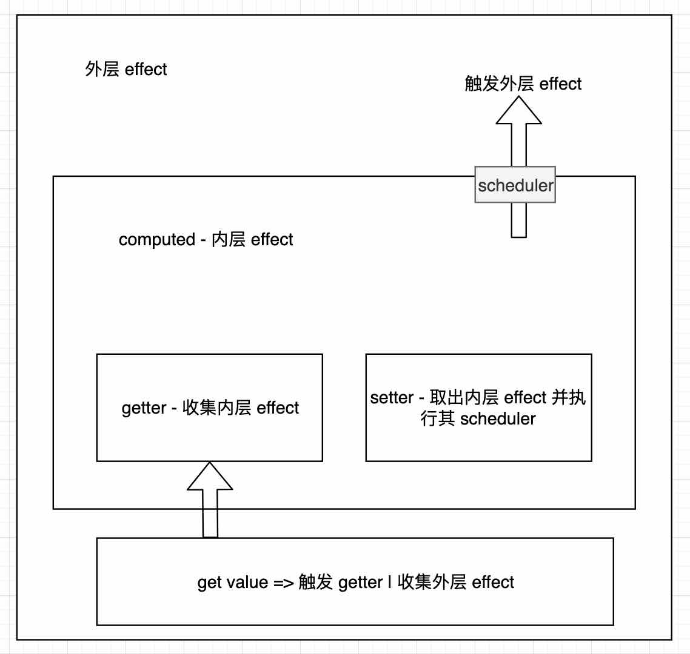

# computed 实现原理

先解释一个概念：
effect 自定义 schedule 时执行流程：

1. 执行 getter 时，会收集 effect 到相应的 dep 中 `（[obj: [a: dep]]）`
2. 执行 setter 时，找到相应的 dep，然后如果有自定义 schedule 函数，就执行自定义 schedule 函数否则执行 getter 函数

在执行 setter 时，如果存在自定义调度（schedule）函数
```js
function triggerEffect(
  effect: ReactiveEffect,
  debuggerEventExtraInfo?: DebuggerEventExtraInfo
) {
  if (effect !== activeEffect || effect.allowRecurse) {
    if (effect.scheduler) {
      effect.scheduler()
    } else {
      effect.run()
    }
  }
}
```


先通过下面示例说明一下 computed 的整个流程：

首先说明一点 computed 相当于一个自定义 schedule 的 effect
```js
effect(() => { // effect 入口 - ReactiveEffect - 1
    const rawObj = {a: 1, b: 2}
    const A =  reactive(rawObj) // 声明一个响应式对象
    const count =  computed(() => A.a + A.b) // 构建一个自定义 schedule 的 effect - ReactiveEffect - 2

    console.log(count.value)
})
```



第一步： effect (ReactiveEffect - 1) 设置为 activeEffect
第二步： 将 rawObj 对象进行 reactive 处理，将 rawObj 对象变成响应式对象，然后将响应式对象 A 变成响应式对象
第三步： 执行 computed 函数，将 computed - effect(ReactiveEffect - 2) 设置为 activeEffect
第四步： 执行 count.value 函数，先触发 trackRefValue 函数，将 activeEffect（ReactiveEffect - 1） 放入到 computed - effect 的 dep 中
第五步： 惰性求值 - 触发 ReactiveEffect - 2 的 getter 函数，也就是`() => A.a + A.b`，将 activeEffect(也就是ReactiveEffect - 2 ) 放入到 dep 中 （[A: [a: dep]] 和 [A: [b: dep]]）
第六步： ReactiveEffect - 2 的 getter 函数执行完毕，将 ReactiveEffect - 1 设置为 activeEffect
第七步： 当 setter 触发时，也就是 A.a 或者 A.b 设置新值时，
第八步： 首先触发 trigger 函数，取出 A 的 a 或者 A 的 b 属性对应 effect，也就是 ReactiveEffect - 2
第九步： 触发 ReactiveEffect - 2 上的 schedule，也就是 computed 的自定义 scheduler 函数
第十步： schedule 会触发 triggerRefValue 函数，取出之前 trackRefValue 放入到 computed 的 dep 上的 ReactiveEffect - 1，也就是入口 effect
    
 
大致就分这十步，下面我们结合源码来详细说明一下：

先看一下 computed 的源码：
## computed

主要调用 ComputedRefImpl
```ts
export function computed<T>(
  getterOrOptions: ComputedGetter<T> | WritableComputedOptions<T>,
  debugOptions?: DebuggerOptions,
  isSSR = false
) {
  let getter: ComputedGetter<T>
  let setter: ComputedSetter<T>

  const onlyGetter = isFunction(getterOrOptions)
  if (onlyGetter) {
    getter = getterOrOptions
    setter = __DEV__
      ? () => {
          console.warn('Write operation failed: computed value is readonly')
        }
      : NOOP
  } else {
    getter = getterOrOptions.get
    setter = getterOrOptions.set
  }

  const cRef = new ComputedRefImpl(getter, setter, onlyGetter || !setter, isSSR)

  return cRef as any
}
```

### ComputedRefImpl

这里面就藏着 computed 所有的逻辑，代码不是很多

```ts
export class ComputedRefImpl<T> {
  public dep?: Dep = undefined // 保存外部 effect

  private _value!: T // 计算结果缓存
  public readonly effect: ReactiveEffect<T> // 构建一个自定义 schedule 的 effect 

  public readonly __v_isRef = true
  public readonly [ReactiveFlags.IS_READONLY]: boolean = false

  public _dirty = true // 惰性求值标识，只有第一次或者 schedule 触发的时候，也就是依赖的 reactive 值发生改变时，才会设置为 true
  public _cacheable: boolean // 主要服务于 ssr，可以先不考虑

  constructor(
    getter: ComputedGetter<T>, // 也就是示例中 () => A.a + A.b
    private readonly _setter: ComputedSetter<T>, // 空函数
    isReadonly: boolean, // 如果没有传入 setter 就是只读的
    isSSR: boolean
  ) {

    // 构建一个自定义 schedule 的 effect

    // 1. get value 第一次获取 computed 的 value 时 _dirty 为 true，执行 getter
    // 2. getter 收集当前 ReactiveEffect， 在 getter 中执行 reacttive 属性中 dep 和 effect 进行存储
    // 3. 当 setter 执行时，也就是 A.a或者 A.b 发生改变时，触发 schedule 执行 triggerRefValue
    // 4. triggerRefValue 执行，就是取出 trackRefValue 存入到 ComputedRefImpl 的 dep 中的 effect,  并执行

    // 属性 _dirty 作用：惰性更新，如果有取值 get value 并且 A.a 发生改变时才 triggerRefValue，否则不触发
    this.effect = new ReactiveEffect(getter, () => {
      if (!this._dirty) {
        this._dirty = true
        triggerRefValue(this)
      }
    })
    this.effect.computed = this
    this.effect.active = this._cacheable = !isSSR
    this[ReactiveFlags.IS_READONLY] = isReadonly
  }

  // 做两件事：
  // 1. 将上级的 effect 放入当前 dep 属性中保存 - trackRefValue
  // 2. 执行 ReactiveEffect 中的 getter 方法
  get value() {
    // the computed ref may get wrapped by other proxies e.g. readonly() #3376
    const self = toRaw(this)
    trackRefValue(self)
    if (self._dirty || !self._cacheable) {
      self._dirty = false
      self._value = self.effect.run()!
    }
    return self._value
  }

  set value(newValue: T) {
    this._setter(newValue)
  }
}
```

主要流程：
1. 初始化（构造函数中）时，生成一个 effect 实例对象，并且传入一个自定义 scheduler。
2. 当获取 computed 的 value 值（get value）时，执行 effect 的 run 方法，也就是传入 computed 中 getter 方法。
3. getter 方法中，会获取 proxyObj 中的某些 key，获取的过程就会将 computed 的初始化的 effect 放入到 proxyObj 的 dep 中。
4. 当 proxyObj 中的某个 key 发生改变时，会触发 proxyObj 的 dep 中的 effect 执行。
5. effect 执行时，会执行 computed 中的 schedule 方法，从而改变 computed 的 dep 中包裹 computed 的 effect。
<br/>


里面有两个关键的函数：
trackRefValue 是将包裹 computed 的 effect 放入 ComputedRefImpl 的 dep 中
triggerRefValue 是将 ComputedRefImpl 的 dep 中的 effect 取出，然后并执行


下面两个条线只是将外层 effect 搜集到 computed 中的 dep 属性里和取出执行 effect

### trackRefValue

这里的 ref 就是 computed 实例对象，所以 dep 指的是 computed 实例对象

```js
export function trackRefValue(ref: RefBase<any>) {
  if (shouldTrack && activeEffect) {
    ref = toRaw(ref)
    trackEffects(ref.dep || (ref.dep = createDep()))
  }
}
```

接下来就是执行 trackEffects 方法。

#### trackEffects
将 activeEffect 放入到 dep 中，这里的 activeEffect 就是包裹 computed 的 effect

```js
export function trackEffects(
  dep: Dep,
  debuggerEventExtraInfo?: DebuggerEventExtraInfo
) {
  let shouldTrack = false

   shouldTrack = !dep.has(activeEffect!)
  
  if (shouldTrack) {
    dep.add(activeEffect!)
    // 添加到 activeEffect 的 deps 中, 为了在 activeEffect 清除的时候，方便清除 dep
    activeEffect!.deps.push(dep)
  }
}
```


### triggerRefValue

就是执行 triggerEffects

```js
export function triggerRefValue(ref: RefBase<any>, newVal?: any) {
  ref = toRaw(ref)
  const dep = ref.dep
  if (dep) {
    triggerEffects(dep)
  }
}

```

#### triggerEffects

先执行 computed, 然后在执行非 computed 的 effect。

防止在其他 effect 中获取的 computed（value）的值没有更新。

```js
export function triggerEffects(
  dep: Dep | ReactiveEffect[],
  debuggerEventExtraInfo?: DebuggerEventExtraInfo
) {
  // spread into array for stabilization
  const effects = isArray(dep) ? dep : [...dep]
  for (const effect of effects) {
    if (effect.computed) {
      triggerEffect(effect, debuggerEventExtraInfo)
    }
  }
  for (const effect of effects) {
    if (!effect.computed) {
      triggerEffect(effect, debuggerEventExtraInfo)
    }
  }
}
```


#### triggerEffect

如果 effect 有 scheduler 就执行 scheduler，否则执行 run 也就是 getter

```js
function triggerEffect(
  effect: ReactiveEffect,
  debuggerEventExtraInfo?: DebuggerEventExtraInfo
) {
  if (effect !== activeEffect || effect.allowRecurse) {
    if (effect.scheduler) {
      effect.scheduler()
    } else {
      effect.run()
    }
  }
}

```