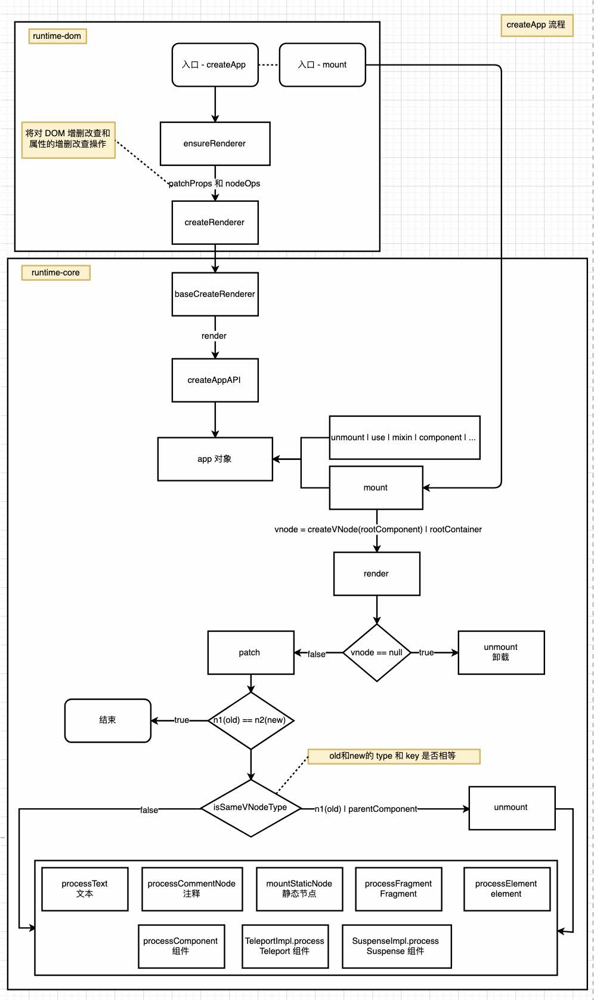

# 应用入口 - createApp

从一个 DEMO 开始，了解 createApp 的作用。

下面是 vue 一个应用简单 demo:
::: code-group

```js [index.js]
// 引入 vue 入口
import { createApp } from "vue";

// 引入根组件
import App from "./App.vue";

// 根据 App 组件创建一个 vue 应用实例
const app = createApp(App);

// 将 App 组件挂载到 DOM(#app) 元素上，从而渲染出整个应用
app.mount("#app");
```

```js [App.vue]
<template>
    <div>hello world</div>
</template>
```

```html [index.html]
<!DOCTYPE html>
<html lang="en">
<head>      
    <meta charset="UTF-8">
    <title>Vue 3</title>
</head>
<body>
    <div id="app"></div>
</body>
</html>
```

:::

有上述 demo 可以看出，Vue 应用的入口是 createApp 函数。
下面我们以 createApp 为切入点来看看 vue 的整个渲染流程。

上面是[文档的说明](https://cn.vuejs.org/api/application.html#createapp)

下面看一下 createApp 的源码：
## 整个应用的入口 - createApp 

主要做了两件事：
1. ensureRenderer - 主要固定 dom 操作（增删改查），将其作为参数传入
2. 
3. 重写 mount
   - 检测 DOM 上是否存在 containerOrSelector
   - 如果没有合适的 rootCompontent， 查看 rootComponent 的 render 方法，或 template
   - 执行原始 mount

```ts
export const createApp = ((...args) => {

  // 加载
  const app = ensureRenderer().createApp(...args)

	const { mount } = app

	// 重写 mount
  app.mount = (containerOrSelector: Element | ShadowRoot | string): any => {
		const container = normalizeContainer(containerOrSelector)
		if (!container) return

		const component = app._component
		if (!isFunction(component) && !component.render && !component.template) {
			component.template = container.innerHTML
		}
			// 在 mount 之前，清除 container 中的内容
			container.innerHTML = ''

			// 调用原始的 mount
			const proxy = mount(container, false, container instanceof SVGElement)

			//...
			return proxy
	}
  return app
}) as CreateAppFunction<Element>
```


### 将 DOM 操作传入 - ensureRenderer

主要固定对平台操作方法 patchProp， nodeOps

ensureRenderer 只是调用 createRenderer 函数传入一个 rendererOptions 作为参数,

rendererOptions 是浏览器平台一系列对属性和节点操作方法

```ts

const rendererOptions = /*#__PURE__*/ extend({ patchProp }, nodeOps)

function ensureRenderer() {
  return (
    renderer ||
    (renderer = createRenderer<Node, Element | ShadowRoot>(rendererOptions))
  )
}
```

createRenderer 方法是在 runtime-core/renderer.js ，之后的方法就开始与 runtime-dom 无关了，也就是与平台无关

有关 patchProp， nodeOps 方法感兴趣的可以看一下，都是对操作 DOM 方法的封装

### createRenderer

为什么不是直接调用 baseCreateRenderer， 需要再多封装一层
因为 baseCreateRenderer 还可以接受 createHydrationFns 有关 SSR 的函数

createRenderer 也很简单，直接调用 baseCreateRenderer，

```ts
export function createRenderer<
  HostNode = RendererNode,
  HostElement = RendererElement
>(options: RendererOptions<HostNode, HostElement>) {
  return baseCreateRenderer<HostNode, HostElement>(options)
}

```

### 渲染核心方法 - baseCreateRenderer 

baseCreateRenderer 是主要的渲染函数，大概有两千多行，也差不多是渲染的核心代码

在入口 createApp 函数中有调用 ensureRenderer().createApp(...args) 相当于调用 createAppAPI(render, hydrate) 函数
传入 render 函数，会在 createAppAPI 的准备工作完成后，开始渲染调用 render 函数

```ts
function baseCreateRenderer(
  options: RendererOptions,
  createHydrationFns?: typeof createHydrationFunctions
): any {
	//...
  return {
    render,
    hydrate,
    createApp: createAppAPI(render, hydrate)
  }
}
```

### 开始渲染 - render

主要调用 patch 构建虚拟树然后调用平台操作方法渲染到 container 上。

```ts
  const render: RootRenderFunction = (vnode, container, isSVG) => {
		// 如果没有虚拟节点，直接卸载现有虚拟树
    if (vnode == null) {
      if (container._vnode) {
        unmount(container._vnode, null, null, true)
      }
    } else {
			// 正常然后 patch 一颗虚拟树，然后调用 patchProp， nodeOps 渲染到 container 上
      patch(container._vnode || null, vnode, container, null, null, null, isSVG)
    }

		// 执行 effect 更新渲染
    flushPreFlushCbs()

		// 执行生命周期 mount
    flushPostFlushCbs()
    container._vnode = vnode
  }
```

### 渲染前的准备 - createAppAPI

主要在渲染之前做一些准备工作

创建一个 app 级别的上下文，上下文存在两个有关渲染的函数 mount，unmount

```ts
export function createAppAPI<HostElement>(
  render: RootRenderFunction<HostElement>,
  hydrate?: RootHydrateFunction
): CreateAppFunction<HostElement> {
 return function createApp(rootComponent, rootProps = null) {
    if (!isFunction(rootComponent)) {
      rootComponent = extend({}, rootComponent)
    }
		
		// 创建一个 App 整体的上下文。
		const context = createAppContext()
		
		// 安装过的插件保存到此
		const installedPlugins = new Set()

		// 是否挂载过的标识
    let isMounted = false

    const app: App = (context.app = {
      _uid: uid++,
      _component: rootComponent as ConcreteComponent,
      _props: rootProps,
      _container: null,
      _context: context,
      _instance: null,

      version,

      get config() {
        return context.config
      },

      set config(v) {
        if (__DEV__) {
          warn(
            `app.config cannot be replaced. Modify individual options instead.`
          )
        }
			},

			use(plugin: Plugin, ...options: any[]) {/**/}
			mixin(mixin: ComponentOptions) {/**/}
			component(name: string, component?: Component): any {/**/}
			directive(name: string, directive?: Directive) {/**/}
			mount(
        rootContainer: HostElement,
        isHydrate?: boolean,
        isSVG?: boolean
      ): any {/**/}
			unmount() {/**/}
			provide(key, value) {/**/}
			runWithContext(fn) {/**/}
		},

		return app;
	}
}


// 把整个 App 中所需要的一些参数，
export function createAppContext(): AppContext {
  return {
    app: null as any,
    config: {
      isNativeTag: NO,
      performance: false,
      globalProperties: {},
      optionMergeStrategies: {},
      errorHandler: undefined,
      warnHandler: undefined,
      compilerOptions: {}
    },
    mixins: [],
    components: {},
    directives: {},
    provides: Object.create(null),
    optionsCache: new WeakMap(),
    propsCache: new WeakMap(),
    emitsCache: new WeakMap()
  }
}
```

下面主要介绍一些 mount 挂载操作

### 挂载操作 - mount

如果是第一次挂载，将根组件转为 VNode 节点，然后执行 render 渲染函数

```ts
      mount(
        rootContainer: HostElement,
        isHydrate?: boolean,
        isSVG?: boolean
      ): any {
        if (!isMounted) {

					// 开发阶段，同一个 rootContainer 开启两个挂载应用
					// 进行警告提示
          // #5571
          if (__DEV__ && (rootContainer as any).__vue_app__) {
            warn(
              `There is already an app instance mounted on the host container.\n` +
                ` If you want to mount another app on the same host container,` +
                ` you need to unmount the previous app by calling \`app.unmount()\` first.`
            )
          }

					// 创建根组件实例
          const vnode = createVNode(
            rootComponent as ConcreteComponent,
            rootProps
          )
          // store app context on the root VNode.
          // this will be set on the root instance on initial mount.
          vnode.appContext = context

					// 执行 render 渲染 操作
          if (isHydrate && hydrate) { // SSR 渲染
            hydrate(vnode as VNode<Node, Element>, rootContainer as any)
          } else {
            render(vnode, rootContainer, isSVG)
          }

					// 将标识置为 true
          isMounted = true

					// 将根容器赋值到 app 的 _container 属性上
          app._container = rootContainer
          // for devtools and telemetry
					// 双向赋值虚拟节点和
          ;(rootContainer as any).__vue_app__ = app

          return getExposeProxy(vnode.component!) || vnode.component!.proxy
        }
      },
```


### patch

1. 判断新旧组件是否相同，相同直接返回
2. 新旧不一致，卸载老的节点
3. 如果有阻断标识，将不在更新子节点
4. 根据不同的类型 - 执行不同的操作
   - 文本节点
   - 注释节点
   - 静态节点
   - 元素节点
   - 
   - 组件节点
   - Fragment - 组件
   - Teleport - 组件
   - Suspense节点 - 组件

接下来将分别使用不同的文章来讲解不同的类型

```ts
  const patch: PatchFn = (
    n1,
    n2,
    container,
    anchor = null,
    parentComponent = null,
    parentSuspense = null,
    isSVG = false,
    slotScopeIds = null,
    optimized = __DEV__ && isHmrUpdating ? false : !!n2.dynamicChildren
  ) => {
    // n1 = old
    // n2 = new
    if (n1 === n2) {
      return
    }

		// 如果新旧不一致，卸载老的
    if (n1 && !isSameVNodeType(n1, n2)) {
      anchor = getNextHostNode(n1)
      unmount(n1, parentComponent, parentSuspense, true)
      n1 = null
    }

		// 这个 Flag 表示阻断，后续子节点不需要更新
    if (n2.patchFlag === PatchFlags.BAIL) {
      optimized = false
      n2.dynamicChildren = null
    }

    const { type, ref, shapeFlag } = n2
    switch (type) {
      case Text: // 文本节点 - 基础节点
        processText(n1, n2, container, anchor)
        break
      case Comment: // 注释节点 - 基础节点
        processCommentNode(n1, n2, container, anchor)
        break
      case Static:
        if (n1 == null) { // 静态节点 - 基础节点
          mountStaticNode(n2, container, anchor, isSVG)
        } else if (__DEV__) {
          patchStaticNode(n1, n2, container, isSVG)
        }
        break
      case Fragment:
        processFragment( // Fragment - 组件
          n1,
          n2,
          container,
          anchor,
          parentComponent,
          parentSuspense,
          isSVG,
          slotScopeIds,
          optimized
        )
        break
      default:
        if (shapeFlag & ShapeFlags.ELEMENT) { // 元素节点 - 基础节点
          processElement(
            n1,
            n2,
            container,
            anchor,
            parentComponent,
            parentSuspense,
            isSVG,
            slotScopeIds,
            optimized
          )
        } else if (shapeFlag & ShapeFlags.COMPONENT) { // 组件节点
          processComponent(
            n1,
            n2,
            container,
            anchor,
            parentComponent,
            parentSuspense,
            isSVG,
            slotScopeIds,
            optimized
          )
        } else if (shapeFlag & ShapeFlags.TELEPORT) { // Teleport节点 - 组件节点
          ;(type as typeof TeleportImpl).process(
            n1 as TeleportVNode,
            n2 as TeleportVNode,
            container,
            anchor,
            parentComponent,
            parentSuspense,
            isSVG,
            slotScopeIds,
            optimized,
            internals
          )
        } else if (__FEATURE_SUSPENSE__ && shapeFlag & ShapeFlags.SUSPENSE) { 
          ;(type as typeof SuspenseImpl).process( // Suspense节点 - 组件节点
            n1,
            n2,
            container,
            anchor,
            parentComponent,
            parentSuspense,
            isSVG,
            slotScopeIds,
            optimized,
            internals
          )
        } else if (__DEV__) {
          warn('Invalid VNode type:', type, `(${typeof type})`)
        }
    }
	}
```

### 新旧节点是否一致 - isSameVNodeType

- 看类型和 key 是否一致

```ts
function isSameVNodeType(n1: VNode, n2: VNode): boolean {
  return n1.type === n2.type && n1.key === n2.key
}
```

## 总结：
整体的渲染流程大概如下：

