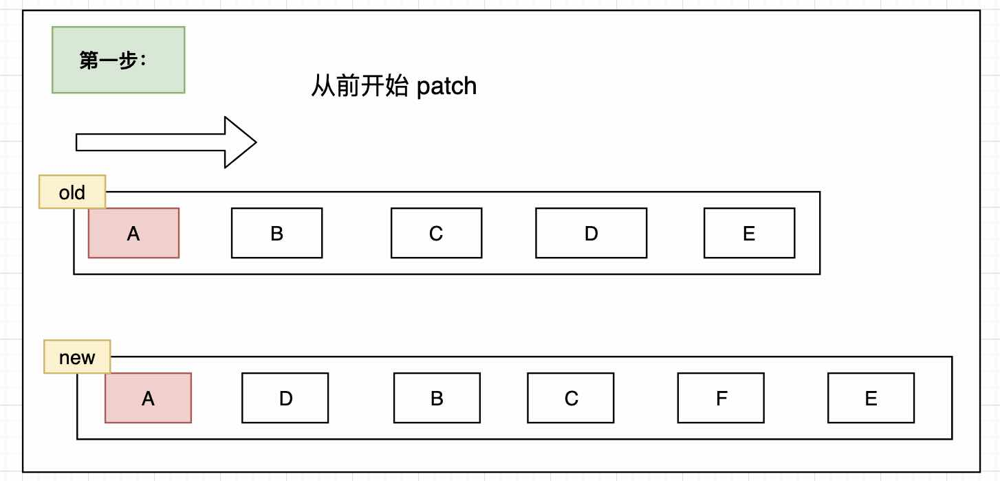
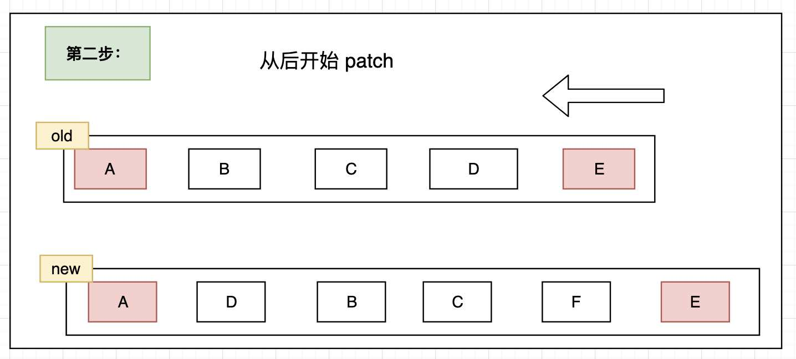
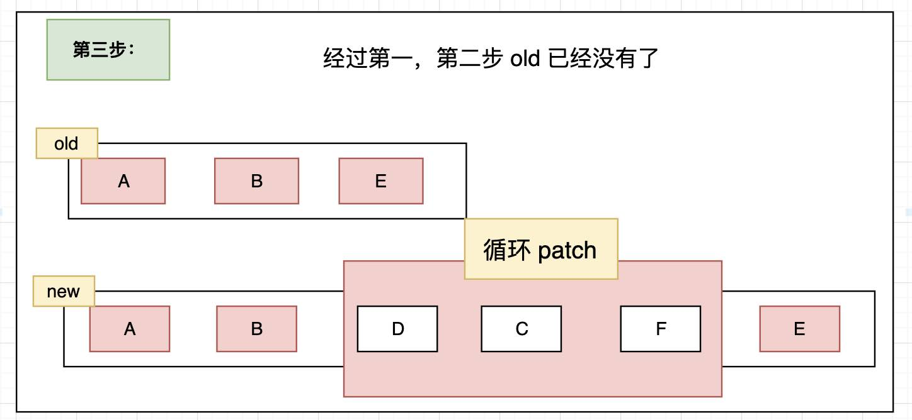
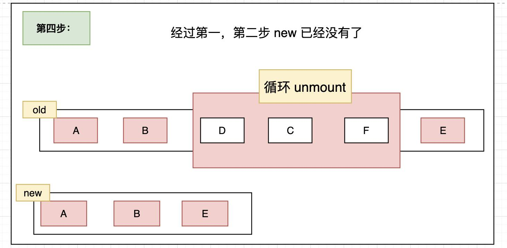
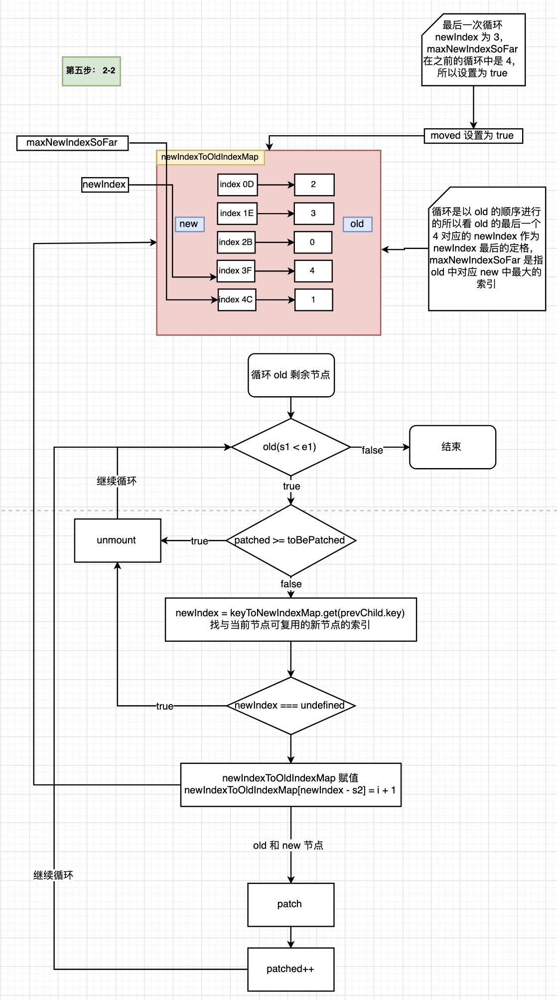
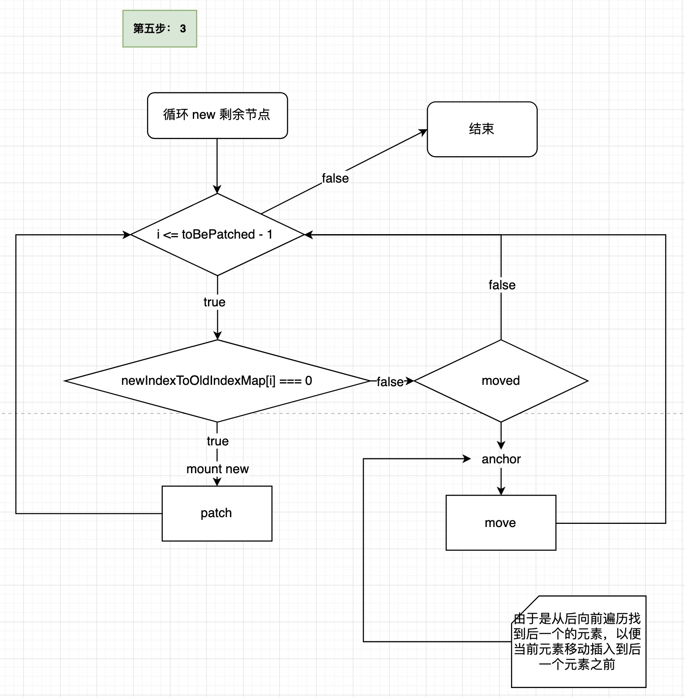

# Diff

大名鼎鼎的 diff 算法，就来自 `patchKeyedChildren` 这个函数。

patch 有 key 的子节点，这里面有三个重点词
- patch
- key
- 子节点


## patchKeyedChildren

找出 newVNode 和 oldVNode 的长度，以便下面的循环

参数：
- n1 - 老节点
- n2 - 新节点
- container - 父节点
- anchor - 下一个兄弟节点
- parentComponent - 组件实例
- parentSuspense - 父级Suspense组件实例
- isSVG - 是否是SVG
- slotScopeIds - 插槽作用域
- optimized - 是否有优化标识（在 patch 中有）

```ts
const patchKeyedChildren = (
c1: VNode[],
c2: VNodeArrayChildren,
container: RendererElement,
parentAnchor: RendererNode | null,
parentComponent: ComponentInternalInstance | null,
parentSuspense: SuspenseBoundary | null,
isSVG: boolean,
slotScopeIds: string[] | null,
optimized: boolean
) => {

    let i = 0 // 计数
    const l2 = c2.length // 新节点长度
    let e1 = c1.length - 1 // 老节点最后一个 index
    let e2 = l2 - 1 // 新节点最后一个 index

    // 下面一步一步的分析
    //...
}

```

### 第一步 - 从前开始

主要是从前面循环两个子节点，找到第一个 key 和 type 都不相同的节点的索引 i

oldVNode: (a b) c
newVNode: (a b) d e

先把括号中相同的找出来进行 patch

第一次循环：
- 克隆 newVNode
- 如果 oldVNode 和 newVNode 中相同 key 和 type 进行 patch
- 否则 break
- 计数加一

```ts
    // 1. sync from start
    // (a b) c
    // (a b) d e
    while (i <= e1 && i <= e2) {
      const n1 = c1[i]
      const n2 = (c2[i] = optimized
        ? cloneIfMounted(c2[i] as VNode)
        // 
        : normalizeVNode(c2[i]))

      // key 和 type 相同
      if (isSameVNodeType(n1, n2)) {
        patch(
          n1,
          n2,
          container,
          null,
          parentComponent,
          parentSuspense,
          isSVG,
          slotScopeIds,
          optimized
        )
      } else {
        break
      }
      i++
    }

```



### 第二步：从后开始

与第一次循环相反，从后面开始找出相同的部分进行 patch

oldVNode: a (b c)
newVNode: d e (b c)

将 (b, c) patch 掉

不一样的是这次不是改变 i 而是改变 e1 和 e2，也就是新老节点结尾的索引


```ts
    // 2. sync from end
    // a (b c)
    // d e (b c)
    while (i <= e1 && i <= e2) {
      const n1 = c1[e1]
      const n2 = (c2[e2] = optimized
        ? cloneIfMounted(c2[e2] as VNode)
        : normalizeVNode(c2[e2]))
      if (isSameVNodeType(n1, n2)) {
        patch(
          n1,
          n2,
          container,
          null,
          parentComponent,
          parentSuspense,
          isSVG,
          slotScopeIds,
          optimized
        )
      } else {
        break
      }
      // 老节点最后的索引
      e1--
      // 新节点最后的索引
      e2--
    }
```



### 第三步 - 老节点循环完毕，新节点挂载

经过前两步的操作，老节点已经消耗完毕，剩余一些新节点进行挂载

```ts
    // (a b)
    // (a b) c
    // i = 2, e1 = 1, e2 = 2
    // (a b)
    // c (a b)
    // i = 0, e1 = -1, e2 = 0
    // i > e1 并且 i<= e2 表示老节点更新完毕，新节点还有
    // 将剩余的新节点进行挂载
    if (i > e1) {
      if (i <= e2) {
        const nextPos = e2 + 1
        const anchor = nextPos < l2 ? (c2[nextPos] as VNode).el : parentAnchor
        // 循环挂载新节点
        while (i <= e2) {
          patch(
            null,
            (c2[i] = optimized
              ? cloneIfMounted(c2[i] as VNode)
              : normalizeVNode(c2[i])),
            container,
            anchor,
            parentComponent,
            parentSuspense,
            isSVG,
            slotScopeIds,
            optimized
          )
          i++
        }
      }
    }

```


### 第四步 - 新节点消耗完毕，剩余部分老节点

与第三步相反，新节点循环完毕，老节点还有，对剩余的老节点进行卸载操作

```ts
    // 4. common sequence + unmount
    // (a b) c
    // (a b)
    // i = 2, e1 = 2, e2 = 1
    // a (b c)
    // (b c)
    // i = 0, e1 = 0, e2 = -1
    else if (i > e2) {
      while (i <= e1) {
        // 卸载老节点
        unmount(c1[i], parentComponent, parentSuspense, true)
        i++
      }
    }
```



### 第五步 - 中间乱序部分处理（分三小步）

经过前四个步骤还没有处理完成，接下来就是一下乱序的对比，也是 diff 的核心部分


```ts
// 5. unknown sequence
// [i ... e1 + 1]: a b [c d e] f g
// [i ... e2 + 1]: a b [e d c h] f g
// i = 2, e1 = 4, e2 = 5
else {

  // oldVNode 开始索引
  const s1 = i // prev starting index
  // newVNode 开始索引
  const s2 = i // next starting index

  //...
  // 三小步
}

```


#### 第一小步 keyToNewIndexMap - Map<key, index>

循环 newVNode，将 key 和 index 做一个 Map 映射 - keyToNewIndexMap

```ts
// 5.1 build key:index map for newChildren
// 循环新的 VNode，将 key（唯一标识） 和 index（位置）做一个 Map 映射
const keyToNewIndexMap: Map<string | number | symbol, number> = new Map()
for (i = s2; i <= e2; i++) {
  const nextChild = (c2[i] = optimized
    ? cloneIfMounted(c2[i] as VNode)
    : normalizeVNode(c2[i]))

  if (nextChild.key != null) {
    keyToNewIndexMap.set(nextChild.key, i)
  }
}

```


#### 第二小步 查找 key 相同的节点

循环老节点，然后查找新节点索引，
如果存在，则说明是可复用的节点，然后更新老节点为新节点，
如果不存在，老节点直接 unmount 掉即可

- 循环老的 VNode
  1. patched >= toBePatched 表示循环了多次以后老的 index（索引） 大于新的所有的 index（索引），将其卸载
   :- new (a,b,d) , old (d, a, c, e, f, m) 其中 e,f,m 就是表示 patched >= toBePatched
  2. 老的有 key 存在，利用此 key 在 newIndexToOldIndexMap 中查看是否在新 VNode 能复用，获取 newIndex
  3. 老的没有 key，循环所有剩余的新 VNode，找到 type 一致的，将新的位置赋值给 newIndex
  4. 如果没找到 newIndex，（也就是不能复用），执行 unmount 卸载此节点
  5. 如果找到进行复用 patch，并且找到最大可复用的索引然后如果不是设置移动标识 moved ，填充新旧索引对应 Map
    :- maxNewIndexSoFar 找到 old 中对应 new 中最大的索引 old: [1, 3, 2], new: [2,3,1], 最大就是 2，就是找到一个参照物
  6. 将新老对应 Map 中的老的索引找到最长子序列 - getSequence
  7. 找出最后一个元素（为了插入找到定位元素）如果没有设置为 null - anchor
  8. 如果当前新老对应的 Map 中没找到对应的老的可复用的 VNode 的索引，直接 mount - patch(new VNode)
  9. 如果有移动标识 moved， 看是否在最长子序列中，如果不在说明不可复用直接执行 move 函数，如果在说明可以复用直接跳过

```ts

let j

// 已经 patch 过的
let patched = 0

// 新节点的长度 - 需要 patch 的
const toBePatched = e2 - s2 + 1

// 移动标识
let moved = false

// 最大的索引
let maxNewIndexSoFar = 0

// 新节点索引对应老节点索引的 Map
const newIndexToOldIndexMap = new Array(toBePatched)
// 全部置空
for (i = 0; i < toBePatched; i++) newIndexToOldIndexMap[i] = 0

// 循环老节点
for (i = s1; i <= e1; i++) {
  const prevChild = c1[i]

  // 先看 for 整体然后再看这段 - 所有新的子节点都已经被 patched, 剩下的需要移除
  if (patched >= toBePatched) {
    // all new children have been patched so this can only be a removal
    unmount(prevChild, parentComponent, parentSuspense, true)
    continue
  }
  let newIndex

  // 通过 key 找出老节点对应新节点的索引
  // 如果没有 key 就通过循环找到新老节点相同的节点的索引
  if (prevChild.key != null) {
    newIndex = keyToNewIndexMap.get(prevChild.key)
  } else {
    // key-less node, try to locate a key-less node of the same type
    for (j = s2; j <= e2; j++) {
      if (
        newIndexToOldIndexMap[j - s2] === 0 &&
        isSameVNodeType(prevChild, c2[j] as VNode)
      ) {
        newIndex = j
        break
      }
    }
  }

  // 没找到相同的新节点索引，证明没有对应的新节点 - 需要卸载当前节点
  if (newIndex === undefined) {
    unmount(prevChild, parentComponent, parentSuspense, true)
  } else {
    // 新节点对应的老节点的索引更新
    newIndexToOldIndexMap[newIndex - s2] = i + 1

    // 找到最后一个可复用的节点（最大的索引）
    // 如果不是最后可复用的节点设置为 moved 标识
    if (newIndex >= maxNewIndexSoFar) {
      maxNewIndexSoFar = newIndex
    } else {
      moved = true
    }

    // 对比并 mount， prevChild 不为 null，会在 patch 函数中再次进行判断
    patch(
      prevChild,
      c2[newIndex] as VNode,
      container,
      null,
      parentComponent,
      parentSuspense,
      isSVG,
      slotScopeIds,
      optimized
    )
    patched++
  }
}
```




#### 第三小步 - 从后向前循环添加子节点（parent.insert）

从后向前循环，如果老节点不存在就直接挂载，否则如果需要排好序的老节点就跳过，否则移动

```ts
const increasingNewIndexSequence = moved

  // 最长递增子序列 - 算法
  ? getSequence(newIndexToOldIndexMap)
  : EMPTY_ARR

j = increasingNewIndexSequence.length - 1

// 从后向前循环 - 因为需要使用 anchor（插入时是从后向前插入的）
for (i = toBePatched - 1; i >= 0; i--) {
  const nextIndex = s2 + i
  const nextChild = c2[nextIndex] as VNode

  // 下一个元素 el，使用 parent.insert 插到 anchor（某个 DOM） 的前面
  const anchor =
    nextIndex + 1 < l2 ? (c2[nextIndex + 1] as VNode).el : parentAnchor
  
  // 表示新增 - 如果不是新增就是移动
  if (newIndexToOldIndexMap[i] === 0) {
    // mount new
    patch(
      null,
      nextChild,
      container,
      anchor,
      parentComponent,
      parentSuspense,
      isSVG,
      slotScopeIds,
      optimized
    )

  // 新旧有对应的
  } else if (moved) {
    // e.g: 1 3 5 2 4
    // increasingNewIndexSequence => 1 3 5 => 老的
    
    // 碰到已经排好序的老节点，不进行操作
    if (j < 0 || i !== increasingNewIndexSequence[j]) {
      move(nextChild, container, anchor, MoveType.REORDER)
    } else {
      j--
    }
  }
}

```


