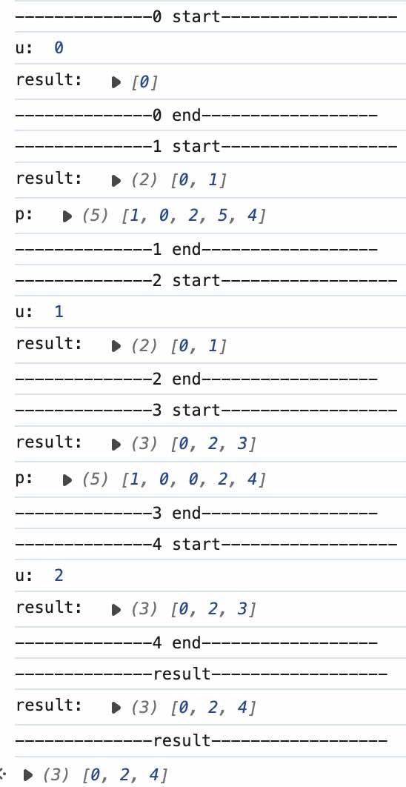
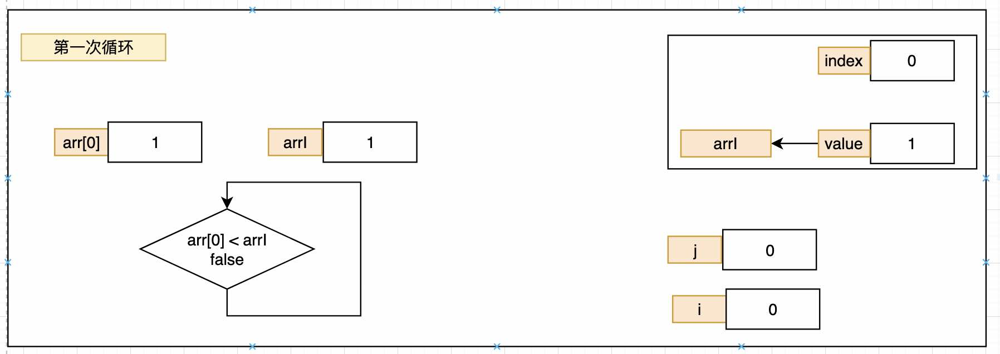
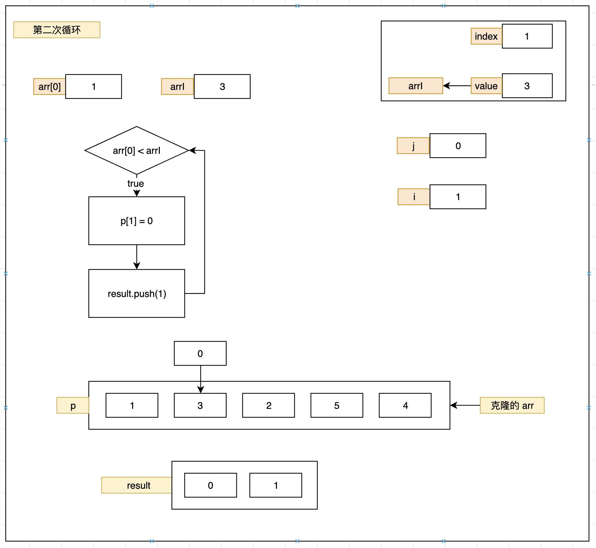
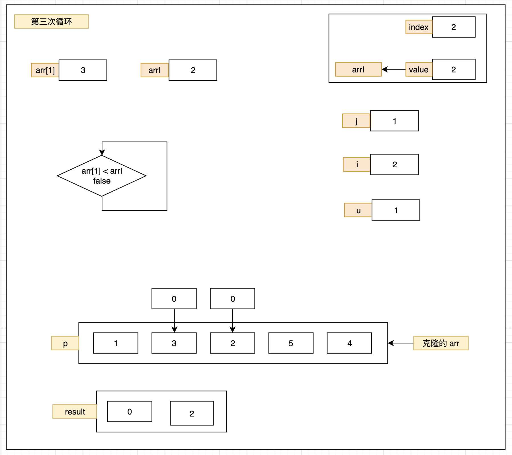
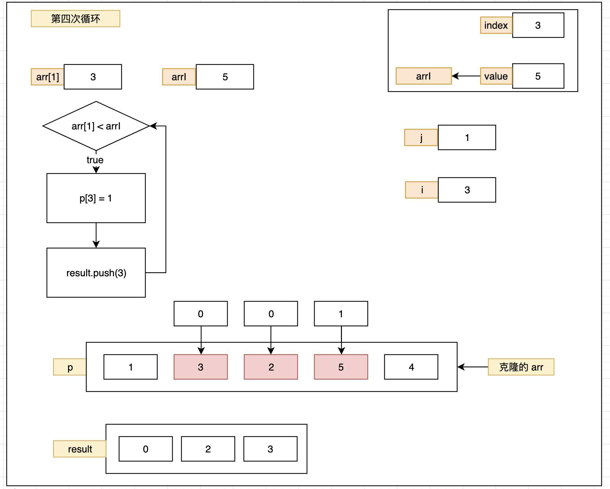
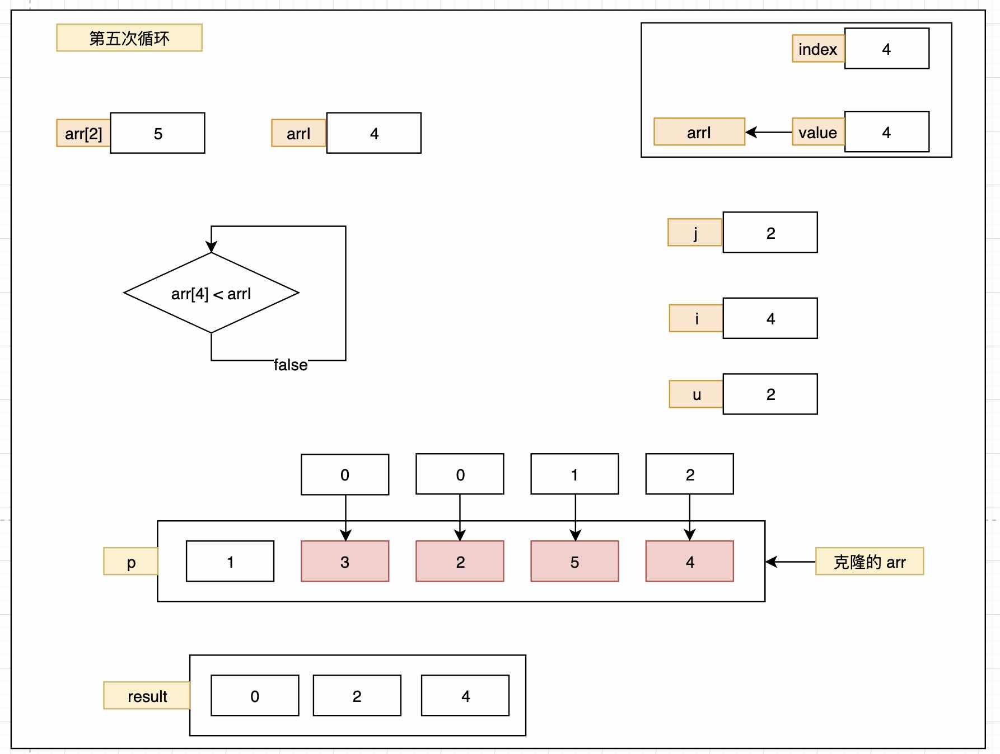
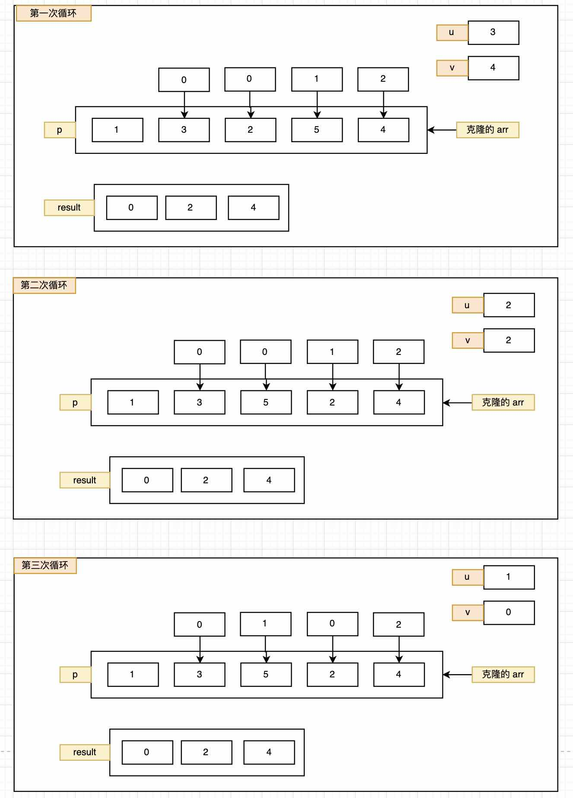

# 最长递增子序列


```js
function getSequence(arr) {
  // 数组的索引（index）代表new，数组中的值（value）代表 old
  // p - arr 的克隆
  const p = arr.slice()
  // result - 初始化数组，存的是 new 新的值
  const result = [0]
  let i, j, u, v, c
  const len = arr.length

  // 循环源数组
  for (i = 0; i < len; i++) {
    const arrI = arr[i]
    if (arrI !== 0) {

      // result 中最大的那个数
      j = result[result.length - 1]
      // 如果当前的 value 大于 result 中的最大的那个值
      // p 中保存则要替换的新的索引
      // 将最大的值的索引推入到 result 中

      // 找到最大 的 push 到 result 中
      // 找到比 result 中最大的数字还要大的
      // 就放进去
      if (arr[j] < arrI) {
        p[i] = j
        result.push(i)
        console.log(`--------------${i} start------------------`)
        console.log("result: ",  [...result])
        console.log("p: ",  [...p])
        console.log(`--------------${i} end------------------`)
        continue
      }

      // 使用二分法将 result 找到最符合 arrI 的位置
      u = 0
      v = result.length - 1
      while (u < v) {
        c = (u + v) >> 1
        if (arr[result[c]] < arrI) {
          u = c + 1
        } else {
          v = c
        }
      }
      console.log(`--------------${i} start------------------`)
      console.log("u: ", u)
      console.log("result: ", result.slice())
      console.log(`--------------${i} end------------------`)
      
      // u =>  arr[result[u-1]] < arrI < arr[result[u]]
      // 找到更小的替换掉
      // 找到更小的更有可能后面大的能排
      if (arrI < arr[result[u]]) {
        if (u > 0) {
          // p 当前位置保留上一个索引
          p[i] = result[u - 1]
        }
        result[u] = i
      }
    }
  }

  console.log(`--------------result------------------`)
  console.log("result: ", result.slice())
  console.log(`--------------result------------------`)
  // p 只是存储最新位置的数字，然后将位置置换为数字
  u = result.length
  v = result[u - 1]
  while (u-- > 0) {
    result[u] = v
    v = p[v]
  }
  return result
}

getSequence([1, 3, 2, 5, 4])
```

打印结果：


看一下整个过程

### 第一次循环



### 第二次循环



### 第三次循环


### 第四次循环


### 第五次循环


p 中保存的是 result 位置的上一个位置。比如：result[4] 的上一个位置是 2  p[4] 中的上一个

### 最后的替换
