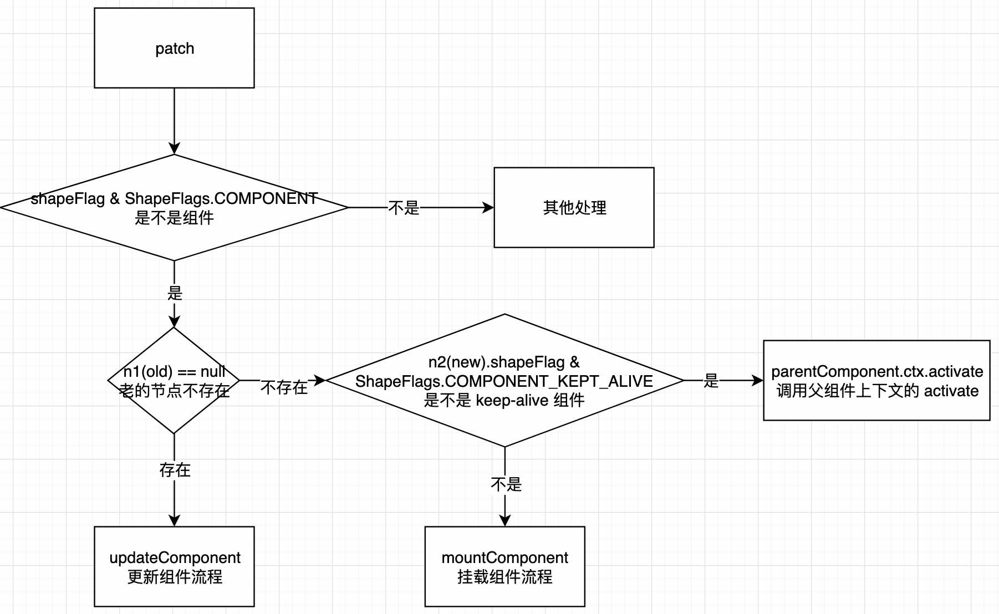
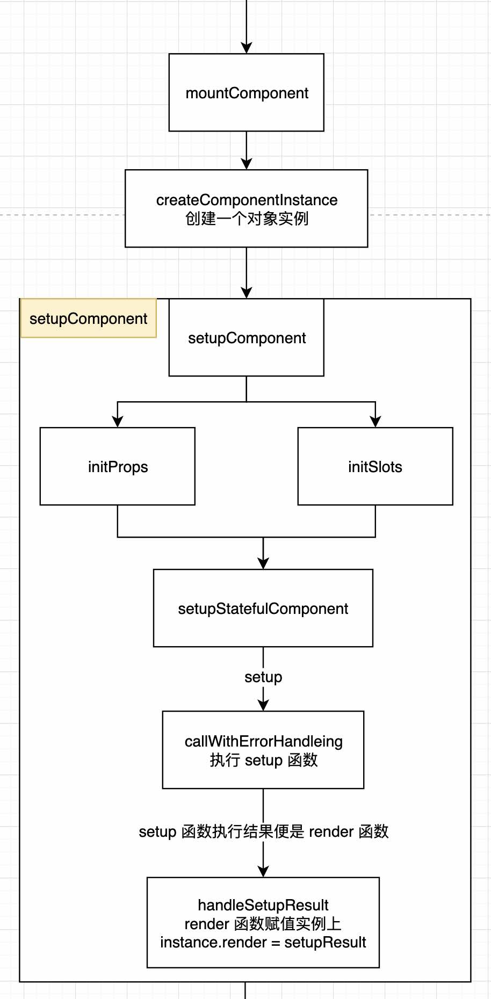
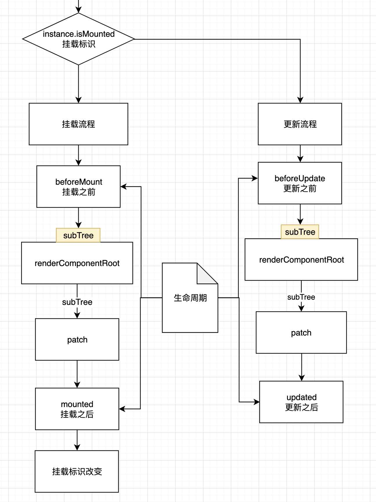
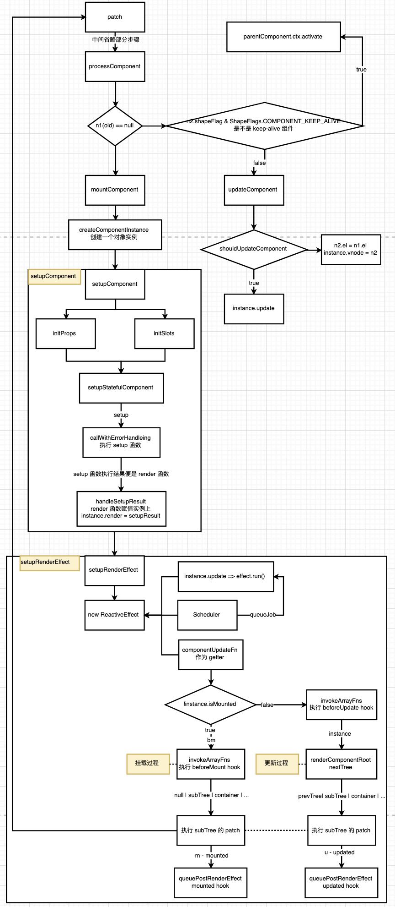

# 组件的挂载和更新

## 组件是什么？
组件就是一些元素的组合。
组件内部元素更新触发条件一般是由定时器或用户输入
组件内部元素更新一般由内部状态或外部传入的 props 决定

组件的更新和挂载，是 Vue 框架中最核心的功能。

vue 的组件挂载或更新是从 processComponent 开始。
下面我们来看一下 processComponent 函数。

## 更新还是挂载（processComponent）

根据旧节点是否存在，作为更新和挂载的条件
- 如果存在，进行更新 - updateComponent
- 如果不存在，进行挂载 - mountComponent

```ts
  const processComponent = (
    n1: VNode | null,
    n2: VNode,
    container: RendererElement,
    anchor: RendererNode | null,
    parentComponent: ComponentInternalInstance | null,
    parentSuspense: SuspenseBoundary | null,
    isSVG: boolean,
    slotScopeIds: string[] | null,
    optimized: boolean
  ) => {
    // 将 slotScopeIds 赋值到新 VNode 上 slotScopeIds，
    // 给更新或挂载 element 上使用 
    n2.slotScopeIds = slotScopeIds
    if (n1 == null) {
      // keep-alive 组件 - 暂不考虑
      if (n2.shapeFlag & ShapeFlags.COMPONENT_KEPT_ALIVE) {
        ;(parentComponent!.ctx as KeepAliveContext).activate(
          n2,
          container,
          anchor,
          isSVG,
          optimized
        )
      } else {
        // 开始挂载流程
        mountComponent(
          n2,
          container,
          anchor,
          parentComponent,
          parentSuspense,
          isSVG,
          optimized
        )
      }
    } else {
      // 更新流程
      updateComponent(n1, n2, optimized)
    }
  }

```




## 挂载流程 - mountComponent

1. 创建组件实例（也就是创建存储该组件各种信息的对象） - createComponentInstance
2. 执行组件 setup 函数
3. 将 setup 函数结果（渲染函数）在 effect 中渲染，以便状态更新时 effect 更新，从而达到重新渲染的效果

UI = effect(render(data)) 

```ts

  const mountComponent: MountComponentFn = (
    initialVNode,
    container,
    anchor,
    parentComponent,
    parentSuspense,
    isSVG,
    optimized
  ) => {

    // 创建组件实例 - createComponentInstance
    const instance: ComponentInternalInstance =
      compatMountInstance ||
      (initialVNode.component = createComponentInstance(
        initialVNode,
        parentComponent,
        parentSuspense
      ))

    //...
    // __COMPAT__ 表示 2.x 版本兼容
    // 不兼容 2.x 时，执行 setupComponent
    if (!(__COMPAT__ && compatMountInstance)) {
       setupComponent(instance)
    }

    //...
    // 将 setup 函数结果（渲染函数）与 effect 结合
    setupRenderEffect(
      instance,
      initialVNode,
      container,
      anchor,
      parentSuspense,
      isSVG,
      optimized
    )
  }
```




### 执行 setup - setupComponent


```js
<template><div>hello world</div></template>
```

最终编译结果：

```js
setup(){
  return () => h('div', 'hello world');
}

```

主要是获取 render 函数


```ts
export function setupComponent(
  instance: ComponentInternalInstance,
  isSSR = false
) {
  // SSR 标识
  isInSSRComponentSetup = isSSR

  const { props, children } = instance.vnode

  // 是否是有状态组件
  const isStateful = isStatefulComponent(instance)

  // 初始化 props - 之后再分析，其中有关 props 和 attr 的区分
  initProps(instance, props, isStateful, isSSR)
  // 初始化 slots
  initSlots(instance, children)

  // 执行重要函数 - setupStatefulComponent
  const setupResult = isStateful
    ? setupStatefulComponent(instance, isSSR)
    : undefined
  
  // SSR 标识
  isInSSRComponentSetup = false
  return setupResult
}
```


### 有状态组件的 setup 处理 - setupStatefulComponent

```ts
function setupStatefulComponent(
  instance: ComponentInternalInstance,
  isSSR: boolean
) {
  // 找到组件
  const Component = instance.type as ComponentOptions


  // 从组件中找到 setup 初始函数
  const { setup } = Component

  // 执行 setup
  const setupResult = callWithErrorHandling(
    setup,
    instance,
    ErrorCodes.SETUP_FUNCTION,
    [instance.props, setupContext]
  )

  if (isPromise(setupResult)) {/**/}
  else {
    // 处理 setup 结果 - 将 setupResult 赋值到实例的 render 属性上
    handleSetupResult(instance, setupResult, isSSR)
  }
}

```

#### 处理 setup 结果 - handleSetupResult

处理 setupResult 不同的结果
- 为函数，则直接赋值到 instance.render 属性上
- 为对象，将结果赋值到 instance.setupState 上
- 最后 finishComponentSetup 处理没有 render 函数的特殊情况

```ts
export function handleSetupResult(
  instance: ComponentInternalInstance,
  setupResult: unknown,
  isSSR: boolean
) {
  if (isFunction(setupResult)) {
    instance.render = setupResult as InternalRenderFunction
  } else if (isObject(setupResult)) {
    instance.setupState = proxyRefs(setupResult)
  }

  finishComponentSetup(instance, isSSR)
}
```

#### 处理没有 render 的情况 - finishComponentSetup

没有 render 函数的情况，找到

```ts
export function finishComponentSetup(
  instance: ComponentInternalInstance,
  isSSR: boolean,
  skipOptions?: boolean
) {
  const Component = instance.type as ComponentOptions

  if (!instance.render) {
    
    // 非 SSR && 有编译函数 && 没有 render 函数
    if (!isSSR && compile && !Component.render) {

      // 获取组件上的模板
      const template = Component.template || resolveMergedOptions(instance).template

      // 找到模板
      if (template) {

        // 编译模板的配置
        const { isCustomElement, compilerOptions } = instance.appContext.config
        const { delimiters, compilerOptions: componentCompilerOptions } =
          Component
        const finalCompilerOptions: CompilerOptions = extend(
          extend(
            {
              isCustomElement,
              delimiters
            },
            compilerOptions
          ),
          componentCompilerOptions
        )

        // 将编译好的渲染函数赋值到 Component.render 上
        Component.render = compile(template, finalCompilerOptions)
      }
    }

    // 最后赋值到组件实例上
    instance.render = (Component.render || NOOP) as InternalRenderFunction
  }
}
```


### 将 render 函数与 effect 结合 - setupRenderEffect

1. 构建一个 ReactiveEffect 实例，用于处理组件的更新
2. 每次执行 update 或 instance.update 时（根据父组件传入的 props 更新）
   - 执行 effect.run -> componentUpdateFn
3. 当状态（data）更新时，（根据状态更新）
   - 会自动执行 `() => queueJob(update)` 函数，把 update 加入队列
   - 下一个微任务执行中执行 update 函数，执行 effect.run -> componentUpdateFn

```ts
  const setupRenderEffect: SetupRenderEffectFn = (
    instance,
    initialVNode,
    container,
    anchor,
    parentSuspense,
    isSVG,
    optimized
  ) => {

    // 挂载 | 更新组件
    const componentUpdateFn = () => {/**/}
  
    // effect 添加自定义的 scheduler
    // 每次执行 effect.run 时，将 componentUpdateFn 执行一遍
    const effect = (instance.effect = new ReactiveEffect(
      componentUpdateFn,
      // 每次状态更新时，执行 scheduler，将 effect.run 放入到更新队列中
      // queueJob 之后，分析 scheduler 时，再看
      () => queueJob(update), 
      instance.scope // 暂不分析
    ))

    // 将更新放到 instance 的 update 属性上，在更新时，取出执行就可以重新渲染
    const update: SchedulerJob = (instance.update = () => effect.run())
    update.id = instance.uid
  
    // 执行一次渲染（effect.run），相当于执行一次 componentUpdateFn 函数
    update()
  }
```


### 组件更新 - componentUpdateFn


挂载阶段：
1. 先执行 beforeMount 生命周期
2. 执行 render 函数，生成 vnode - renderComponentRoot
3. 将 vnode 渲染到 dom 中 - patch
4. 执行 mounted 生命周期
5. 将组件上下文对象中挂载标识设置为 true

更新阶段：
1. 先执行 beforeUpdate 生命周期
2. 执行 render 函数，生成 vnode - renderComponentRoot
3. 将 vnode 渲染到 dom 中 - patch
4. 执行 updated 生命周期

bm - beforeMount
m - mounted
bu - beforeUpdate
u - updated

```ts
    const componentUpdateFn = () => {

      // 根据挂载标识，执行挂载或更新操作
      if (!instance.isMounted) {
        /************************ 挂载阶段 ************************/
        let vnodeHook: VNodeHook | null | undefined
        const { el, props } = initialVNode

        // bm - beforeMount
        // m - mounted
        // 取出挂载阶段的两个生命周期 beforeMount， mounted
        const { bm, m, parent } = instance

        // 如果存在 beforeMount 生命周期，就执行
        // bm 可能有一个或多个
        if (bm) {
          invokeArrayFns(bm)
        }

        // SSR
        if (el && hydrateNode) {
          //...
        } else {
          // 渲染子节点 - 
          const subTree = (instance.subTree = renderComponentRoot(instance))

          // 将子节点渲染到 container 容器中
          patch(
            null,
            subTree,
            container,
            anchor,
            instance,
            parentSuspense,
            isSVG
          )

          initialVNode.el = subTree.el
        }

        // 将 mounted 生命周期函数放入到 pendingPostFlushCbs 队列中
        // 等待下一个事件循环（微任务）中执行
        if (m) {
          queuePostRenderEffect(m, parentSuspense)
        }

        // 将 instance 实例的 isMounted 属性设置为 true，
        // 表示已经挂载过了，再次更新时，执行 update 操作
        instance.isMounted = true

      } else {
        /************************ 更新阶段 ************************/
        // bu - beforeUpdate
        // u - updated
        // 取出 beforeUpdate, updated 生命周期
        let { next, bu, u, parent, vnode } = instance
        let originNext = next
        let vnodeHook: VNodeHook | null | undefined

        // 如果存在 beforeUpdate，执行 beforeUpdate 生命周期
        if (bu) {
          invokeArrayFns(bu)
        }

        // 执行 render 函数
        const nextTree = renderComponentRoot(instance)

        // 更新组件实例上，subTree 属性，指向最新的子树
        const prevTree = instance.subTree
        instance.subTree = nextTree

        // 将 subTree 渲染到 container 容器中
        patch(
          prevTree,
          nextTree,
          // parent may have changed if it's in a teleport
          hostParentNode(prevTree.el!)!,
          // anchor may have changed if it's in a fragment
          getNextHostNode(prevTree),
          instance,
          parentSuspense,
          isSVG
        )

        next.el = nextTree.el

        // 如果存在 updated，执行 updated 生命周期
        if (u) {
          queuePostRenderEffect(u, parentSuspense)
        }
      }
      
    }

```



两个阶段都调用 renderComponentRoot 也就是执行渲染函数，下面我们简单看一下都做了些什么

### 执行 render 函数 - renderComponentRoot

大致看一下主要是在 try...catch 中将 render 执行，然后将结果返回

```ts
export function renderComponentRoot(
  instance: ComponentInternalInstance
): VNode {
  const {
    type: Component,
    vnode,
    proxy,
    withProxy,
    props,
    propsOptions: [propsOptions],
    slots,
    attrs,
    emit,
    render,
    renderCache,
    data,
    setupState,
    ctx,
    inheritAttrs
  } = instance
  
  try {
    if (vnode.shapeFlag & ShapeFlags.STATEFUL_COMPONENT) {
      // withProxy is a proxy with a different `has` trap only for
      // runtime-compiled render functions using `with` block.
      const proxyToUse = withProxy || proxy

      // 执行 render 函数
      result = normalizeVNode(
        render!.call(
          proxyToUse,
          proxyToUse!,
          renderCache,
          props,
          setupState,
          data,
          ctx
        )
      )
      fallthroughAttrs = attrs
    } else {/**/}
  } catch (err) {
    blockStack.length = 0
    // 错误处理
    handleError(err, instance, ErrorCodes.RENDER_FUNCTION)
    // 创建一个注释节点
    result = createVNode(Comment)
  }

  //...
  return result
}

```


## 更新流程 - updateComponent

1. 判断是否需要更新 - shouldUpdateComponent
2. 正常更新
   - 移除重复的 instance.update
   - 重新将 instance.update 加入队列，等待下一个微任务
3. 不更新：将老 VNode 的 el 赋值到新 VNode 的 el 上

```ts
  const updateComponent = (n1: VNode, n2: VNode, optimized: boolean) => {
    const instance = (n2.component = n1.component)!
    if (shouldUpdateComponent(n1, n2, optimized)) {
      // Suspense 组件更新
      if (
        __FEATURE_SUSPENSE__ &&
        instance.asyncDep &&
        !instance.asyncResolved
      ) {
        //...
      } else {
        // 正常组件更新
        instance.next = n2

        // 检测队列中是否存在该更新，如果存在删除，下面重新加入
        invalidateJob(instance.update)
        // 执行 update 函数，
        // 等待下一个微任务执行 effect.run -> componentUpdateFn
        instance.update()

      }
    } else {
      // 不需要更新
      n2.el = n1.el
      instance.vnode = n2
    }
  }
```

## 总结一张图：

